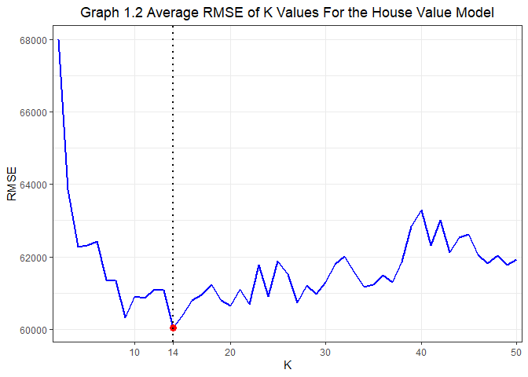

Exercise 2
================
By Eliza Malinova, Zhenghao Li, and Raushan Baizakova

# Problem 1. Saratoga house prices

## Question 1: What model outperforms the “medium” model considered in class?

*Medium Model:* price \~ lotSize + age + livingArea + pctCollege +
bedrooms + fireplaces+bathrooms + rooms + heating + fuel + centralAir

In this exercise, the purpose is to choose a model that outperforms the
above medium model in predicting housing prices based on the dataset
Saratoga. The dataset has 1728 observations and 16 variables including
price, land value, age, rooms, and other house characteristics. The
target variable is price. Before building models, there is an issue
about the target variable: a housing price consists of the land value
and the house value. The land value is predetermined before a house is
built and is less likely to be affected by those house characteristics.
Moreover, the land value is an intrinsic part of a housing price. So,
generally, the land value should be excluded from our feature variables
to avoid regressing the target variable on a variable that is a part of
the target variable itself. To tackle this issue, we used the following
procedure.

*Step 1.* Use price as the target variable:

1)  Manually build a model that has a lower RMSE than the medium model
    of price;

2)  Use forward selection method to automatically select a model with
    the lowest AIC;

3)  Compare the RMSE of the model manually built and the RMSE of the
    model forward selected, and choose the model with a lower RMSE.

*Step 2.* Generate a new target variable, houseValue, by subtracting
land value from the price:

1)  Build a medium model using houseValue as the target variable and the
    same feature variables as in the medium model of Step 1;

2)  Manually build a model that has a lower RMSE than above medium model
    of house value;

3)  Use forward selection method to automatically select a model with
    the lowest AIC and compare the RMSE of the selected model with the
    RMSE of the manually built model, and choose the model with a lower
    RMSE.

*Step 3.* Compare the chosen model in Step 1 with the chosen model in
Step 2 and use the model with a lower RMSE to help predict the housing
price.

Table 1.1 shows the models we compared in Step 1.

<table class="table" style="margin-left: auto; margin-right: auto;">

<caption>

**Table 1.1 : Models With Price As the Target Variable**

</caption>

<tbody>

<tr>

<td style="text-align:left;">

Baseline Model 1 (Medium Model)

</td>

</tr>

<tr>

<td style="text-align:left;">

price = lotSize + age + livingArea + pctCollege + bedrooms +
fireplaces+bathrooms + rooms + heating + fuel + centralAir

</td>

</tr>

<tr>

<td style="text-align:left;">

Price Model 1 (Manually Built Model)

</td>

</tr>

<tr>

<td style="text-align:left;">

price = rooms + bathrooms + bathrooms*rooms + lotSize +
newConstruction+livingArea + livingArea*rooms + lotSize \* livingArea +
pctCollege + heating + fuel + livingArea \* (heating + fuel) +
centralAir + waterfront

</td>

</tr>

<tr>

<td style="text-align:left;">

Price Model 2 (Forward Selected Model)

</td>

</tr>

<tr>

<td style="text-align:left;">

price = livingArea + landValue + bathrooms + waterfront +
newConstruction + heating + lotSize + age + centralAir + rooms +
bedrooms + landValue \* newConstruction + bathrooms \* heating +
livingArea \* bathrooms + lotSize \* age + livingArea \* waterfront +
landValue \* lotSize + livingArea \* centralAir + age \* centralAir +
livingArea \* landValue + bathrooms \* bedrooms + bathrooms \*
waterfront + heating \* bedrooms + heating \* rooms + waterfront \*
centralAir + waterfront \* lotSize + landValue \* age + age \* rooms +
livingArea \* lotSize + lotSize \* rooms + lotSize \* centralAir

</td>

</tr>

<tr>

<td style="text-align:left;">

Price Model 2.1 (Forward Selected Model without landValue)

</td>

</tr>

<tr>

<td style="text-align:left;">

price = livingArea + bathrooms + waterfront + newConstruction +
heating+lotSize + age + centralAir + rooms + bedrooms + bathrooms \*
heating + livingArea \* bathrooms + lotSize \* age + livingArea \*
waterfront + livingArea \* centralAir + age \* centralAir + bathrooms \*
bedrooms + bathrooms \* waterfront + heating \* bedrooms + heating \*
rooms + waterfront \* centralAir + waterfront \* lotSize + age \*
rooms+livingArea \* lotSize + lotSize \* rooms + lotSize \* centralAir

</td>

</tr>

</tbody>

</table>

All the models are measured by the average out-of-sample RMSE. After
randomly splitting the dataset into a train data set and a test dataset,
we ran three models in the train dataset, and then used the test dataset
to get an out-of-sample RMSE for each model. We repeated this procedure
for 100 times and then took the average of all out-of-sample RMSE. The
average out-of-sample RMSE are listed in the following table.

<table class="table" style="width: auto !important; margin-left: auto; margin-right: auto;">

<caption>

**Table 1.2 : RMSE for Price Models of Step 1**

</caption>

<tbody>

<tr>

<td style="text-align:left;width: 10em; ">

Baseline Model 1

</td>

<td style="text-align:right;">

64778.46

</td>

</tr>

<tr>

<td style="text-align:left;width: 10em; ">

Price Model 1

</td>

<td style="text-align:right;">

62179.52

</td>

</tr>

<tr>

<td style="text-align:left;width: 10em; ">

Price Model 2

</td>

<td style="text-align:right;">

56862.00

</td>

</tr>

<tr>

<td style="text-align:left;width: 10em; ">

Price Model 2.1

</td>

<td style="text-align:right;">

63054.21

</td>

</tr>

</tbody>

</table>

According to the above table, the Price Model 2 has the lowest average
out-of-sample around 58000. However, the Price Model 2 includes the
variable landValue as a feature variable, which is a part of price.
Therefore, the low RMSE of Price Model 2 is probably from using a part
of the target variable to explain the outcome, which disturbs the
assessment of the predictive abilities of the feature variables. To see
that, we ran the Price Model 2 after removing landValue and its
interactions with other feature variables on the right-hand side. The
resulted RMSE (of Price Model 2.1) increased to around 64000, though
still lower than the Baseline Model 1.

To address this problem, we implemented the Step 2, building three
models with the houseValue as the target variable, as shown in Table 1.3

<table class="table" style="margin-left: auto; margin-right: auto;">

<caption>

**Table 1.3 : Models With houseValue As the Target Variable**

</caption>

<tbody>

<tr>

<td style="text-align:left;">

Baseline Model 2 (Medium Model of houseValue)

</td>

</tr>

<tr>

<td style="text-align:left;">

houseValue = lotSize + age + livingArea + pctCollege + bedrooms +
fireplaces + bathrooms + rooms + heating + fuel + centralAir

</td>

</tr>

<tr>

<td style="text-align:left;">

House Value Model 1 (Manually Built Model)

</td>

</tr>

<tr>

<td style="text-align:left;">

houseValue = landValue + rooms + bathrooms + bathrooms*rooms + lotSize +
newConstruction+ livingArea + livingArea * rooms+lotSize \* livingArea +
pctCollege + heating + fuel +livingArea \* heating + livingArea \*
fuel+centralAir + waterfront

</td>

</tr>

<tr>

<td style="text-align:left;">

House Value Model 2 (Forward Selected Model)

</td>

</tr>

<tr>

<td style="text-align:left;">

houseValue = livingArea + bathrooms + waterfront + newConstruction +
heating + lotSize + age + rooms + centralAir + landValue + bedrooms +
bathrooms \* heating + livingArea \* bathrooms + lotSize \* age +
livingArea \* newConstruction + livingArea \* waterfront + livingArea \*
centralAir + age \* centralAir + newConstruction \* landValue + lotSize
\* landValue + livingArea \* landValue + bathrooms \* bedrooms +
bathrooms \* newConstruction + heating \* bedrooms + heating \* rooms +
bathrooms \* waterfront + waterfront \* centralAir + waterfront \*
lotSize + age \* landValue + age \* rooms + livingArea \* lotSize +
lotSize \* rooms + lotSize \* centralAir

</td>

</tr>

</tbody>

</table>

The Baseline Model 2 has the same feature variables as the Baseline
Model 1. The main difference between HouseValue Model 1 and Price Model
1 is that HouseValue Model 1 includes landvalue but Price Model 1 does
not. We are now free to include landvalue as a feature variable since it
is not part of the target variable anymore.

House Value Model 2 was picked by the forward selection. The average
out-of-sample RMSE are shown in Table 1.4.

<table>

<caption>

**Table 1.4 : RMSE for HouseValue Models of Step 2**

</caption>

<tbody>

<tr>

<td style="text-align:left;">

Baseline Model 2

</td>

<td style="text-align:right;">

60863.64

</td>

</tr>

<tr>

<td style="text-align:left;">

House Value Model 1

</td>

<td style="text-align:right;">

58885.02

</td>

</tr>

<tr>

<td style="text-align:left;">

House Value Model 2

</td>

<td style="text-align:right;">

59407.03

</td>

</tr>

</tbody>

</table>

The results show that the House Value Model 1 and House Value Model 2
both have the average out-of-sample RMSE around 59000. This value is
much lower than that of Price Model 2.1, but close to that of Price
Model 2 that regresses price on landValue and other characteristics.

Therefore, based on the average out-of-sample RMSE, we can choose either
House Value Model 1 or House Value Model 2. If we prefer a more
parsimonious model, House Value Model 1 is to be selected. If preferring
a lower AIC, House Value Model 2 is to be selected since forward
selection in default returns the model with the lowest AIC. But both
have much lower RMSE than the Baseline Model 2 as well as Baseline Model
1.

Note that since HouseValue models predict house values nor house prices,
we need to add those corresponding land values to predicted house values
when predicting prices.

## Question 2: Which Variables or Interactions Drive Prices More?

In this part, we decide to use a more parsimonious model, House Value
Model 1, to examine feature variables’ coefficients. To see which
variables and interactions are extremely strong in driving the price, we
list the estimates of coefficients in the Table 1.5.

<table style="border-collapse:collapse; border:none;">

<caption style="font-weight: bold; text-align:left;">

**Table 1.5 Coefficients of House Value Model 1**

</caption>

<tr>

<th style="border-top: double; text-align:center; font-style:normal; font-weight:bold; padding:0.2cm;  text-align:left; ">

 

</th>

<th colspan="3" style="border-top: double; text-align:center; font-style:normal; font-weight:bold; padding:0.2cm; ">

House Value Model 1

</th>

</tr>

<tr>

<td style=" text-align:center; border-bottom:1px solid; font-style:italic; font-weight:normal;  text-align:left; ">

Predictors

</td>

<td style=" text-align:center; border-bottom:1px solid; font-style:italic; font-weight:normal;  ">

Coefficients

</td>

<td style=" text-align:center; border-bottom:1px solid; font-style:italic; font-weight:normal;  ">

CI

</td>

<td style=" text-align:center; border-bottom:1px solid; font-style:italic; font-weight:normal;  ">

p

</td>

</tr>

<tr>

<td style=" padding:0.2cm; text-align:left; vertical-align:top; text-align:left; ">

(Intercept)

</td>

<td style=" padding:0.2cm; text-align:left; vertical-align:top; text-align:center;  ">

107330.69

</td>

<td style=" padding:0.2cm; text-align:left; vertical-align:top; text-align:center;  ">

56054.61 – 158606.77

</td>

<td style=" padding:0.2cm; text-align:left; vertical-align:top; text-align:center;  ">

<strong>\<0.001

</td>

</tr>

<tr>

<td style=" padding:0.2cm; text-align:left; vertical-align:top; text-align:left; ">

landValue

</td>

<td style=" padding:0.2cm; text-align:left; vertical-align:top; text-align:center;  ">

\-0.18

</td>

<td style=" padding:0.2cm; text-align:left; vertical-align:top; text-align:center;  ">

\-0.28 – -0.08

</td>

<td style=" padding:0.2cm; text-align:left; vertical-align:top; text-align:center;  ">

<strong>0.001</strong>

</td>

</tr>

<tr>

<td style=" padding:0.2cm; text-align:left; vertical-align:top; text-align:left; ">

rooms

</td>

<td style=" padding:0.2cm; text-align:left; vertical-align:top; text-align:center;  ">

\-2782.47

</td>

<td style=" padding:0.2cm; text-align:left; vertical-align:top; text-align:center;  ">

\-7230.59 – 1665.65

</td>

<td style=" padding:0.2cm; text-align:left; vertical-align:top; text-align:center;  ">

0.220

</td>

</tr>

<tr>

<td style=" padding:0.2cm; text-align:left; vertical-align:top; text-align:left; ">

bathrooms

</td>

<td style=" padding:0.2cm; text-align:left; vertical-align:top; text-align:center;  ">

17606.43

</td>

<td style=" padding:0.2cm; text-align:left; vertical-align:top; text-align:center;  ">

\-3798.08 – 39010.93

</td>

<td style=" padding:0.2cm; text-align:left; vertical-align:top; text-align:center;  ">

0.107

</td>

</tr>

<tr>

<td style=" padding:0.2cm; text-align:left; vertical-align:top; text-align:left; ">

lotSize

</td>

<td style=" padding:0.2cm; text-align:left; vertical-align:top; text-align:center;  ">

18146.34

</td>

<td style=" padding:0.2cm; text-align:left; vertical-align:top; text-align:center;  ">

6481.51 – 29811.18

</td>

<td style=" padding:0.2cm; text-align:left; vertical-align:top; text-align:center;  ">

<strong>0.002</strong>

</td>

</tr>

<tr>

<td style=" padding:0.2cm; text-align:left; vertical-align:top; text-align:left; ">

newConstruction \[No\]

</td>

<td style=" padding:0.2cm; text-align:left; vertical-align:top; text-align:center;  ">

54171.39

</td>

<td style=" padding:0.2cm; text-align:left; vertical-align:top; text-align:center;  ">

38802.87 – 69539.92

</td>

<td style=" padding:0.2cm; text-align:left; vertical-align:top; text-align:center;  ">

<strong>\<0.001

</td>

</tr>

<tr>

<td style=" padding:0.2cm; text-align:left; vertical-align:top; text-align:left; ">

livingArea

</td>

<td style=" padding:0.2cm; text-align:left; vertical-align:top; text-align:center;  ">

71.12

</td>

<td style=" padding:0.2cm; text-align:left; vertical-align:top; text-align:center;  ">

45.26 – 96.97

</td>

<td style=" padding:0.2cm; text-align:left; vertical-align:top; text-align:center;  ">

<strong>\<0.001

</td>

</tr>

<tr>

<td style=" padding:0.2cm; text-align:left; vertical-align:top; text-align:left; ">

pctCollege

</td>

<td style=" padding:0.2cm; text-align:left; vertical-align:top; text-align:center;  ">

\-166.89

</td>

<td style=" padding:0.2cm; text-align:left; vertical-align:top; text-align:center;  ">

\-479.89 – 146.12

</td>

<td style=" padding:0.2cm; text-align:left; vertical-align:top; text-align:center;  ">

0.296

</td>

</tr>

<tr>

<td style=" padding:0.2cm; text-align:left; vertical-align:top; text-align:left; ">

heating \[hot water/steam\]

</td>

<td style=" padding:0.2cm; text-align:left; vertical-align:top; text-align:center;  ">

48893.08

</td>

<td style=" padding:0.2cm; text-align:left; vertical-align:top; text-align:center;  ">

23106.90 – 74679.27

</td>

<td style=" padding:0.2cm; text-align:left; vertical-align:top; text-align:center;  ">

<strong>\<0.001

</td>

</tr>

<tr>

<td style=" padding:0.2cm; text-align:left; vertical-align:top; text-align:left; ">

heating \[electric\]

</td>

<td style=" padding:0.2cm; text-align:left; vertical-align:top; text-align:center;  ">

69827.23

</td>

<td style=" padding:0.2cm; text-align:left; vertical-align:top; text-align:center;  ">

\-27079.80 – 166734.27

</td>

<td style=" padding:0.2cm; text-align:left; vertical-align:top; text-align:center;  ">

0.158

</td>

</tr>

<tr>

<td style=" padding:0.2cm; text-align:left; vertical-align:top; text-align:left; ">

fuel \[electric\]

</td>

<td style=" padding:0.2cm; text-align:left; vertical-align:top; text-align:center;  ">

\-41375.08

</td>

<td style=" padding:0.2cm; text-align:left; vertical-align:top; text-align:center;  ">

\-137460.26 – 54710.11

</td>

<td style=" padding:0.2cm; text-align:left; vertical-align:top; text-align:center;  ">

0.398

</td>

</tr>

<tr>

<td style=" padding:0.2cm; text-align:left; vertical-align:top; text-align:left; ">

fuel \[oil\]

</td>

<td style=" padding:0.2cm; text-align:left; vertical-align:top; text-align:center;  ">

36382.08

</td>

<td style=" padding:0.2cm; text-align:left; vertical-align:top; text-align:center;  ">

8812.25 – 63951.91

</td>

<td style=" padding:0.2cm; text-align:left; vertical-align:top; text-align:center;  ">

<strong>0.010</strong>

</td>

</tr>

<tr>

<td style=" padding:0.2cm; text-align:left; vertical-align:top; text-align:left; ">

centralAir \[No\]

</td>

<td style=" padding:0.2cm; text-align:left; vertical-align:top; text-align:center;  ">

\-12645.25

</td>

<td style=" padding:0.2cm; text-align:left; vertical-align:top; text-align:center;  ">

\-19914.79 – -5375.71

</td>

<td style=" padding:0.2cm; text-align:left; vertical-align:top; text-align:center;  ">

<strong>0.001</strong>

</td>

</tr>

<tr>

<td style=" padding:0.2cm; text-align:left; vertical-align:top; text-align:left; ">

waterfront \[No\]

</td>

<td style=" padding:0.2cm; text-align:left; vertical-align:top; text-align:center;  ">

\-132825.81

</td>

<td style=" padding:0.2cm; text-align:left; vertical-align:top; text-align:center;  ">

\-164585.17 – -101066.45

</td>

<td style=" padding:0.2cm; text-align:left; vertical-align:top; text-align:center;  ">

<strong>\<0.001

</td>

</tr>

<tr>

<td style=" padding:0.2cm; text-align:left; vertical-align:top; text-align:left; ">

rooms \* bathrooms

</td>

<td style=" padding:0.2cm; text-align:left; vertical-align:top; text-align:center;  ">

832.67

</td>

<td style=" padding:0.2cm; text-align:left; vertical-align:top; text-align:center;  ">

\-1951.33 – 3616.68

</td>

<td style=" padding:0.2cm; text-align:left; vertical-align:top; text-align:center;  ">

0.557

</td>

</tr>

<tr>

<td style=" padding:0.2cm; text-align:left; vertical-align:top; text-align:left; ">

rooms \* livingArea

</td>

<td style=" padding:0.2cm; text-align:left; vertical-align:top; text-align:center;  ">

1.69

</td>

<td style=" padding:0.2cm; text-align:left; vertical-align:top; text-align:center;  ">

\-1.17 – 4.54

</td>

<td style=" padding:0.2cm; text-align:left; vertical-align:top; text-align:center;  ">

0.248

</td>

</tr>

<tr>

<td style=" padding:0.2cm; text-align:left; vertical-align:top; text-align:left; ">

lotSize \* livingArea

</td>

<td style=" padding:0.2cm; text-align:left; vertical-align:top; text-align:center;  ">

\-4.47

</td>

<td style=" padding:0.2cm; text-align:left; vertical-align:top; text-align:center;  ">

\-10.20 – 1.26

</td>

<td style=" padding:0.2cm; text-align:left; vertical-align:top; text-align:center;  ">

0.126

</td>

</tr>

<tr>

<td style=" padding:0.2cm; text-align:left; vertical-align:top; text-align:left; ">

livingArea \* heating \[hot water/steam\]

</td>

<td style=" padding:0.2cm; text-align:left; vertical-align:top; text-align:center;  ">

\-34.65

</td>

<td style=" padding:0.2cm; text-align:left; vertical-align:top; text-align:center;  ">

\-47.97 – -21.34

</td>

<td style=" padding:0.2cm; text-align:left; vertical-align:top; text-align:center;  ">

<strong>\<0.001

</td>

</tr>

<tr>

<td style=" padding:0.2cm; text-align:left; vertical-align:top; text-align:left; ">

livingArea \* heating \[electric\]

</td>

<td style=" padding:0.2cm; text-align:left; vertical-align:top; text-align:center;  ">

\-42.81

</td>

<td style=" padding:0.2cm; text-align:left; vertical-align:top; text-align:center;  ">

\-98.68 – 13.06

</td>

<td style=" padding:0.2cm; text-align:left; vertical-align:top; text-align:center;  ">

0.133

</td>

</tr>

<tr>

<td style=" padding:0.2cm; text-align:left; vertical-align:top; text-align:left; ">

livingArea \* fuel \[electric\]

</td>

<td style=" padding:0.2cm; text-align:left; vertical-align:top; text-align:center;  ">

19.11

</td>

<td style=" padding:0.2cm; text-align:left; vertical-align:top; text-align:center;  ">

\-35.79 – 74.01

</td>

<td style=" padding:0.2cm; text-align:left; vertical-align:top; text-align:center;  ">

0.495

</td>

</tr>

<tr>

<td style=" padding:0.2cm; text-align:left; vertical-align:top; text-align:left; ">

livingArea \* fuel \[oil\]

</td>

<td style=" padding:0.2cm; text-align:left; vertical-align:top; text-align:center;  ">

\-26.46

</td>

<td style=" padding:0.2cm; text-align:left; vertical-align:top; text-align:center;  ">

\-41.87 – -11.04

</td>

<td style=" padding:0.2cm; text-align:left; vertical-align:top; text-align:center;  ">

<strong>0.001</strong>

</td>

</tr>

</table>

A brief look tells us that those variables and interactions with
significant coefficients can be candidates of extremely strong drivers
of prices. Such variables include the size of lot (lotSize), if the
house is newly constructed (newConstructionNo), the living area, type of
heating system (hot water/steam and electric), the sources of heating
(fuel), if a house includes waterfront (waterfrontNo), and the
interactions between the living area and heating as well as the living
area and fuel.

To decide their relative strength in driving prices, we ran nine
different modifications of the House Value Model 1 but for each of the
nine models we excluded the specific variable of interest from the House
Value Model 1. Afterwards, we got the average out-of-sample RMSE for
each of these 9 models. The higher the average out-of-sample RMSE of a
model relative to that of the House Value Model 1, the stronger is that
excluded variable as a price driver. We subtracted the House Value Model
1’s average RMSE from each of the nine models’ average RMSE to see the
impact of the excluded variables. The results are shown in Table 1.6

<table>

<caption>

**Table 1.6 Use Changes in RMSE to Evaluate Price Drivers**

</caption>

<tbody>

<tr>

<td style="text-align:left;">

lotSize

</td>

<td style="text-align:right;">

0.00

</td>

</tr>

<tr>

<td style="text-align:left;">

NewConstruction

</td>

<td style="text-align:right;">

770.13

</td>

</tr>

<tr>

<td style="text-align:left;">

livingArea

</td>

<td style="text-align:right;">

0.00

</td>

</tr>

<tr>

<td style="text-align:left;">

heating

</td>

<td style="text-align:right;">

0.00

</td>

</tr>

<tr>

<td style="text-align:left;">

fuel

</td>

<td style="text-align:right;">

0.00

</td>

</tr>

<tr>

<td style="text-align:left;">

waterfront

</td>

<td style="text-align:right;">

1202.57

</td>

</tr>

<tr>

<td style="text-align:left;">

centralAir

</td>

<td style="text-align:right;">

0.00

</td>

</tr>

<tr>

<td style="text-align:left;">

livingArea\*heating

</td>

<td style="text-align:right;">

307.79

</td>

</tr>

<tr>

<td style="text-align:left;">

livingArea\*fuel

</td>

<td style="text-align:right;">

226.17

</td>

</tr>

</tbody>

</table>

From the differences in average RMSEs, we can see that four variables
have very strong impact on prices: waterfront, NewConstruction,
livingArea \* heating, and livingArea \* fuel. However, other variables
are not such strong drivers of prices from the perspective of RMSE.

## Question 3: The Performance of KNN Method

Now we use KNN regression to predict prices. The approach is similar:
first, use price as the target variable, then use house value as the
target variable, at last, choose the model (i.e. choose the value of K)
with a lower RMSE and compare it with the RMSE we have gotten in Q 1.1.
A special aspect in KNN regression is that since the distances between K
points are very sensitive to the magnitudes of variables, all the
variables have to be standardized by their standard deviations at first.
Except that, the whole procedure is the same as in linear regression.
Table 6 shows the lowest average out-of-sample RMSE and corresponding K
values for price KNN model and house value KNN model. We also show how
the average out-of-sample RMSE vary with the different values of K in
Graph 1 (for price model) and Graph 2 (for house value model).

<table>

<caption>

**Table 1.7 Minimum RMSE and Corresponding K**

</caption>

<thead>

<tr>

<th style="text-align:left;">

Models

</th>

<th style="text-align:right;">

Minimum Mean

</th>

<th style="text-align:right;">

K

</th>

</tr>

</thead>

<tbody>

<tr>

<td style="text-align:left;">

The Price Model

</td>

<td style="text-align:right;">

62169.30

</td>

<td style="text-align:right;">

14

</td>

</tr>

<tr>

<td style="text-align:left;">

The House Value Model

</td>

<td style="text-align:right;">

59968.24

</td>

<td style="text-align:right;">

14

</td>

</tr>

</tbody>

</table>

Based on above table and graph, we can conclude: first, house value KNN
model has a lower “lowest average out-of-sample RMSE”. So similar to the
case of the linear model, house value also performs better as a target
variable in KNN regression. Second, compared to linear models with the
price as the target variable, the price KNN regression has a lower
minimum average out-of-sample RMSE for some K values. However, compared
to linear models with the house value as the target variable, house
value KNN doesn’t perform better since its minimum average out-of-sample
is usually higher than that of the linear model. Therefore, based on the
RMSE as a measurement of the model performance in predicting house
prices, linear model is a better choice if the target variable is a
house value, while the KNN regression is better if the target value is
the price. Generally, from the perspectives of a lower RMSE than the
“medium” model’s RMSE, this report suggests using House Value Model 1
to predict the market values of properties. We recommend House Value
Model 1 because this model is more parsimonious and more reasonable than
House Value Model 2, even though House Value Model 2 has a slightly
lower average RMSE.

# Problem 2: A hospital audit

In problem 2, we examine the performance of the radiologists by
answering two questions. The first question has the goal to observe how
clinically conservative each radiologist is in recalling patients. The
second question intends to answer whether radiologists weigh less
importance on some risk factor that should actually be considered more
rigorously when making a recall decision.

## Question 1: Are some radiologists more clinically conservative than others in recalling patients, holding patient risk factors equal?

First, we compare the performance of three logistic models shown below,
that regress recall on different risk factors. We use out-of-sample
accuracy rates and out-of-sample error rates as model performance
measures. By evaluating the accuracy rate, we examine how accurate our
model is in making predictions. We also compute error rate, which is the
opposite of a model’s accuracy, to examine the rate of misfits.

**Model 1** Recallβ = β1 age + β2
history + β3 symptoms + β4 menopause +
β5 density + β6 radiologist + β7
radiologist\* age + β8 radiologist\* history + β9
radiologist\* symptoms + β10 radiologist\* menopause +
β11 radiologist\*density

**Model 2:** Recallβ = β1 age + β2
history + β3 symptoms + β4 menopause +
β5 density + β6 radiologist

**Model 3:** Recallβ = β1 age + β2
symptoms + β3 age \* symptoms + β4 history +
β5 menopause + β6 density + β7
radiologist

We performed 100 simulations on each model and computed the average
out-of-sample accuracy rate and the average out-of-sample classification
error rate for each of the three models. Based on these performance
rates, we decided which model to use to predict the probabilities of
recall for each radiologist. All three models have high out of sample
performance; however, models 2 and 3 have higher out of sample
accuracies and lower classification error rates on average than model 1.

Table 2.1 displays the average out of sample accuracies and
classification error rates for each of the three models.

<table class="table table-striped" style="width: auto !important; margin-left: auto; margin-right: auto;">

<caption>

**Table 2.1 Average Model Performance Rates**

</caption>

<thead>

<tr>

<th style="text-align:left;">

</th>

<th style="text-align:right;">

Mean

</th>

</tr>

</thead>

<tbody>

<tr>

<td style="text-align:left;">

Accuracy Out Model 1

</td>

<td style="text-align:right;">

0.8360

</td>

</tr>

<tr>

<td style="text-align:left;">

Accuracy Out Model 2

</td>

<td style="text-align:right;">

0.8470

</td>

</tr>

<tr>

<td style="text-align:left;">

Accuracy Out Model 3

</td>

<td style="text-align:right;">

0.8472

</td>

</tr>

<tr>

<td style="text-align:left;">

Classification Errors Model 1

</td>

<td style="text-align:right;">

0.1645

</td>

</tr>

<tr>

<td style="text-align:left;">

Classification Errors Model 2

</td>

<td style="text-align:right;">

0.1535

</td>

</tr>

<tr>

<td style="text-align:left;">

Classification Errors Model 3

</td>

<td style="text-align:right;">

0.1533

</td>

</tr>

</tbody>

</table>

We use two indicators to determine which radiologists are more
clinically conservative and which are less. The first approach is to
examine the radiologists’ coefficients and compare them while holding
all risk factors constant. The second approach is to compare their
overall predicted probabilities of recalling a patient.

We decide to use model 2 to run a logistic regression and compare the
coefficients of each radiologist variable. The coefficient of
radiologist 89 is the highest. Therefore, given that radiologist 89 is
making the recall decision, the odds of a recall is multiplied by
exp(0.46) \~ 1.59, holding all risk factors constant. Hence, out of all
five radiologists, 89 is the most clinically conservative in recalling
patients. On the other hand, radiologist 34 has the lowest coefficient,
so if this radiologist is making the recall decision, the odds of a
recall are multiplied by exp(-0.52) \~ 0.59, holding all other variables
constant. Therefore, radiologist 34 is the least clinically conservative
in recalling patients and he has the highest threshold for wanting to
double check the patient’s results.

Table 2.2 shows the coefficients resulting from the regression model 2.

<table style="border-collapse:collapse; border:none;">

<caption style="font-weight: bold; text-align:left;">

**Table 2.2 Coefficients of Model 2**

</caption>

<tr>

<th style="border-top: double; text-align:center; font-style:normal; font-weight:bold; padding:0.2cm;  text-align:left; ">

 

</th>

<th colspan="2" style="border-top: double; text-align:center; font-style:normal; font-weight:bold; padding:0.2cm; ">

Model 2

</th>

</tr>

<tr>

<td style=" text-align:center; border-bottom:1px solid; font-style:italic; font-weight:normal;  text-align:left; ">

Predictors

</td>

<td style=" text-align:center; border-bottom:1px solid; font-style:italic; font-weight:normal;  ">

Coefficients

</td>

<td style=" text-align:center; border-bottom:1px solid; font-style:italic; font-weight:normal;  ">

p

</td>

</tr>

<tr>

<td style=" padding:0.2cm; text-align:left; vertical-align:top; text-align:left; ">

(Intercept)

</td>

<td style=" padding:0.2cm; text-align:left; vertical-align:top; text-align:center;  ">

\-3.28

</td>

<td style=" padding:0.2cm; text-align:left; vertical-align:top; text-align:center;  ">

<strong>\<0.001

</td>

</tr>

<tr>

<td style=" padding:0.2cm; text-align:left; vertical-align:top; text-align:left; ">

age \[5059\]

</td>

<td style=" padding:0.2cm; text-align:left; vertical-align:top; text-align:center;  ">

0.11

</td>

<td style=" padding:0.2cm; text-align:left; vertical-align:top; text-align:center;  ">

0.707

</td>

</tr>

<tr>

<td style=" padding:0.2cm; text-align:left; vertical-align:top; text-align:left; ">

age \[6069\]

</td>

<td style=" padding:0.2cm; text-align:left; vertical-align:top; text-align:center;  ">

0.16

</td>

<td style=" padding:0.2cm; text-align:left; vertical-align:top; text-align:center;  ">

0.665

</td>

</tr>

<tr>

<td style=" padding:0.2cm; text-align:left; vertical-align:top; text-align:left; ">

age \[70plus\]

</td>

<td style=" padding:0.2cm; text-align:left; vertical-align:top; text-align:center;  ">

0.11

</td>

<td style=" padding:0.2cm; text-align:left; vertical-align:top; text-align:center;  ">

0.770

</td>

</tr>

<tr>

<td style=" padding:0.2cm; text-align:left; vertical-align:top; text-align:left; ">

history

</td>

<td style=" padding:0.2cm; text-align:left; vertical-align:top; text-align:center;  ">

0.22

</td>

<td style=" padding:0.2cm; text-align:left; vertical-align:top; text-align:center;  ">

0.354

</td>

</tr>

<tr>

<td style=" padding:0.2cm; text-align:left; vertical-align:top; text-align:left; ">

symptoms

</td>

<td style=" padding:0.2cm; text-align:left; vertical-align:top; text-align:center;  ">

0.73

</td>

<td style=" padding:0.2cm; text-align:left; vertical-align:top; text-align:center;  ">

<strong>0.042</strong>

</td>

</tr>

<tr>

<td style=" padding:0.2cm; text-align:left; vertical-align:top; text-align:left; ">

menopause \[postmenoNoHT\]

</td>

<td style=" padding:0.2cm; text-align:left; vertical-align:top; text-align:center;  ">

\-0.19

</td>

<td style=" padding:0.2cm; text-align:left; vertical-align:top; text-align:center;  ">

0.415

</td>

</tr>

<tr>

<td style=" padding:0.2cm; text-align:left; vertical-align:top; text-align:left; ">

menopause \[postmenounknown\]

</td>

<td style=" padding:0.2cm; text-align:left; vertical-align:top; text-align:center;  ">

0.40

</td>

<td style=" padding:0.2cm; text-align:left; vertical-align:top; text-align:center;  ">

0.385

</td>

</tr>

<tr>

<td style=" padding:0.2cm; text-align:left; vertical-align:top; text-align:left; ">

menopause \[premeno\]

</td>

<td style=" padding:0.2cm; text-align:left; vertical-align:top; text-align:center;  ">

0.34

</td>

<td style=" padding:0.2cm; text-align:left; vertical-align:top; text-align:center;  ">

0.274

</td>

</tr>

<tr>

<td style=" padding:0.2cm; text-align:left; vertical-align:top; text-align:left; ">

density \[2\]

</td>

<td style=" padding:0.2cm; text-align:left; vertical-align:top; text-align:center;  ">

1.22

</td>

<td style=" padding:0.2cm; text-align:left; vertical-align:top; text-align:center;  ">

<strong>0.024</strong>

</td>

</tr>

<tr>

<td style=" padding:0.2cm; text-align:left; vertical-align:top; text-align:left; ">

density \[3\]

</td>

<td style=" padding:0.2cm; text-align:left; vertical-align:top; text-align:center;  ">

1.42

</td>

<td style=" padding:0.2cm; text-align:left; vertical-align:top; text-align:center;  ">

<strong>0.008</strong>

</td>

</tr>

<tr>

<td style=" padding:0.2cm; text-align:left; vertical-align:top; text-align:left; ">

density \[4\]

</td>

<td style=" padding:0.2cm; text-align:left; vertical-align:top; text-align:center;  ">

1.00

</td>

<td style=" padding:0.2cm; text-align:left; vertical-align:top; text-align:center;  ">

0.097

</td>

</tr>

<tr>

<td style=" padding:0.2cm; text-align:left; vertical-align:top; text-align:left; ">

radiologist \[34\]

</td>

<td style=" padding:0.2cm; text-align:left; vertical-align:top; text-align:center;  ">

\-0.52

</td>

<td style=" padding:0.2cm; text-align:left; vertical-align:top; text-align:center;  ">

0.111

</td>

</tr>

<tr>

<td style=" padding:0.2cm; text-align:left; vertical-align:top; text-align:left; ">

radiologist \[66\]

</td>

<td style=" padding:0.2cm; text-align:left; vertical-align:top; text-align:center;  ">

0.35

</td>

<td style=" padding:0.2cm; text-align:left; vertical-align:top; text-align:center;  ">

0.204

</td>

</tr>

<tr>

<td style=" padding:0.2cm; text-align:left; vertical-align:top; text-align:left; ">

radiologist \[89\]

</td>

<td style=" padding:0.2cm; text-align:left; vertical-align:top; text-align:center;  ">

0.46

</td>

<td style=" padding:0.2cm; text-align:left; vertical-align:top; text-align:center;  ">

0.098

</td>

</tr>

<tr>

<td style=" padding:0.2cm; text-align:left; vertical-align:top; text-align:left; ">

radiologist \[95\]

</td>

<td style=" padding:0.2cm; text-align:left; vertical-align:top; text-align:center;  ">

\-0.05

</td>

<td style=" padding:0.2cm; text-align:left; vertical-align:top; text-align:center;  ">

0.859

</td>

</tr>

</table>

Table 2.3 displays the odds ratios resulted from regressing model 2.
Considering the fact that radiologist 13 is the base for the logistic
model, radiologist 89 and 66 both increase the odds of recall compared
to radiologist 13, while radiologists 95 and 34 both decrease the odds
of recall compared to radiologist 13. Hence, observing the odds ratios
of each radiologist, the ranking of radiologists from most clinically
conservative to least clinically conservative is as follows: radiologist
89, radiologist 66, radiologist 13, radiologist 95, radiologist 34.

Table 2.3 confirms the above conclusions and shows odds ratios,
confidence intervals and p-values estimated from regressing model 2.

<table style="border-collapse:collapse; border:none;">

<caption style="font-weight: bold; text-align:left;">

**Table 2.3 Odds Ratios of Model 2**

</caption>

<tr>

<th style="border-top: double; text-align:center; font-style:normal; font-weight:bold; padding:0.2cm;  text-align:left; ">

 

</th>

<th colspan="3" style="border-top: double; text-align:center; font-style:normal; font-weight:bold; padding:0.2cm; ">

recall

</th>

</tr>

<tr>

<td style=" text-align:center; border-bottom:1px solid; font-style:italic; font-weight:normal;  text-align:left; ">

Predictors

</td>

<td style=" text-align:center; border-bottom:1px solid; font-style:italic; font-weight:normal;  ">

Odds Ratios

</td>

<td style=" text-align:center; border-bottom:1px solid; font-style:italic; font-weight:normal;  ">

CI

</td>

<td style=" text-align:center; border-bottom:1px solid; font-style:italic; font-weight:normal;  ">

p

</td>

</tr>

<tr>

<td style=" padding:0.2cm; text-align:left; vertical-align:top; text-align:left; ">

(Intercept)

</td>

<td style=" padding:0.2cm; text-align:left; vertical-align:top; text-align:center;  ">

0.04

</td>

<td style=" padding:0.2cm; text-align:left; vertical-align:top; text-align:center;  ">

0.01 – 0.12

</td>

<td style=" padding:0.2cm; text-align:left; vertical-align:top; text-align:center;  ">

<strong>\<0.001

</td>

</tr>

<tr>

<td style=" padding:0.2cm; text-align:left; vertical-align:top; text-align:left; ">

age \[5059\]

</td>

<td style=" padding:0.2cm; text-align:left; vertical-align:top; text-align:center;  ">

1.12

</td>

<td style=" padding:0.2cm; text-align:left; vertical-align:top; text-align:center;  ">

0.63 – 2.00

</td>

<td style=" padding:0.2cm; text-align:left; vertical-align:top; text-align:center;  ">

0.707

</td>

</tr>

<tr>

<td style=" padding:0.2cm; text-align:left; vertical-align:top; text-align:left; ">

age \[6069\]

</td>

<td style=" padding:0.2cm; text-align:left; vertical-align:top; text-align:center;  ">

1.17

</td>

<td style=" padding:0.2cm; text-align:left; vertical-align:top; text-align:center;  ">

0.58 – 2.40

</td>

<td style=" padding:0.2cm; text-align:left; vertical-align:top; text-align:center;  ">

0.665

</td>

</tr>

<tr>

<td style=" padding:0.2cm; text-align:left; vertical-align:top; text-align:left; ">

age \[70plus\]

</td>

<td style=" padding:0.2cm; text-align:left; vertical-align:top; text-align:center;  ">

1.11

</td>

<td style=" padding:0.2cm; text-align:left; vertical-align:top; text-align:center;  ">

0.54 – 2.31

</td>

<td style=" padding:0.2cm; text-align:left; vertical-align:top; text-align:center;  ">

0.770

</td>

</tr>

<tr>

<td style=" padding:0.2cm; text-align:left; vertical-align:top; text-align:left; ">

history

</td>

<td style=" padding:0.2cm; text-align:left; vertical-align:top; text-align:center;  ">

1.24

</td>

<td style=" padding:0.2cm; text-align:left; vertical-align:top; text-align:center;  ">

0.78 – 1.94

</td>

<td style=" padding:0.2cm; text-align:left; vertical-align:top; text-align:center;  ">

0.354

</td>

</tr>

<tr>

<td style=" padding:0.2cm; text-align:left; vertical-align:top; text-align:left; ">

symptoms

</td>

<td style=" padding:0.2cm; text-align:left; vertical-align:top; text-align:center;  ">

2.07

</td>

<td style=" padding:0.2cm; text-align:left; vertical-align:top; text-align:center;  ">

0.99 – 4.09

</td>

<td style=" padding:0.2cm; text-align:left; vertical-align:top; text-align:center;  ">

<strong>0.042</strong>

</td>

</tr>

<tr>

<td style=" padding:0.2cm; text-align:left; vertical-align:top; text-align:left; ">

menopause \[postmenoNoHT\]

</td>

<td style=" padding:0.2cm; text-align:left; vertical-align:top; text-align:center;  ">

0.82

</td>

<td style=" padding:0.2cm; text-align:left; vertical-align:top; text-align:center;  ">

0.52 – 1.31

</td>

<td style=" padding:0.2cm; text-align:left; vertical-align:top; text-align:center;  ">

0.415

</td>

</tr>

<tr>

<td style=" padding:0.2cm; text-align:left; vertical-align:top; text-align:left; ">

menopause \[postmenounknown\]

</td>

<td style=" padding:0.2cm; text-align:left; vertical-align:top; text-align:center;  ">

1.50

</td>

<td style=" padding:0.2cm; text-align:left; vertical-align:top; text-align:center;  ">

0.56 – 3.55

</td>

<td style=" padding:0.2cm; text-align:left; vertical-align:top; text-align:center;  ">

0.385

</td>

</tr>

<tr>

<td style=" padding:0.2cm; text-align:left; vertical-align:top; text-align:left; ">

menopause \[premeno\]

</td>

<td style=" padding:0.2cm; text-align:left; vertical-align:top; text-align:center;  ">

1.41

</td>

<td style=" padding:0.2cm; text-align:left; vertical-align:top; text-align:center;  ">

0.77 – 2.61

</td>

<td style=" padding:0.2cm; text-align:left; vertical-align:top; text-align:center;  ">

0.274

</td>

</tr>

<tr>

<td style=" padding:0.2cm; text-align:left; vertical-align:top; text-align:left; ">

density \[2\]

</td>

<td style=" padding:0.2cm; text-align:left; vertical-align:top; text-align:center;  ">

3.39

</td>

<td style=" padding:0.2cm; text-align:left; vertical-align:top; text-align:center;  ">

1.32 – 11.53

</td>

<td style=" padding:0.2cm; text-align:left; vertical-align:top; text-align:center;  ">

<strong>0.024</strong>

</td>

</tr>

<tr>

<td style=" padding:0.2cm; text-align:left; vertical-align:top; text-align:left; ">

density \[3\]

</td>

<td style=" padding:0.2cm; text-align:left; vertical-align:top; text-align:center;  ">

4.13

</td>

<td style=" padding:0.2cm; text-align:left; vertical-align:top; text-align:center;  ">

1.62 – 14.00

</td>

<td style=" padding:0.2cm; text-align:left; vertical-align:top; text-align:center;  ">

<strong>0.008</strong>

</td>

</tr>

<tr>

<td style=" padding:0.2cm; text-align:left; vertical-align:top; text-align:left; ">

density \[4\]

</td>

<td style=" padding:0.2cm; text-align:left; vertical-align:top; text-align:center;  ">

2.72

</td>

<td style=" padding:0.2cm; text-align:left; vertical-align:top; text-align:center;  ">

0.90 – 10.13

</td>

<td style=" padding:0.2cm; text-align:left; vertical-align:top; text-align:center;  ">

0.097

</td>

</tr>

<tr>

<td style=" padding:0.2cm; text-align:left; vertical-align:top; text-align:left; ">

radiologist \[34\]

</td>

<td style=" padding:0.2cm; text-align:left; vertical-align:top; text-align:center;  ">

0.59

</td>

<td style=" padding:0.2cm; text-align:left; vertical-align:top; text-align:center;  ">

0.31 – 1.12

</td>

<td style=" padding:0.2cm; text-align:left; vertical-align:top; text-align:center;  ">

0.111

</td>

</tr>

<tr>

<td style=" padding:0.2cm; text-align:left; vertical-align:top; text-align:left; ">

radiologist \[66\]

</td>

<td style=" padding:0.2cm; text-align:left; vertical-align:top; text-align:center;  ">

1.43

</td>

<td style=" padding:0.2cm; text-align:left; vertical-align:top; text-align:center;  ">

0.83 – 2.48

</td>

<td style=" padding:0.2cm; text-align:left; vertical-align:top; text-align:center;  ">

0.204

</td>

</tr>

<tr>

<td style=" padding:0.2cm; text-align:left; vertical-align:top; text-align:left; ">

radiologist \[89\]

</td>

<td style=" padding:0.2cm; text-align:left; vertical-align:top; text-align:center;  ">

1.59

</td>

<td style=" padding:0.2cm; text-align:left; vertical-align:top; text-align:center;  ">

0.92 – 2.77

</td>

<td style=" padding:0.2cm; text-align:left; vertical-align:top; text-align:center;  ">

0.098

</td>

</tr>

<tr>

<td style=" padding:0.2cm; text-align:left; vertical-align:top; text-align:left; ">

radiologist \[95\]

</td>

<td style=" padding:0.2cm; text-align:left; vertical-align:top; text-align:center;  ">

0.95

</td>

<td style=" padding:0.2cm; text-align:left; vertical-align:top; text-align:center;  ">

0.53 – 1.69

</td>

<td style=" padding:0.2cm; text-align:left; vertical-align:top; text-align:center;  ">

0.859

</td>

</tr>

</table>

To address the problem that radiologists do not see the same patients we
used counterfactual approach. We applied model 2 to compute the
predicted probabilities for each radiologist. For a test set, we used
the whole data set but for each prediction we transformed the first
column to include only one radiologist per test set. In this way, each
radiologist’s average predicted probability was calculated using the
same patients. To examine how conservative each radiologist is, we
compared their average predicted probabilities.

Table 2.4 shows the average predicted probability of recalling a patient
for each radiologist.

<table class="table table-striped" style="width: auto !important; margin-left: auto; margin-right: auto;">

<caption>

**Table 2.4 Average Probability per Radiologist**

</caption>

<thead>

<tr>

<th style="text-align:left;">

</th>

<th style="text-align:right;">

Average Probability

</th>

</tr>

</thead>

<tbody>

<tr>

<td style="text-align:left;">

Radiologist 13

</td>

<td style="text-align:right;">

0.1399278

</td>

</tr>

<tr>

<td style="text-align:left;">

Radiologist 34

</td>

<td style="text-align:right;">

0.0979331

</td>

</tr>

<tr>

<td style="text-align:left;">

Radiologist 66

</td>

<td style="text-align:right;">

0.1954165

</td>

</tr>

<tr>

<td style="text-align:left;">

Radiologist 89

</td>

<td style="text-align:right;">

0.1963964

</td>

</tr>

<tr>

<td style="text-align:left;">

Radiologist 95

</td>

<td style="text-align:right;">

0.1387934

</td>

</tr>

</tbody>

</table>

As revealed from Table 2.4, radiologist 89 can be regarded as the most
clinically conservative out of all radiologists, very closely followed
by 66, since both their average predicted probabilities are the highest.
On the other hand, radiologist 34 is the least conservative with the
lowest average predicted probability recorded by both models, giving
risk factors constant. Therefore, if we compare radiologist 89 to
radiologist 34, we can state that radiologist 89 has a lower threshold
for wanting to double-check the patient’s results compared to
radiologist 34. These results confirm the conclusion from our first
approach where we compared coefficients.

To confirm the results above, we also computed false negative rates and
false positive rates for each radiologist. If a radiologist has the
lowest false negative, then he or she is more likely to recall the
patients who have cancer so they can be treated as early as possible. On
the other hand, if a radiologist has the lowest false positive rate then
he or she is more likely to recall the patients who do not have cancer
so they are not disturbed for no reason.

Below we list the confusion matrices for each radiologist.

<table class="table" style="width: auto !important; float: left; margin-right: 10px;">

<caption>

**Confusion Matrix: Radiologist 13**

</caption>

<thead>

<tr>

<th style="text-align:left;">

</th>

<th style="text-align:center;">

recall = 0

</th>

<th style="text-align:center;">

recall = 1

</th>

</tr>

</thead>

<tbody>

<tr>

<td style="text-align:left;">

cancer = 0

</td>

<td style="text-align:center;">

165

</td>

<td style="text-align:center;">

25

</td>

</tr>

<tr>

<td style="text-align:left;">

cancer = 1

</td>

<td style="text-align:center;">

4

</td>

<td style="text-align:center;">

4

</td>

</tr>

</tbody>

</table>

<table class="table" style="width: auto !important; margin-right: 0; margin-left: auto">

<caption>

**Confusion Matrix: Radiologist 34**

</caption>

<thead>

<tr>

<th style="text-align:left;">

</th>

<th style="text-align:center;">

recall = 0

</th>

<th style="text-align:center;">

recall = 1

</th>

</tr>

</thead>

<tbody>

<tr>

<td style="text-align:left;">

cancer = 0

</td>

<td style="text-align:center;">

177

</td>

<td style="text-align:center;">

13

</td>

</tr>

<tr>

<td style="text-align:left;">

cancer = 1

</td>

<td style="text-align:center;">

3

</td>

<td style="text-align:center;">

4

</td>

</tr>

</tbody>

</table>

<table class="table" style="width: auto !important; float: left; margin-right: 10px;">

<caption>

**Confusion Matrix: Radiologist 66**

</caption>

<thead>

<tr>

<th style="text-align:left;">

</th>

<th style="text-align:center;">

recall = 0

</th>

<th style="text-align:center;">

recall = 1

</th>

</tr>

</thead>

<tbody>

<tr>

<td style="text-align:left;">

cancer = 0

</td>

<td style="text-align:center;">

157

</td>

<td style="text-align:center;">

33

</td>

</tr>

<tr>

<td style="text-align:left;">

cancer = 1

</td>

<td style="text-align:center;">

4

</td>

<td style="text-align:center;">

4

</td>

</tr>

</tbody>

</table>

<table class="table" style="width: auto !important; margin-right: 0; margin-left: auto">

<caption>

**Confusion Matrix: Radiologist 89**

</caption>

<thead>

<tr>

<th style="text-align:left;">

</th>

<th style="text-align:center;">

recall = 0

</th>

<th style="text-align:center;">

recall = 1

</th>

</tr>

</thead>

<tbody>

<tr>

<td style="text-align:left;">

cancer = 0

</td>

<td style="text-align:center;">

157

</td>

<td style="text-align:center;">

33

</td>

</tr>

<tr>

<td style="text-align:left;">

cancer = 1

</td>

<td style="text-align:center;">

2

</td>

<td style="text-align:center;">

5

</td>

</tr>

</tbody>

</table>

<table class="table" style="width: auto !important; margin-left: auto; margin-right: auto;">

<caption>

**Confusion Matrix: Radiologist 95**

</caption>

<thead>

<tr>

<th style="text-align:left;">

</th>

<th style="text-align:center;">

recall = 0

</th>

<th style="text-align:center;">

recall = 1

</th>

</tr>

</thead>

<tbody>

<tr>

<td style="text-align:left;">

cancer = 0

</td>

<td style="text-align:center;">

168

</td>

<td style="text-align:center;">

22

</td>

</tr>

<tr>

<td style="text-align:left;">

cancer = 1

</td>

<td style="text-align:center;">

2

</td>

<td style="text-align:center;">

5

</td>

</tr>

</tbody>

</table>

1.  For radiologist 13, False Negative is 4/(4+8) = 0.5, False Positive
    is 25/(165+25) = 0.13.
2.  For radiologist 34, False Negative is 3/(3+4) = 0.43, False Positive
    is 13/(177+33) = 0.068.
3.  For radiologist 66, False Negative is 4/(4+4) = 0.5, False Positive
    is 33/(157+33) = 0.1737.
4.  For radiologist 89, False Negative is 2/(2+5) = 0.2857, False
    Positive is 33/(157+33) = 0.1737.
5.  For radiologist 95, False Negative is 2/(2+5) = 0.2857, False
    Positive is 22/(168+22) = 0.1158.

The false positive rates support the prediction probability of results
made by both models. We stated that the most clinically conservative
radiologist seems to be radiologist 89 and the second most clinically
conservative – radiologist 66. The false positive rates for both
radiologists confirm these results since their rates are the highest.
Both radiologists 89 and 66 have wrongly recalled patients most
frequently because these radiologists are the two most conservative.
Radiologist 34 has the smallest false positive rate since he/she can be
considered as the radiologist who is most likely to not recall patients
who do not end up having cancer. This result also supports the fact that
radiologist 34 is the least conservative.

As for the False Negative results, the radiologists that are most likely
to recall the patients that do end up having cancer are radiologists 89
and 95 because they have the lowest false negatives rates.

## Question 2: Does the data suggest that radiologists should be weighing some clinical risk factors more heavily than they currently are?

For question 2, we have decided to use two ways to evaluate what cancer
risk factors radiologists weigh more heavily. First, we approach the
problem through comparison of deviances to measure the performance of
the model in terms of the predicted probabilities. Second, we examine
the coefficients of each risk factor separately to conclude if
radiologists are putting enough weight on these factors when making a
recall decision.

In the first approach, where we compute deviances, we are not using
confusion matrices and related error rates. The reason is that error
rates are looking at decisions of class labels as opposed to how
well-calibrated predicted probabilities are to the actual outcomes. In
making decisions, both costs and probabilities matter, as different
kinds of errors may have different costs, especially if we are
considering the costs related to cancer outcomes. Thus, we want to
evaluate the probability of prediction models independently of the
decisions that it makes about the class label.

By calculating the likelihood of each model’s predicted probabilities
and then finding the deviance, we conclude whether radiologists should
be weighting some clinical factors more heavily that they currently are.
The decisions are based on the magnitude of the average deviance of each
model. If a model has a smaller average deviance, it is performing
better than a one with higher average deviance. Hence, the model with
better(smaller) deviance accounts for some factor(s) that have not been
accounted for in the model with higher deviance.

We compared the following logistic models that regress cancer on risk
factors. Model 1 is the baseline model that we compare all other models
with:

**Model 1:** Cancerβ = β1 recall

**Model 2:** Cancerβ = β1 recall + β2
menopause

**Model 3:** Cancerβ = β1 recall + β2
density

**Model 4:** Cancerβ = β1 recall + β2
history

**Model 5:** Cancerβ = β1 recall + β2
symptoms

**Model 6:** Cancerβ = β1 recall + β2
age

**Model 7:** Cancerβ = β1 recall + β2
density + β2 symptoms

**Model 8:** Cancerβ = β1 recall + β2
density + β2 symptoms + β2 menopause

We simulated 100 regressions for each model, calculated the deviances
for each model and then took average of these deviances to come up with
an average deviance per model. The reason why we have included models 7
and 8 is because density, symptoms and menopause have the lowest average
deviances compared to all other models except the baseline model, model
1. Hence, we wanted to observe if the average deviances of models 7 and
8 will be lower than that of the baseline model.

Table 2.5 reveals the average deviance of each of the 10 models.

<table class="table table-striped" style="width: auto !important; margin-left: auto; margin-right: auto;">

<caption>

**Table 2.5 Average Deviance per Model**

</caption>

<thead>

<tr>

<th style="text-align:left;">

</th>

<th style="text-align:right;">

Average Deviance

</th>

</tr>

</thead>

<tbody>

<tr>

<td style="text-align:left;">

Deviance: Baseline

</td>

<td style="text-align:right;">

27.90053

</td>

</tr>

<tr>

<td style="text-align:left;">

Deviance: Menopause

</td>

<td style="text-align:right;">

28.37640

</td>

</tr>

<tr>

<td style="text-align:left;">

Deviance: Density

</td>

<td style="text-align:right;">

31.89922

</td>

</tr>

<tr>

<td style="text-align:left;">

Deviance: History

</td>

<td style="text-align:right;">

28.20911

</td>

</tr>

<tr>

<td style="text-align:left;">

Deviance: Symptoms

</td>

<td style="text-align:right;">

28.17413

</td>

</tr>

<tr>

<td style="text-align:left;">

Deviance: Age

</td>

<td style="text-align:right;">

27.97097

</td>

</tr>

<tr>

<td style="text-align:left;">

Deviance: Density\&Symptoms

</td>

<td style="text-align:right;">

32.15095

</td>

</tr>

<tr>

<td style="text-align:left;">

Deviance: Density, Symptoms & Menopause

</td>

<td style="text-align:right;">

32.52086

</td>

</tr>

</tbody>

</table>

We consider the first model, where we are regressing cancer on recall,
as the baseline model. If the radiologists have been weighing risk
factors flawlessly, the baseline model would have the lowest deviance,
as they take into account all the risk factors when making decisions to
recall the patients. By comparing the baseline model with all the models
that have only one more variable added to the recall variable (models 2,
3, 4, 5, 6), we find that the lowest average deviance has model 1, the
baseline model, as shown in Table 2.5. This result indicates that
radiologists are considering strongly enough all the risk factors when
making a recall decision.

Lastly, in the second approach, we compare the coefficients of models 2,
3, 4, 5, and 6 to see if they are high enough. If a coefficient has a
significant effect on the odds of having a cancer, then the radiologist
may not be considering that risk factor as strongly in making his or her
recall decision.

The following table shows the coefficients of each of the models that
consist of one other variable except the recall.

<table style="border-collapse:collapse; border:none;">

<caption style="font-weight: bold; text-align:left;">

**Table 2.6 Coefficients of Models**

</caption>

<tr>

<th style="border-top: double; text-align:center; font-style:normal; font-weight:bold; padding:0.2cm;  text-align:left; ">

 

</th>

<th colspan="1" style="border-top: double; text-align:center; font-style:normal; font-weight:bold; padding:0.2cm; ">

Model 1

</th>

<th colspan="1" style="border-top: double; text-align:center; font-style:normal; font-weight:bold; padding:0.2cm; ">

Model 2

</th>

<th colspan="1" style="border-top: double; text-align:center; font-style:normal; font-weight:bold; padding:0.2cm; ">

Model 3

</th>

<th colspan="1" style="border-top: double; text-align:center; font-style:normal; font-weight:bold; padding:0.2cm; ">

Model 4

</th>

<th colspan="1" style="border-top: double; text-align:center; font-style:normal; font-weight:bold; padding:0.2cm; ">

Model 5

</th>

<th colspan="1" style="border-top: double; text-align:center; font-style:normal; font-weight:bold; padding:0.2cm; ">

Model 6

</th>

</tr>

<tr>

<td style=" text-align:center; border-bottom:1px solid; font-style:italic; font-weight:normal;  text-align:left; ">

Predictors

</td>

<td style=" text-align:center; border-bottom:1px solid; font-style:italic; font-weight:normal;  ">

Coefficients

</td>

<td style=" text-align:center; border-bottom:1px solid; font-style:italic; font-weight:normal;  ">

Coefficients

</td>

<td style=" text-align:center; border-bottom:1px solid; font-style:italic; font-weight:normal;  ">

Coefficients

</td>

<td style=" text-align:center; border-bottom:1px solid; font-style:italic; font-weight:normal;  ">

Coefficients

</td>

<td style=" text-align:center; border-bottom:1px solid; font-style:italic; font-weight:normal;  ">

Coefficients

</td>

<td style=" text-align:center; border-bottom:1px solid; font-style:italic; font-weight:normal;  col7">

Coefficients

</td>

</tr>

<tr>

<td style=" padding:0.2cm; text-align:left; vertical-align:top; text-align:left; ">

(Intercept)

</td>

<td style=" padding:0.2cm; text-align:left; vertical-align:top; text-align:center;  ">

\-4.01

</td>

<td style=" padding:0.2cm; text-align:left; vertical-align:top; text-align:center;  ">

\-4.00

</td>

<td style=" padding:0.2cm; text-align:left; vertical-align:top; text-align:center;  ">

\-4.79

</td>

<td style=" padding:0.2cm; text-align:left; vertical-align:top; text-align:center;  ">

\-4.04

</td>

<td style=" padding:0.2cm; text-align:left; vertical-align:top; text-align:center;  ">

\-4.02

</td>

<td style=" padding:0.2cm; text-align:left; vertical-align:top; text-align:center;  col7">

\-4.32

</td>

</tr>

<tr>

<td style=" padding:0.2cm; text-align:left; vertical-align:top; text-align:left; ">

recall

</td>

<td style=" padding:0.2cm; text-align:left; vertical-align:top; text-align:center;  ">

2.26

</td>

<td style=" padding:0.2cm; text-align:left; vertical-align:top; text-align:center;  ">

2.26

</td>

<td style=" padding:0.2cm; text-align:left; vertical-align:top; text-align:center;  ">

2.26

</td>

<td style=" padding:0.2cm; text-align:left; vertical-align:top; text-align:center;  ">

2.26

</td>

<td style=" padding:0.2cm; text-align:left; vertical-align:top; text-align:center;  ">

2.25

</td>

<td style=" padding:0.2cm; text-align:left; vertical-align:top; text-align:center;  col7">

2.33

</td>

</tr>

<tr>

<td style=" padding:0.2cm; text-align:left; vertical-align:top; text-align:left; ">

menopause \[postmenoNoHT\]

</td>

<td style=" padding:0.2cm; text-align:left; vertical-align:top; text-align:center;  ">

</td>

<td style=" padding:0.2cm; text-align:left; vertical-align:top; text-align:center;  ">

\-0.02

</td>

<td style=" padding:0.2cm; text-align:left; vertical-align:top; text-align:center;  ">

</td>

<td style=" padding:0.2cm; text-align:left; vertical-align:top; text-align:center;  ">

</td>

<td style=" padding:0.2cm; text-align:left; vertical-align:top; text-align:center;  ">

</td>

<td style=" padding:0.2cm; text-align:left; vertical-align:top; text-align:center;  col7">

</td>

</tr>

<tr>

<td style=" padding:0.2cm; text-align:left; vertical-align:top; text-align:left; ">

menopause \[postmenounknown\]

</td>

<td style=" padding:0.2cm; text-align:left; vertical-align:top; text-align:center;  ">

</td>

<td style=" padding:0.2cm; text-align:left; vertical-align:top; text-align:center;  ">

0.77

</td>

<td style=" padding:0.2cm; text-align:left; vertical-align:top; text-align:center;  ">

</td>

<td style=" padding:0.2cm; text-align:left; vertical-align:top; text-align:center;  ">

</td>

<td style=" padding:0.2cm; text-align:left; vertical-align:top; text-align:center;  ">

</td>

<td style=" padding:0.2cm; text-align:left; vertical-align:top; text-align:center;  col7">

</td>

</tr>

<tr>

<td style=" padding:0.2cm; text-align:left; vertical-align:top; text-align:left; ">

menopause \[premeno\]

</td>

<td style=" padding:0.2cm; text-align:left; vertical-align:top; text-align:center;  ">

</td>

<td style=" padding:0.2cm; text-align:left; vertical-align:top; text-align:center;  ">

\-0.17

</td>

<td style=" padding:0.2cm; text-align:left; vertical-align:top; text-align:center;  ">

</td>

<td style=" padding:0.2cm; text-align:left; vertical-align:top; text-align:center;  ">

</td>

<td style=" padding:0.2cm; text-align:left; vertical-align:top; text-align:center;  ">

</td>

<td style=" padding:0.2cm; text-align:left; vertical-align:top; text-align:center;  col7">

</td>

</tr>

<tr>

<td style=" padding:0.2cm; text-align:left; vertical-align:top; text-align:left; ">

density \[2\]

</td>

<td style=" padding:0.2cm; text-align:left; vertical-align:top; text-align:center;  ">

</td>

<td style=" padding:0.2cm; text-align:left; vertical-align:top; text-align:center;  ">

</td>

<td style=" padding:0.2cm; text-align:left; vertical-align:top; text-align:center;  ">

0.67

</td>

<td style=" padding:0.2cm; text-align:left; vertical-align:top; text-align:center;  ">

</td>

<td style=" padding:0.2cm; text-align:left; vertical-align:top; text-align:center;  ">

</td>

<td style=" padding:0.2cm; text-align:left; vertical-align:top; text-align:center;  col7">

</td>

</tr>

<tr>

<td style=" padding:0.2cm; text-align:left; vertical-align:top; text-align:left; ">

density \[3\]

</td>

<td style=" padding:0.2cm; text-align:left; vertical-align:top; text-align:center;  ">

</td>

<td style=" padding:0.2cm; text-align:left; vertical-align:top; text-align:center;  ">

</td>

<td style=" padding:0.2cm; text-align:left; vertical-align:top; text-align:center;  ">

0.67

</td>

<td style=" padding:0.2cm; text-align:left; vertical-align:top; text-align:center;  ">

</td>

<td style=" padding:0.2cm; text-align:left; vertical-align:top; text-align:center;  ">

</td>

<td style=" padding:0.2cm; text-align:left; vertical-align:top; text-align:center;  col7">

</td>

</tr>

<tr>

<td style=" padding:0.2cm; text-align:left; vertical-align:top; text-align:left; ">

density \[4\]

</td>

<td style=" padding:0.2cm; text-align:left; vertical-align:top; text-align:center;  ">

</td>

<td style=" padding:0.2cm; text-align:left; vertical-align:top; text-align:center;  ">

</td>

<td style=" padding:0.2cm; text-align:left; vertical-align:top; text-align:center;  ">

1.62

</td>

<td style=" padding:0.2cm; text-align:left; vertical-align:top; text-align:center;  ">

</td>

<td style=" padding:0.2cm; text-align:left; vertical-align:top; text-align:center;  ">

</td>

<td style=" padding:0.2cm; text-align:left; vertical-align:top; text-align:center;  col7">

</td>

</tr>

<tr>

<td style=" padding:0.2cm; text-align:left; vertical-align:top; text-align:left; ">

history

</td>

<td style=" padding:0.2cm; text-align:left; vertical-align:top; text-align:center;  ">

</td>

<td style=" padding:0.2cm; text-align:left; vertical-align:top; text-align:center;  ">

</td>

<td style=" padding:0.2cm; text-align:left; vertical-align:top; text-align:center;  ">

</td>

<td style=" padding:0.2cm; text-align:left; vertical-align:top; text-align:center;  ">

0.21

</td>

<td style=" padding:0.2cm; text-align:left; vertical-align:top; text-align:center;  ">

</td>

<td style=" padding:0.2cm; text-align:left; vertical-align:top; text-align:center;  col7">

</td>

</tr>

<tr>

<td style=" padding:0.2cm; text-align:left; vertical-align:top; text-align:left; ">

symptoms

</td>

<td style=" padding:0.2cm; text-align:left; vertical-align:top; text-align:center;  ">

</td>

<td style=" padding:0.2cm; text-align:left; vertical-align:top; text-align:center;  ">

</td>

<td style=" padding:0.2cm; text-align:left; vertical-align:top; text-align:center;  ">

</td>

<td style=" padding:0.2cm; text-align:left; vertical-align:top; text-align:center;  ">

</td>

<td style=" padding:0.2cm; text-align:left; vertical-align:top; text-align:center;  ">

0.26

</td>

<td style=" padding:0.2cm; text-align:left; vertical-align:top; text-align:center;  col7">

</td>

</tr>

<tr>

<td style=" padding:0.2cm; text-align:left; vertical-align:top; text-align:left; ">

age \[5059\]

</td>

<td style=" padding:0.2cm; text-align:left; vertical-align:top; text-align:center;  ">

</td>

<td style=" padding:0.2cm; text-align:left; vertical-align:top; text-align:center;  ">

</td>

<td style=" padding:0.2cm; text-align:left; vertical-align:top; text-align:center;  ">

</td>

<td style=" padding:0.2cm; text-align:left; vertical-align:top; text-align:center;  ">

</td>

<td style=" padding:0.2cm; text-align:left; vertical-align:top; text-align:center;  ">

</td>

<td style=" padding:0.2cm; text-align:left; vertical-align:top; text-align:center;  col7">

0.19

</td>

</tr>

<tr>

<td style=" padding:0.2cm; text-align:left; vertical-align:top; text-align:left; ">

age \[6069\]

</td>

<td style=" padding:0.2cm; text-align:left; vertical-align:top; text-align:center;  ">

</td>

<td style=" padding:0.2cm; text-align:left; vertical-align:top; text-align:center;  ">

</td>

<td style=" padding:0.2cm; text-align:left; vertical-align:top; text-align:center;  ">

</td>

<td style=" padding:0.2cm; text-align:left; vertical-align:top; text-align:center;  ">

</td>

<td style=" padding:0.2cm; text-align:left; vertical-align:top; text-align:center;  ">

</td>

<td style=" padding:0.2cm; text-align:left; vertical-align:top; text-align:center;  col7">

\-0.12

</td>

</tr>

<tr>

<td style=" padding:0.2cm; text-align:left; vertical-align:top; text-align:left; ">

age \[70plus\]

</td>

<td style=" padding:0.2cm; text-align:left; vertical-align:top; text-align:center;  ">

</td>

<td style=" padding:0.2cm; text-align:left; vertical-align:top; text-align:center;  ">

</td>

<td style=" padding:0.2cm; text-align:left; vertical-align:top; text-align:center;  ">

</td>

<td style=" padding:0.2cm; text-align:left; vertical-align:top; text-align:center;  ">

</td>

<td style=" padding:0.2cm; text-align:left; vertical-align:top; text-align:center;  ">

</td>

<td style=" padding:0.2cm; text-align:left; vertical-align:top; text-align:center;  col7">

0.92

</td>

</tr>

</table>

As seen from the table above, the highest coefficients are for density,
age and menopause. Looking at model 3, the patients with a risk factor
of density \[4\] (extremely danse) have exp(1.62) \~ 5.05 times the odds
of having cancer as patients with density 1, even holding recall status
constant. Hence, we can conclude that radiologists may not be weighting
as much importance to density as they should be when interpreting the
mammogram and deciding whether to recall the patient. Considering models
6 and 2, patients older than 70 have exp(0.92) \~ 2.51 times the odds of
having cancer as patients younger than 50, holding recall status
constant. Also, if the patient has been observed to have a
postmenounknown menopause risk factor, then she has exp(0.77) \~ 2.51
times the odds of having cancer compared to a patient with post
menopause $HT, holding recall constant. All 3 of these coefficients
significantly influence the odds of having a cancer, especially the
density \[4\] coefficient. Therefore, radiologists should be suggested
to weigh density, age, and menopause more heavily than they currently
are.

Regressing cancer on these 3 variables: density, age and menopause
together, increases the coefficients for density and age even more as
revealed in the table below. The table 2.7 displays the coefficients of
the logistic model 7.

**Model 7:** Cancerβ = β1 recall + β2
density + β2 age + β2 menopause

<table style="border-collapse:collapse; border:none;">

<caption style="font-weight: bold; text-align:left;">

**Table 2.7 Coefficients of Model 7**

</caption>

<tr>

<th style="border-top: double; text-align:center; font-style:normal; font-weight:bold; padding:0.2cm;  text-align:left; ">

 

</th>

<th colspan="1" style="border-top: double; text-align:center; font-style:normal; font-weight:bold; padding:0.2cm; ">

Model 7

</th>

</tr>

<tr>

<td style=" text-align:center; border-bottom:1px solid; font-style:italic; font-weight:normal;  text-align:left; ">

Predictors

</td>

<td style=" text-align:center; border-bottom:1px solid; font-style:italic; font-weight:normal;  ">

Coefficients

</td>

</tr>

<tr>

<td style=" padding:0.2cm; text-align:left; vertical-align:top; text-align:left; ">

(Intercept)

</td>

<td style=" padding:0.2cm; text-align:left; vertical-align:top; text-align:center;  ">

\-5.58

</td>

</tr>

<tr>

<td style=" padding:0.2cm; text-align:left; vertical-align:top; text-align:left; ">

recall

</td>

<td style=" padding:0.2cm; text-align:left; vertical-align:top; text-align:center;  ">

2.30

</td>

</tr>

<tr>

<td style=" padding:0.2cm; text-align:left; vertical-align:top; text-align:left; ">

density \[2\]

</td>

<td style=" padding:0.2cm; text-align:left; vertical-align:top; text-align:center;  ">

0.74

</td>

</tr>

<tr>

<td style=" padding:0.2cm; text-align:left; vertical-align:top; text-align:left; ">

density \[3\]

</td>

<td style=" padding:0.2cm; text-align:left; vertical-align:top; text-align:center;  ">

0.87

</td>

</tr>

<tr>

<td style=" padding:0.2cm; text-align:left; vertical-align:top; text-align:left; ">

density \[4\]

</td>

<td style=" padding:0.2cm; text-align:left; vertical-align:top; text-align:center;  ">

1.97

</td>

</tr>

<tr>

<td style=" padding:0.2cm; text-align:left; vertical-align:top; text-align:left; ">

age \[5059\]

</td>

<td style=" padding:0.2cm; text-align:left; vertical-align:top; text-align:center;  ">

0.44

</td>

</tr>

<tr>

<td style=" padding:0.2cm; text-align:left; vertical-align:top; text-align:left; ">

age \[6069\]

</td>

<td style=" padding:0.2cm; text-align:left; vertical-align:top; text-align:center;  ">

0.39

</td>

</tr>

<tr>

<td style=" padding:0.2cm; text-align:left; vertical-align:top; text-align:left; ">

age \[70plus\]

</td>

<td style=" padding:0.2cm; text-align:left; vertical-align:top; text-align:center;  ">

1.40

</td>

</tr>

<tr>

<td style=" padding:0.2cm; text-align:left; vertical-align:top; text-align:left; ">

menopause \[postmenoNoHT\]

</td>

<td style=" padding:0.2cm; text-align:left; vertical-align:top; text-align:center;  ">

\-0.17

</td>

</tr>

<tr>

<td style=" padding:0.2cm; text-align:left; vertical-align:top; text-align:left; ">

menopause \[postmenounknown\]

</td>

<td style=" padding:0.2cm; text-align:left; vertical-align:top; text-align:center;  ">

0.77

</td>

</tr>

<tr>

<td style=" padding:0.2cm; text-align:left; vertical-align:top; text-align:left; ">

menopause \[premeno\]

</td>

<td style=" padding:0.2cm; text-align:left; vertical-align:top; text-align:center;  ">

0.18

</td>

</tr>

</table>

The two approaches lead us to slightly different conclusions. First, the
comparison of each model’s average deviance revealed that the baseline
model (cancer regressed only on recall) has the lowest deviance on
average; hence, radiologists are already weighing sufficient importance
on all risk factors. However, the comparison of each risk factor’s
coefficient showed us that radiologist should actually weigh density,
age and menopause stronger than they currently are in making recall
decisions.

Since the deviance measure can be considered more unstable than
examining the coefficients, we will lean on the results from approach 2
and conclude that radiologists should be placing more importance on
density, age and menopause when making a recall decision.

# Problem 3: Predicting when articles go viral

In this exercise we are interested in building a model to predict
whether articles published by Mashable will be viral or not based on the
cutoff of 1400 shares. In addition, the article-level features are
explored in order to know how to improve an article’s chance of being
viral.

### Approach specification

In building a predictive model for Mashable’s articles, two different
approaches have been used.The first approach does linear regression
first and then chooses a threshold based on the prediction of the linear
model to get the predicted binary dependent variable. The second
approach chooses a threshold first to get a binary dependent variable
and then uses classification models (logistic model and KNN) to regress
that binary variable on feature variables.

## First Approach: Regress first and threshold second

First, we fit various linear regression models to predict the number of
shares of Mashable’s articles that included all the article features as
predictors, except those that were likely to be perfectly collinear with
each other. At the next stage, the predicted shares were thresholded at
1400 shares to evaluate the performance of the model on a test set.
Since more than 50 percent articles in the raw data were not viral, the
model which always predicted “not viral” was chosen as a baseline model.
Afterwards, out-of-sample performances of our predictive models were
evaluated compared to the out-of-sample performance of the baseline
model.

The model that has all article features as predictors has the lowest
error rate compared to the Baseline model among others. Its averaged
overall error rate, true positive rate and false positive rate across
100 train/test splits together with confusion matrix for one of the
iterations are shown below.

<table>

<caption>

\*\*Table 3.1 The Performance of The Linear Model

</caption>

<tbody>

<tr>

<td style="text-align:left;">

Error.rate.of.Linear.Model

</td>

<td style="text-align:right;">

0.4408

</td>

</tr>

<tr>

<td style="text-align:left;">

Error.rate.of.Null.Model

</td>

<td style="text-align:right;">

0.4929

</td>

</tr>

<tr>

<td style="text-align:left;">

TPR.of.Linear.Model

</td>

<td style="text-align:right;">

0.9047

</td>

</tr>

<tr>

<td style="text-align:left;">

FPR.of.Linear.Model

</td>

<td style="text-align:right;">

0.7765

</td>

</tr>

</tbody>

</table>

<table>

<caption>

**Table 3.2. Confusion Matrix For The Linear Model**

</caption>

<thead>

<tr>

<th style="text-align:left;">

</th>

<th style="text-align:center;">

Predicted viral status No

</th>

<th style="text-align:center;">

Predicted viral status Yes

</th>

</tr>

</thead>

<tbody>

<tr>

<td style="text-align:left;">

True viral status No

</td>

<td style="text-align:center;">

857

</td>

<td style="text-align:center;">

3073

</td>

</tr>

<tr>

<td style="text-align:left;">

True viral status Yes

</td>

<td style="text-align:center;">

396

</td>

<td style="text-align:center;">

3603

</td>

</tr>

</tbody>

</table>

Overall error rate of the linear model is 44% with an absolute
improvement of 5% over the null model’s error rate. On average, its true
positive rate is about 91% and its false positive rate is about 78%.

In addition to the linear regression model, KNN regression model was
also performed to predict the viral status of articles using the same
approach of regressing first and thresholding next. From the table 3.3
it can be seen that KNN model had very similar results to the linear
regression model.  

<table>

<caption>

**Table 3.3 Performance of The KNN Model**

</caption>

<thead>

<tr>

<th style="text-align:left;">

Model Performance Measures

</th>

<th style="text-align:right;">

Rate

</th>

<th style="text-align:right;">

K

</th>

</tr>

</thead>

<tbody>

<tr>

<td style="text-align:left;">

Min ErrorRate

</td>

<td style="text-align:right;">

0.4328415

</td>

<td style="text-align:right;">

3

</td>

</tr>

<tr>

<td style="text-align:left;">

Max True Positive Rate

</td>

<td style="text-align:right;">

0.9951344

</td>

<td style="text-align:right;">

97

</td>

</tr>

<tr>

<td style="text-align:left;">

Min False Positive Rate

</td>

<td style="text-align:right;">

0.6028827

</td>

<td style="text-align:right;">

3

</td>

</tr>

</tbody>

</table>

## Second Approach: Threshold first and classify second

Second approach of building predictive model comes from the standpoint
of classification. A new binomial variable for article being viral is
defined. We fit a logistic regression that included all the article
features as predictors to directly predict the viral status as a target
variable. The model which always predicts “not viral” was chosen as a
baseline model and out-of-sample performances of our classification
model were evaluated compared to the out-of-sample performance of the
baseline model.

Similar to the approach with linear regression model, the full model
that included all the article features as predictors, except those that
were perfectly collinear with each other, was chosen among other
logistic models with a smaller number of explanatory variables based on
the comparison of error rates. Its averaged overall error rate, true
positive rate and false positive rate across 100 train/test splits
together with confusion matrix for one of the iterations are shown
below.

<table>

<caption>

**Table 3.4 The Performance of Logistic Model**

</caption>

<tbody>

<tr>

<td style="text-align:left;">

Error.Rate.of.Logit.Model

</td>

<td style="text-align:right;">

0.3842

</td>

</tr>

<tr>

<td style="text-align:left;">

Error.Rate.of.Null.Model

</td>

<td style="text-align:right;">

0.4940

</td>

</tr>

<tr>

<td style="text-align:left;">

TPR.of.Logit.Model

</td>

<td style="text-align:right;">

0.5634

</td>

</tr>

<tr>

<td style="text-align:left;">

FPR.of.Logit.Model

</td>

<td style="text-align:right;">

0.3330

</td>

</tr>

</tbody>

</table>

<table>

<caption>

**Table 3.5 Confusion Matrix For The Logistic Model**

</caption>

<thead>

<tr>

<th style="text-align:left;">

</th>

<th style="text-align:center;">

Predicted viral status No

</th>

<th style="text-align:center;">

Predicted viral status Yes

</th>

</tr>

</thead>

<tbody>

<tr>

<td style="text-align:left;">

True viral status No

</td>

<td style="text-align:center;">

2698

</td>

<td style="text-align:center;">

1227

</td>

</tr>

<tr>

<td style="text-align:left;">

True viral status Yes

</td>

<td style="text-align:center;">

1786

</td>

<td style="text-align:center;">

2218

</td>

</tr>

</tbody>

</table>

Overall error rate of the logistic model is 39% with an absolute
improvement of 10% over the null model’s error rate. On average, its
true positive rate is about 57% and its false positive rate is about
37%.

KNN regression model for classification that directly predicts the viral
status as a target variable yields similar results to the logistic
regression model. However, in general, KNN will perform slightly better
but is more unstable than the logistic model.

<table>

<caption>

**Table 3.6 Performance of KNN Model**

</caption>

<thead>

<tr>

<th style="text-align:left;">

Model Performance Measures

</th>

<th style="text-align:right;">

Rate

</th>

<th style="text-align:right;">

K

</th>

</tr>

</thead>

<tbody>

<tr>

<td style="text-align:left;">

Min ErrorRate

</td>

<td style="text-align:right;">

0.3699079

</td>

<td style="text-align:right;">

3

</td>

</tr>

<tr>

<td style="text-align:left;">

Max True Positive Rate

</td>

<td style="text-align:right;">

0.5881743

</td>

<td style="text-align:right;">

97

</td>

</tr>

<tr>

<td style="text-align:left;">

Min False Positive Rate

</td>

<td style="text-align:right;">

0.3076160

</td>

<td style="text-align:right;">

3

</td>

</tr>

</tbody>

</table>

### Conclusion

<table>

<caption>

**Table 3.7 Comparison Between Two Approaches**

</caption>

<thead>

<tr>

<th style="text-align:left;">

Performance Measures

</th>

<th style="text-align:right;">

Logit Model(Approach 2): Average Performance Measures

</th>

<th style="text-align:right;">

Linear Model(Approach 1): Average Performance Measures

</th>

</tr>

</thead>

<tbody>

<tr>

<td style="text-align:left;">

Error rate of Model

</td>

<td style="text-align:right;">

0.3842

</td>

<td style="text-align:right;">

0.4408

</td>

</tr>

<tr>

<td style="text-align:left;">

Error rate of Null model

</td>

<td style="text-align:right;">

0.4940

</td>

<td style="text-align:right;">

0.4929

</td>

</tr>

<tr>

<td style="text-align:left;">

TPR

</td>

<td style="text-align:right;">

0.5634

</td>

<td style="text-align:right;">

0.9047

</td>

</tr>

<tr>

<td style="text-align:left;">

FPR

</td>

<td style="text-align:right;">

0.3330

</td>

<td style="text-align:right;">

0.7765

</td>

</tr>

</tbody>

</table>

Table 3.7 shows the comparison of two approaches based on their
performance evaluation measures. If we evaluate the two approaches based
on their error rates, it can be concluded that the second approach of
thresholding the shares of articles first and then using classification
as a second step performs better than the first approach. It produces an
absolute improvement of about 6% over the method of using the linear
regression model first and then thresholding. In addition, the
classification method gives lower false positive rates compared to the
linear regression (relative improvement of about 45%). However, obtained
improvements in the error rate and false positive rate of the
classification model comes in the expense of its relatively lower true
positive rates. As the linear regression model performs better in
predicting continuous variables, not discrete outcomes, it potentially
has more room for errors that comes from choosing the threshold for the
followed discretization. Categorization or discretization assumes that
the relationship between the predictor and the response is flat within
intervals and the threshold is very likely to be estimated with sampling
error. Moreover, the errors we get from the first stage linear
regression might be magnified in the second stage when choosing
threshold. That’s another reason why the linear regression has higher
error rates and false positive rates.

Logistic regression performs better on classification problems due to
the fact that they are constructed to predict conditional probabilities
where the binary outcomes are in the discrete form. Unlike linear
regression, logistic regression can directly predict probabilities
(values that are restricted to the (0,1) interval), furthermore, those
probabilities are well-calibrated when compared to the linear
regression.

*How to improve an article’s chance to become viral?*

<table style="border-collapse:collapse; border:none;">

<caption style="font-weight: bold; text-align:left;">

**Table 3.8 Coefficients of the Logistic Model**

</caption>

<tr>

<th style="border-top: double; text-align:center; font-style:normal; font-weight:bold; padding:0.2cm;  text-align:left; ">

 

</th>

<th colspan="2" style="border-top: double; text-align:center; font-style:normal; font-weight:bold; padding:0.2cm; ">

viral

</th>

</tr>

<tr>

<td style=" text-align:center; border-bottom:1px solid; font-style:italic; font-weight:normal;  text-align:left; ">

Predictors

</td>

<td style=" text-align:center; border-bottom:1px solid; font-style:italic; font-weight:normal;  ">

Coefficients

</td>

<td style=" text-align:center; border-bottom:1px solid; font-style:italic; font-weight:normal;  ">

p

</td>

</tr>

<tr>

<td style=" padding:0.2cm; text-align:left; vertical-align:top; text-align:left; ">

(Intercept)

</td>

<td style=" padding:0.2cm; text-align:left; vertical-align:top; text-align:center;  ">

0.64

</td>

<td style=" padding:0.2cm; text-align:left; vertical-align:top; text-align:center;  ">

<strong>\<0.001

</td>

</tr>

<tr>

<td style=" padding:0.2cm; text-align:left; vertical-align:top; text-align:left; ">

n\_tokens\_title

</td>

<td style=" padding:0.2cm; text-align:left; vertical-align:top; text-align:center;  ">

\-0.02

</td>

<td style=" padding:0.2cm; text-align:left; vertical-align:top; text-align:center;  ">

<strong>0.004</strong>

</td>

</tr>

<tr>

<td style=" padding:0.2cm; text-align:left; vertical-align:top; text-align:left; ">

n\_tokens\_content

</td>

<td style=" padding:0.2cm; text-align:left; vertical-align:top; text-align:center;  ">

\-0.00

</td>

<td style=" padding:0.2cm; text-align:left; vertical-align:top; text-align:center;  ">

<strong>0.006</strong>

</td>

</tr>

<tr>

<td style=" padding:0.2cm; text-align:left; vertical-align:top; text-align:left; ">

num\_other\_hrefs

</td>

<td style=" padding:0.2cm; text-align:left; vertical-align:top; text-align:center;  ">

0.02

</td>

<td style=" padding:0.2cm; text-align:left; vertical-align:top; text-align:center;  ">

<strong>\<0.001

</td>

</tr>

<tr>

<td style=" padding:0.2cm; text-align:left; vertical-align:top; text-align:left; ">

num\_self\_hrefs

</td>

<td style=" padding:0.2cm; text-align:left; vertical-align:top; text-align:center;  ">

\-0.01

</td>

<td style=" padding:0.2cm; text-align:left; vertical-align:top; text-align:center;  ">

<strong>0.020</strong>

</td>

</tr>

<tr>

<td style=" padding:0.2cm; text-align:left; vertical-align:top; text-align:left; ">

num\_imgs

</td>

<td style=" padding:0.2cm; text-align:left; vertical-align:top; text-align:center;  ">

0.01

</td>

<td style=" padding:0.2cm; text-align:left; vertical-align:top; text-align:center;  ">

<strong>\<0.001

</td>

</tr>

<tr>

<td style=" padding:0.2cm; text-align:left; vertical-align:top; text-align:left; ">

num\_videos

</td>

<td style=" padding:0.2cm; text-align:left; vertical-align:top; text-align:center;  ">

0.01

</td>

<td style=" padding:0.2cm; text-align:left; vertical-align:top; text-align:center;  ">

<strong>\<0.001

</td>

</tr>

<tr>

<td style=" padding:0.2cm; text-align:left; vertical-align:top; text-align:left; ">

average\_token\_length

</td>

<td style=" padding:0.2cm; text-align:left; vertical-align:top; text-align:center;  ">

\-0.24

</td>

<td style=" padding:0.2cm; text-align:left; vertical-align:top; text-align:center;  ">

<strong>\<0.001

</td>

</tr>

<tr>

<td style=" padding:0.2cm; text-align:left; vertical-align:top; text-align:left; ">

num\_keywords

</td>

<td style=" padding:0.2cm; text-align:left; vertical-align:top; text-align:center;  ">

0.04

</td>

<td style=" padding:0.2cm; text-align:left; vertical-align:top; text-align:center;  ">

<strong>\<0.001

</td>

</tr>

<tr>

<td style=" padding:0.2cm; text-align:left; vertical-align:top; text-align:left; ">

data\_channel\_is\_lifestyle

</td>

<td style=" padding:0.2cm; text-align:left; vertical-align:top; text-align:center;  ">

0.28

</td>

<td style=" padding:0.2cm; text-align:left; vertical-align:top; text-align:center;  ">

<strong>\<0.001

</td>

</tr>

<tr>

<td style=" padding:0.2cm; text-align:left; vertical-align:top; text-align:left; ">

data\_channel\_is\_entertainment

</td>

<td style=" padding:0.2cm; text-align:left; vertical-align:top; text-align:center;  ">

\-0.37

</td>

<td style=" padding:0.2cm; text-align:left; vertical-align:top; text-align:center;  ">

<strong>\<0.001

</td>

</tr>

<tr>

<td style=" padding:0.2cm; text-align:left; vertical-align:top; text-align:left; ">

data\_channel\_is\_bus

</td>

<td style=" padding:0.2cm; text-align:left; vertical-align:top; text-align:center;  ">

0.30

</td>

<td style=" padding:0.2cm; text-align:left; vertical-align:top; text-align:center;  ">

<strong>\<0.001

</td>

</tr>

<tr>

<td style=" padding:0.2cm; text-align:left; vertical-align:top; text-align:left; ">

data\_channel\_is\_socmed

</td>

<td style=" padding:0.2cm; text-align:left; vertical-align:top; text-align:center;  ">

1.15

</td>

<td style=" padding:0.2cm; text-align:left; vertical-align:top; text-align:center;  ">

<strong>\<0.001

</td>

</tr>

<tr>

<td style=" padding:0.2cm; text-align:left; vertical-align:top; text-align:left; ">

data\_channel\_is\_tech

</td>

<td style=" padding:0.2cm; text-align:left; vertical-align:top; text-align:center;  ">

0.65

</td>

<td style=" padding:0.2cm; text-align:left; vertical-align:top; text-align:center;  ">

<strong>\<0.001

</td>

</tr>

<tr>

<td style=" padding:0.2cm; text-align:left; vertical-align:top; text-align:left; ">

self\_reference\_avg\_sharess

</td>

<td style=" padding:0.2cm; text-align:left; vertical-align:top; text-align:center;  ">

0.00

</td>

<td style=" padding:0.2cm; text-align:left; vertical-align:top; text-align:center;  ">

<strong>\<0.001

</td>

</tr>

<tr>

<td style=" padding:0.2cm; text-align:left; vertical-align:top; text-align:left; ">

weekday\_is\_monday

</td>

<td style=" padding:0.2cm; text-align:left; vertical-align:top; text-align:center;  ">

\-0.72

</td>

<td style=" padding:0.2cm; text-align:left; vertical-align:top; text-align:center;  ">

<strong>\<0.001

</td>

</tr>

<tr>

<td style=" padding:0.2cm; text-align:left; vertical-align:top; text-align:left; ">

weekday\_is\_tuesday

</td>

<td style=" padding:0.2cm; text-align:left; vertical-align:top; text-align:center;  ">

\-0.82

</td>

<td style=" padding:0.2cm; text-align:left; vertical-align:top; text-align:center;  ">

<strong>\<0.001

</td>

</tr>

<tr>

<td style=" padding:0.2cm; text-align:left; vertical-align:top; text-align:left; ">

weekday\_is\_wednesday

</td>

<td style=" padding:0.2cm; text-align:left; vertical-align:top; text-align:center;  ">

\-0.78

</td>

<td style=" padding:0.2cm; text-align:left; vertical-align:top; text-align:center;  ">

<strong>\<0.001

</td>

</tr>

<tr>

<td style=" padding:0.2cm; text-align:left; vertical-align:top; text-align:left; ">

weekday\_is\_thursday

</td>

<td style=" padding:0.2cm; text-align:left; vertical-align:top; text-align:center;  ">

\-0.76

</td>

<td style=" padding:0.2cm; text-align:left; vertical-align:top; text-align:center;  ">

<strong>\<0.001

</td>

</tr>

<tr>

<td style=" padding:0.2cm; text-align:left; vertical-align:top; text-align:left; ">

weekday\_is\_friday

</td>

<td style=" padding:0.2cm; text-align:left; vertical-align:top; text-align:center;  ">

\-0.58

</td>

<td style=" padding:0.2cm; text-align:left; vertical-align:top; text-align:center;  ">

<strong>\<0.001

</td>

</tr>

<tr>

<td style=" padding:0.2cm; text-align:left; vertical-align:top; text-align:left; ">

weekday\_is\_saturday

</td>

<td style=" padding:0.2cm; text-align:left; vertical-align:top; text-align:center;  ">

0.19

</td>

<td style=" padding:0.2cm; text-align:left; vertical-align:top; text-align:center;  ">

<strong>0.004</strong>

</td>

</tr>

<tr>

<td style=" padding:0.2cm; text-align:left; vertical-align:top; text-align:left; ">

global\_rate\_positive\_words

</td>

<td style=" padding:0.2cm; text-align:left; vertical-align:top; text-align:center;  ">

4.21

</td>

<td style=" padding:0.2cm; text-align:left; vertical-align:top; text-align:center;  ">

<strong>\<0.001

</td>

</tr>

<tr>

<td style=" padding:0.2cm; text-align:left; vertical-align:top; text-align:left; ">

global\_rate\_negative\_words

</td>

<td style=" padding:0.2cm; text-align:left; vertical-align:top; text-align:center;  ">

\-1.04

</td>

<td style=" padding:0.2cm; text-align:left; vertical-align:top; text-align:center;  ">

0.391

</td>

</tr>

<tr>

<td style=" padding:0.2cm; text-align:left; vertical-align:top; text-align:left; ">

avg\_positive\_polarity

</td>

<td style=" padding:0.2cm; text-align:left; vertical-align:top; text-align:center;  ">

0.49

</td>

<td style=" padding:0.2cm; text-align:left; vertical-align:top; text-align:center;  ">

<strong>\<0.001

</td>

</tr>

<tr>

<td style=" padding:0.2cm; text-align:left; vertical-align:top; text-align:left; ">

avg\_negative\_polarity

</td>

<td style=" padding:0.2cm; text-align:left; vertical-align:top; text-align:center;  ">

\-0.54

</td>

<td style=" padding:0.2cm; text-align:left; vertical-align:top; text-align:center;  ">

<strong>\<0.001

</td>

</tr>

<tr>

<td style=" padding:0.2cm; text-align:left; vertical-align:top; text-align:left; ">

title\_subjectivity

</td>

<td style=" padding:0.2cm; text-align:left; vertical-align:top; text-align:center;  ">

0.15

</td>

<td style=" padding:0.2cm; text-align:left; vertical-align:top; text-align:center;  ">

<strong>\<0.001

</td>

</tr>

<tr>

<td style=" padding:0.2cm; text-align:left; vertical-align:top; text-align:left; ">

title\_sentiment\_polarity

</td>

<td style=" padding:0.2cm; text-align:left; vertical-align:top; text-align:center;  ">

0.20

</td>

<td style=" padding:0.2cm; text-align:left; vertical-align:top; text-align:center;  ">

<strong>\<0.001

</td>

</tr>

</table>

Table of the coefficients and their significance levels of the logistic
regression model above can be used to know how to improve the Mashable
articles chance of getting viral.  
Based on the logistic model’s coefficients, it can be recommended to
Mashable writers to increase the rate of positive words in the content,
focus more on data channels like “Social Media” and “Tech” and try to
avoid publishing on weekdays as the model predicts lower chance of
getting viral for the articles published on weekdays.
