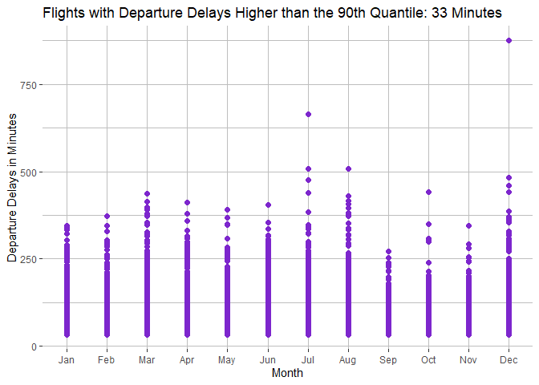
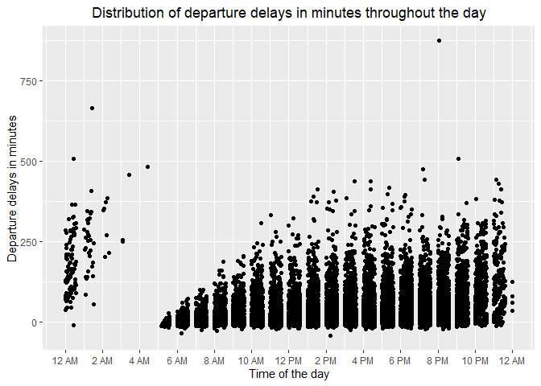
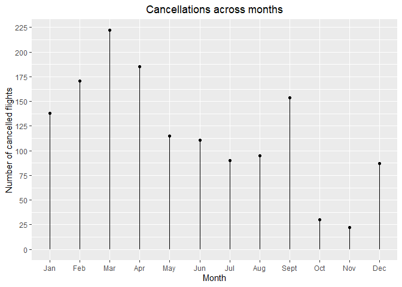
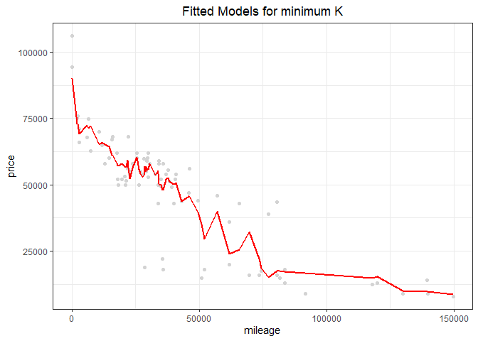
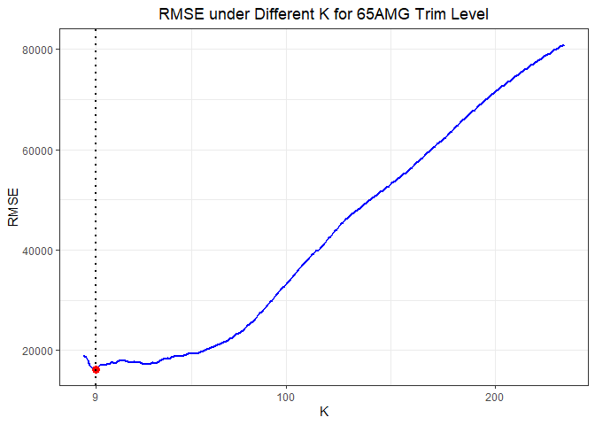

Exercise 1
================
By Eliza Malinova, Zhenghao Li, and Raushan Baizakova

# 1\. Data Visualization: Flights at ABIA

## 1.1 How Does the Airport Traffic Looks Like

## 1.2 Which City Has the Most Flights from Austin?

The map shows the airports whose out of Austin flights have the highest
departure delay on average. The darker points indicate higher mean of
departure delay. Here, the darkest point on the map is the DSM airport
with an average departure delay of more than 125 minutes.

To construct the map, we first grouped the ABIA data by destination and
calculated the mean for each destination airport. Afterwards, we used
the airports data from the MUCflights which includes the airport names
abbreviation and the cities where they are located. The airports table
has been joined with the “data” table which includes the mean of delayed
departure by airports. The common column by which the joined has
occurred is the airports name column: “Dest”.

## 1.3 Are Monthly Average Departure Delay and Arrival Delay Different

## 1.4 For Every Weekday, Which Month Is the Worst For Travel

The graph displays the average of departure delays for each weekday of
the month. For example, if the traveler is planning on traveling
December on a Saturday, he can expect to encounter a departure delay of
18 minutes on average. However, if a traveler usually travels for
business purposes, he or she would mostly travel on weekdays such as
Mondays or Tuesdays, whose highest expected delays on average occur in
March.

For this graph, the data – ABIA has been grouped first by Month and then
by Day of Week by taking the average of DepDelay for each weekday of the
month. In this way, we can account for the different delays that are
expected for each weekday of the month, since delays tend to vary by
month. There are months in which business travelers dominate such as
March and April, hence the weekdays with high delays will on average be
Monday to Thursday. On the other hand, leisure travelers tend to travel
mostly in December, thus highest delays for this month will be expected
during the weekend.

## 1.5 Which Month Has the Most Extreme Delays

## 1.6 Which City Has the Worst Average Departure Delays

\#\#1.7 When and How Long to Expect the Delays

\#\#1.8 Which Delays Happened Most Frequently

\#\#1.9 Which Month Has Most Cancellations

# K-nearest neighbors

## 2.1 Look at Price vs Mileage For Each Trim Level

## 2.1 The Optimal K Vlaue for 350 Trim Level

## 2.2 The Optimal K Vlaue for 65AMG Trim Level

