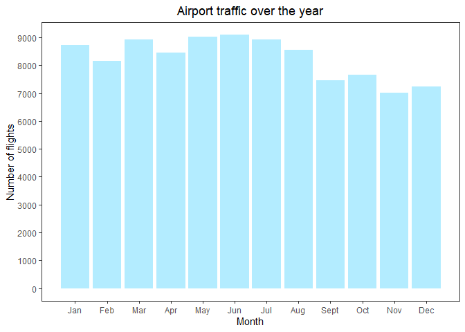
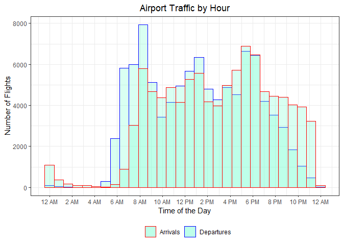
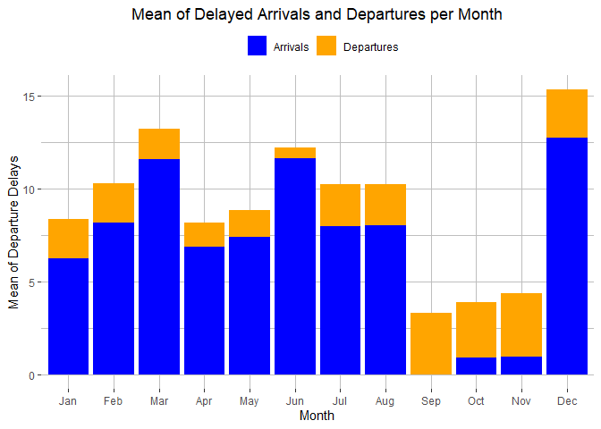
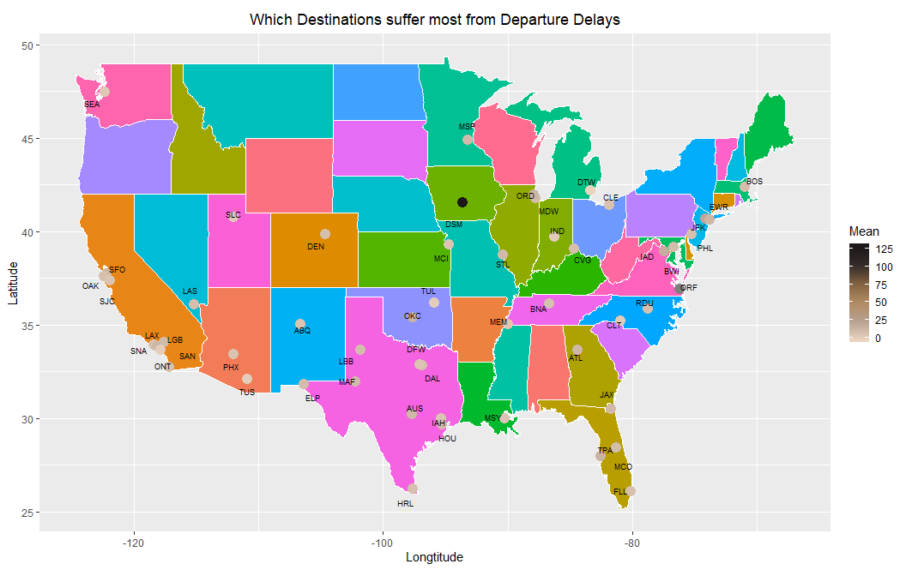
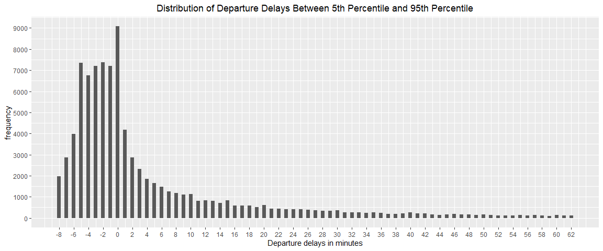

Exercise 1
================
By Eliza Malinova, Zhenghao Li, and Raushan Baizakova

# 1\. Data Visualization: Flights at ABIA

## 1.1 How Does the Airport Traffic Looks Like

## 1.6 Which City Has the Most Flights from Austin?

## 1.7 Are Monthly Average Departure Delay and Arrival Delay Different

## 1.2 For Every Weekday, Which Month Is the Worst For Travel

## 1.3 Which Month Has the Most Extreme Delays

## 1.4 Which City Has the Worst Average Departure Delays

\#\#1.6. When and How Long to Expect the Delays

\#\#1.5. Which Delays Happened Most Frequently

\#\#1.8. Which Month Has Most Cancellations

# K-nearest neighbors

## 2.1 Look at Price vs Mileage For Each Trim Level

## 2.1 The Optimal K Vlaue for 350 Trim Level

## 2.2 The Optimal K Vlaue for 65AMG Trim Level

