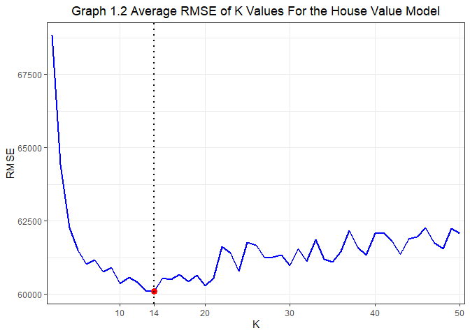

Exercise 2
================
By Eliza Malinova, Zhenghao Li, and Raushan Baizakova

# 1\. Saratoga house prices

## 1.1 Select a Good Model for Predicting Prices

In this exercise, the purpose is to choose a model good at predicting
housing prices based on the dataset Saratoga. The dataset has 1728
observations and 16 variables including price, land value, age, rooms,
and other house characteristics. The target variable is price. Before
building models, there is an issue about the target variable: a housing
price consists of the land value and the house value. The land value is
predetermined before a house is built and is less likely to be affected
by those house characteristics. Moreover, the land value is an intrinsic
part of a housing price. So, generally, the land value should be
excluded from our feature variables to avoid regressing the target
variable on a variable that is a part of the target variable itself. To
tackle with this issue, we used the following procedure.

Step1 Use price as the target variable

1)  Manually build a model that has a lower RMSE than the medium model
    of price;

2)  Use forward selection method to automatically select a model with
    the lowest AIC;

3)  Compare the RMSE of the model manually built and the RMSE of the
    mode forward selected, choosing the model with a lower RMSE.

Step 2 Generate a new target variable houseValue by subtracting land
value from the price

1)  Build a medium model use houseValue as the target variable and the
    same feature variables as in the medium model of Step 1;

2)  Manually build a model that has a lower RMSE than above medium model
    of house value;

3)  Use forward selection method to automatically select a model with
    the lowest AIC and compare the RMSE of the selected model with the
    RMSE of the manually built model, choosing the model with a lower
    RMSE.

Step 3 Compare the chosen model in Step 1 with the chosen model in Step
2 and use the model with a lower RMSE to help predicting the housing
price.

Table 1.1 shows the models we compared in Step 1.

<table class="table" style="margin-left: auto; margin-right: auto;">

<caption>

**Table 1.1 : Models With Price As the Target Variable**

</caption>

<tbody>

<tr>

<td style="text-align:left;">

Baseline Model 1 (Medium Model)

</td>

</tr>

<tr>

<td style="text-align:left;">

price = lotSize + age + livingArea + pctCollege + bedrooms +
fireplaces+bathrooms + rooms + heating + fuel + centralAir

</td>

</tr>

<tr>

<td style="text-align:left;">

Price Model 1 (Manually Built Model)

</td>

</tr>

<tr>

<td style="text-align:left;">

price = rooms + bathrooms + bathrooms*rooms + lotSize +
newConstruction+livingArea + livingArea*rooms + lotSize \* livingArea +
pctCollege + heating + fuel + livingArea \* (heating + fuel) +
centralAir + waterfront

</td>

</tr>

<tr>

<td style="text-align:left;">

Price Model 2 (Forward Selected Model)

</td>

</tr>

<tr>

<td style="text-align:left;">

price = livingArea + landValue + bathrooms + waterfront +
newConstruction + heating + lotSize + age + centralAir + rooms +
bedrooms + landValue \* newConstruction + bathrooms \* heating +
livingArea \* bathrooms + lotSize \* age + livingArea \* waterfront +
landValue \* lotSize + livingArea \* centralAir + age \* centralAir +
livingArea \* landValue + bathrooms \* bedrooms + bathrooms \*
waterfront + heating \* bedrooms + heating \* rooms + waterfront \*
centralAir + waterfront \* lotSize + landValue \* age + age \* rooms +
livingArea \* lotSize + lotSize \* rooms + lotSize \* centralAir

</td>

</tr>

<tr>

<td style="text-align:left;">

Price Model 2.1 (Forward Selected Model without landValue)

</td>

</tr>

<tr>

<td style="text-align:left;">

price = livingArea + bathrooms + waterfront + newConstruction +
heating+lotSize + age + centralAir + rooms + bedrooms + bathrooms \*
heating + livingArea \* bathrooms + lotSize \* age + livingArea \*
waterfront + livingArea \* centralAir + age \* centralAir + bathrooms \*
bedrooms + bathrooms \* waterfront + heating \* bedrooms + heating \*
rooms + waterfront \* centralAir + waterfront \* lotSize + age \*
rooms+livingArea \* lotSize + lotSize \* rooms + lotSize \* centralAir

</td>

</tr>

</tbody>

</table>

All the models are measured by the average out-of-sample RMSE. After
randomly splitting the dataset into a train data set and a test dataset,
we ran three models in the train dataset, and then used the test dataset
to get an out-of-sample RMSE. We repeated this procedure for 100 times
and then took the average of all out-of-sample RMSE. The average
out-of-sample RMSE are listed in the following table.

<table class="table" style="width: auto !important; margin-left: auto; margin-right: auto;">

<caption>

**Table 1.2 : RMSE for Price Models of Step 1**

</caption>

<tbody>

<tr>

<td style="text-align:left;width: 10em; ">

Baseline Model 1

</td>

<td style="text-align:right;">

66426.91

</td>

</tr>

<tr>

<td style="text-align:left;width: 10em; ">

Price Model 1

</td>

<td style="text-align:right;">

63724.62

</td>

</tr>

<tr>

<td style="text-align:left;width: 10em; ">

Price Model 2

</td>

<td style="text-align:right;">

58952.32

</td>

</tr>

<tr>

<td style="text-align:left;width: 10em; ">

Price Model 2.1

</td>

<td style="text-align:right;">

65153.66

</td>

</tr>

</tbody>

</table>

According to above table, the Price Model 2 has an average out-of-sample
RMSE has the lowest average out-of-sample around 58000.However, the
Price Model 2 includes the variable landValue as a feature variable,
which is a part of price. Therefore, the low RMSE of Price Model 2 is
probably from using a part of the target variable to explain the target
variable, which disturbs the assessment of predictive abilities of other
feature variables. To see that, we ran the Price Model 2 after removing
landValue and its interactions with other feature variables on the
right-hand side. The resulted RMSE (of Price Model 2.1) increased to
around 64000, though still lower than the Baseline Model 1.

To address this problem, we implemented the Step 2, building three
models with the houseValue as the target variable, as shown in Table 1.3

<table class="table" style="margin-left: auto; margin-right: auto;">

<caption>

**Table 1.3 : Models With houseValue As the Target Variable**

</caption>

<tbody>

<tr>

<td style="text-align:left;">

Baseline Model 2 (Medium Model of houseValue)

</td>

</tr>

<tr>

<td style="text-align:left;">

houseValue = lotSize + age + livingArea + pctCollege + bedrooms +
fireplaces + bathrooms + rooms + heating + fuel + centralAir

</td>

</tr>

<tr>

<td style="text-align:left;">

House Value Model 1 (Manually Built Model)

</td>

</tr>

<tr>

<td style="text-align:left;">

houseValue = landValue + rooms + bathrooms + bathrooms*rooms + lotSize +
newConstruction+ livingArea + livingArea * rooms+lotSize \* livingArea +
pctCollege + heating + fuel +livingArea \* heating + livingArea \*
fuel+centralAir + waterfront

</td>

</tr>

<tr>

<td style="text-align:left;">

House Value Model 2 (Forward Selected Model)

</td>

</tr>

<tr>

<td style="text-align:left;">

houseValue = livingArea + bathrooms + waterfront + newConstruction +
heating + lotSize + age + rooms + centralAir + landValue + bedrooms +
bathrooms \* heating + livingArea \* bathrooms + lotSize \* age +
livingArea \* newConstruction + livingArea \* waterfront + livingArea \*
centralAir + age \* centralAir + newConstruction \* landValue + lotSize
\* landValue + livingArea \* landValue + bathrooms \* bedrooms +
bathrooms \* newConstruction + heating \* bedrooms + heating \* rooms +
bathrooms \* waterfront + waterfront \* centralAir + waterfront \*
lotSize + age \* landValue + age \* rooms + livingArea \* lotSize +
lotSize \* rooms + lotSize \* centralAir

</td>

</tr>

</tbody>

</table>

The Baseline Model 2 has the same feature variables as the Baseline
Model 1. The House Value Model 1 has the same feature variables as Price
Model 1 except including the landValue variable, since house values and
land values are more likely to be affected by different factors and
correlated much less than prices and land values. House Value Model 2
was picked by the forward selection. The average out-of-sample RMSE are
shown in Table 1.4.

<table>

<caption>

**Table 1.4 : RMSE for HouseValue Models of Step 2**

</caption>

<tbody>

<tr>

<td style="text-align:left;">

Baseline Model 2

</td>

<td style="text-align:right;">

60714.85

</td>

</tr>

<tr>

<td style="text-align:left;">

House Value Model 1

</td>

<td style="text-align:right;">

58817.31

</td>

</tr>

<tr>

<td style="text-align:left;">

House Value Model 2

</td>

<td style="text-align:right;">

58695.63

</td>

</tr>

</tbody>

</table>

The results show that the House Value Model 1 and House Value Model 2
both have the average out-of-sample RMSE around 59000, a value much
lower than that of Price Model 2.1, but close to that of Price Model 2
that regresses price on landValue and other characteristics.

Therefore, based on the average out-of-sample RMSE, we can choose either
House Value Model 1 or House Value Model 2. If we prefer a more
parsimonious mode, House Value Model 1 is to be selected. If preferring
a lower AIC, House Value Model 2 is to be selected since forward
selection in default returns the model with the lowest AIC. But both
have much lower RMSE than the Baseline Model 2 as well as Baseline Model
1.

Note that since for HouseValue models predict house values, we need to
add those corresponding land values to predicted house values when
predicting prices

## 1.2 Those Extremely Strong Price Drivers

Now we decide to prefer a more parsimonious model hence choose House
Value Model 1. To see which variables and interactions are extremely
strong in driving the price, we list the estimates of coefficients in
the Table 1.5.

<table style="border-collapse:collapse; border:none;">

<caption style="font-weight: bold; text-align:left;">

Table 1.5 Coefficients of House Value Model 1

</caption>

<tr>

<th style="border-top: double; text-align:center; font-style:normal; font-weight:bold; padding:0.2cm;  text-align:left; ">

 

</th>

<th colspan="3" style="border-top: double; text-align:center; font-style:normal; font-weight:bold; padding:0.2cm; ">

House Value Model 1

</th>

</tr>

<tr>

<td style=" text-align:center; border-bottom:1px solid; font-style:italic; font-weight:normal;  text-align:left; ">

Predictors

</td>

<td style=" text-align:center; border-bottom:1px solid; font-style:italic; font-weight:normal;  ">

Coefficients

</td>

<td style=" text-align:center; border-bottom:1px solid; font-style:italic; font-weight:normal;  ">

CI

</td>

<td style=" text-align:center; border-bottom:1px solid; font-style:italic; font-weight:normal;  ">

p

</td>

</tr>

<tr>

<td style=" padding:0.2cm; text-align:left; vertical-align:top; text-align:left; ">

landValue

</td>

<td style=" padding:0.2cm; text-align:left; vertical-align:top; text-align:center;  ">

\-0.19

</td>

<td style=" padding:0.2cm; text-align:left; vertical-align:top; text-align:center;  ">

\-0.29 – -0.08

</td>

<td style=" padding:0.2cm; text-align:left; vertical-align:top; text-align:center;  ">

<strong>\<0.001

</td>

</tr>

<tr>

<td style=" padding:0.2cm; text-align:left; vertical-align:top; text-align:left; ">

rooms

</td>

<td style=" padding:0.2cm; text-align:left; vertical-align:top; text-align:center;  ">

\-3563.03

</td>

<td style=" padding:0.2cm; text-align:left; vertical-align:top; text-align:center;  ">

\-8260.48 – 1134.42

</td>

<td style=" padding:0.2cm; text-align:left; vertical-align:top; text-align:center;  ">

0.137

</td>

</tr>

<tr>

<td style=" padding:0.2cm; text-align:left; vertical-align:top; text-align:left; ">

bathrooms

</td>

<td style=" padding:0.2cm; text-align:left; vertical-align:top; text-align:center;  ">

18929.88

</td>

<td style=" padding:0.2cm; text-align:left; vertical-align:top; text-align:center;  ">

\-2632.58 – 40492.34

</td>

<td style=" padding:0.2cm; text-align:left; vertical-align:top; text-align:center;  ">

0.085

</td>

</tr>

<tr>

<td style=" padding:0.2cm; text-align:left; vertical-align:top; text-align:left; ">

lotSize

</td>

<td style=" padding:0.2cm; text-align:left; vertical-align:top; text-align:center;  ">

30604.13

</td>

<td style=" padding:0.2cm; text-align:left; vertical-align:top; text-align:center;  ">

15633.95 – 45574.31

</td>

<td style=" padding:0.2cm; text-align:left; vertical-align:top; text-align:center;  ">

<strong>\<0.001

</td>

</tr>

<tr>

<td style=" padding:0.2cm; text-align:left; vertical-align:top; text-align:left; ">

newConstruction \[No\]

</td>

<td style=" padding:0.2cm; text-align:left; vertical-align:top; text-align:center;  ">

54850.30

</td>

<td style=" padding:0.2cm; text-align:left; vertical-align:top; text-align:center;  ">

38832.70 – 70867.90

</td>

<td style=" padding:0.2cm; text-align:left; vertical-align:top; text-align:center;  ">

<strong>\<0.001

</td>

</tr>

<tr>

<td style=" padding:0.2cm; text-align:left; vertical-align:top; text-align:left; ">

livingArea

</td>

<td style=" padding:0.2cm; text-align:left; vertical-align:top; text-align:center;  ">

59.32

</td>

<td style=" padding:0.2cm; text-align:left; vertical-align:top; text-align:center;  ">

33.23 – 85.41

</td>

<td style=" padding:0.2cm; text-align:left; vertical-align:top; text-align:center;  ">

<strong>\<0.001

</td>

</tr>

<tr>

<td style=" padding:0.2cm; text-align:left; vertical-align:top; text-align:left; ">

pctCollege

</td>

<td style=" padding:0.2cm; text-align:left; vertical-align:top; text-align:center;  ">

\-109.55

</td>

<td style=" padding:0.2cm; text-align:left; vertical-align:top; text-align:center;  ">

\-436.75 – 217.64

</td>

<td style=" padding:0.2cm; text-align:left; vertical-align:top; text-align:center;  ">

0.511

</td>

</tr>

<tr>

<td style=" padding:0.2cm; text-align:left; vertical-align:top; text-align:left; ">

heating \[hot water/steam\]

</td>

<td style=" padding:0.2cm; text-align:left; vertical-align:top; text-align:center;  ">

48517.46

</td>

<td style=" padding:0.2cm; text-align:left; vertical-align:top; text-align:center;  ">

21006.92 – 76028.00

</td>

<td style=" padding:0.2cm; text-align:left; vertical-align:top; text-align:center;  ">

<strong>0.001</strong>

</td>

</tr>

<tr>

<td style=" padding:0.2cm; text-align:left; vertical-align:top; text-align:left; ">

heating \[electric\]

</td>

<td style=" padding:0.2cm; text-align:left; vertical-align:top; text-align:center;  ">

60387.62

</td>

<td style=" padding:0.2cm; text-align:left; vertical-align:top; text-align:center;  ">

\-50297.06 – 171072.31

</td>

<td style=" padding:0.2cm; text-align:left; vertical-align:top; text-align:center;  ">

0.285

</td>

</tr>

<tr>

<td style=" padding:0.2cm; text-align:left; vertical-align:top; text-align:left; ">

fuel \[electric\]

</td>

<td style=" padding:0.2cm; text-align:left; vertical-align:top; text-align:center;  ">

\-43047.19

</td>

<td style=" padding:0.2cm; text-align:left; vertical-align:top; text-align:center;  ">

\-152730.92 – 66636.55

</td>

<td style=" padding:0.2cm; text-align:left; vertical-align:top; text-align:center;  ">

0.441

</td>

</tr>

<tr>

<td style=" padding:0.2cm; text-align:left; vertical-align:top; text-align:left; ">

fuel \[oil\]

</td>

<td style=" padding:0.2cm; text-align:left; vertical-align:top; text-align:center;  ">

25784.00

</td>

<td style=" padding:0.2cm; text-align:left; vertical-align:top; text-align:center;  ">

\-3170.21 – 54738.20

</td>

<td style=" padding:0.2cm; text-align:left; vertical-align:top; text-align:center;  ">

0.081

</td>

</tr>

<tr>

<td style=" padding:0.2cm; text-align:left; vertical-align:top; text-align:left; ">

centralAir \[No\]

</td>

<td style=" padding:0.2cm; text-align:left; vertical-align:top; text-align:center;  ">

\-11649.39

</td>

<td style=" padding:0.2cm; text-align:left; vertical-align:top; text-align:center;  ">

\-19055.57 – -4243.22

</td>

<td style=" padding:0.2cm; text-align:left; vertical-align:top; text-align:center;  ">

<strong>0.002</strong>

</td>

</tr>

<tr>

<td style=" padding:0.2cm; text-align:left; vertical-align:top; text-align:left; ">

waterfront \[No\]

</td>

<td style=" padding:0.2cm; text-align:left; vertical-align:top; text-align:center;  ">

\-126907.93

</td>

<td style=" padding:0.2cm; text-align:left; vertical-align:top; text-align:center;  ">

\-159501.44 – -94314.42

</td>

<td style=" padding:0.2cm; text-align:left; vertical-align:top; text-align:center;  ">

<strong>\<0.001

</td>

</tr>

<tr>

<td style=" padding:0.2cm; text-align:left; vertical-align:top; text-align:left; ">

rooms \* bathrooms

</td>

<td style=" padding:0.2cm; text-align:left; vertical-align:top; text-align:center;  ">

1080.04

</td>

<td style=" padding:0.2cm; text-align:left; vertical-align:top; text-align:center;  ">

\-1733.00 – 3893.08

</td>

<td style=" padding:0.2cm; text-align:left; vertical-align:top; text-align:center;  ">

0.451

</td>

</tr>

<tr>

<td style=" padding:0.2cm; text-align:left; vertical-align:top; text-align:left; ">

rooms \* livingArea

</td>

<td style=" padding:0.2cm; text-align:left; vertical-align:top; text-align:center;  ">

2.44

</td>

<td style=" padding:0.2cm; text-align:left; vertical-align:top; text-align:center;  ">

\-0.49 – 5.37

</td>

<td style=" padding:0.2cm; text-align:left; vertical-align:top; text-align:center;  ">

0.103

</td>

</tr>

<tr>

<td style=" padding:0.2cm; text-align:left; vertical-align:top; text-align:left; ">

lotSize \* livingArea

</td>

<td style=" padding:0.2cm; text-align:left; vertical-align:top; text-align:center;  ">

\-9.62

</td>

<td style=" padding:0.2cm; text-align:left; vertical-align:top; text-align:center;  ">

\-16.65 – -2.60

</td>

<td style=" padding:0.2cm; text-align:left; vertical-align:top; text-align:center;  ">

<strong>0.007</strong>

</td>

</tr>

<tr>

<td style=" padding:0.2cm; text-align:left; vertical-align:top; text-align:left; ">

livingArea \* heating \[hot water/steam\]

</td>

<td style=" padding:0.2cm; text-align:left; vertical-align:top; text-align:center;  ">

\-34.89

</td>

<td style=" padding:0.2cm; text-align:left; vertical-align:top; text-align:center;  ">

\-49.37 – -20.42

</td>

<td style=" padding:0.2cm; text-align:left; vertical-align:top; text-align:center;  ">

<strong>\<0.001

</td>

</tr>

<tr>

<td style=" padding:0.2cm; text-align:left; vertical-align:top; text-align:left; ">

livingArea \* heating \[electric\]

</td>

<td style=" padding:0.2cm; text-align:left; vertical-align:top; text-align:center;  ">

\-37.72

</td>

<td style=" padding:0.2cm; text-align:left; vertical-align:top; text-align:center;  ">

\-99.58 – 24.14

</td>

<td style=" padding:0.2cm; text-align:left; vertical-align:top; text-align:center;  ">

0.232

</td>

</tr>

<tr>

<td style=" padding:0.2cm; text-align:left; vertical-align:top; text-align:left; ">

livingArea \* fuel \[electric\]

</td>

<td style=" padding:0.2cm; text-align:left; vertical-align:top; text-align:center;  ">

20.51

</td>

<td style=" padding:0.2cm; text-align:left; vertical-align:top; text-align:center;  ">

\-40.45 – 81.48

</td>

<td style=" padding:0.2cm; text-align:left; vertical-align:top; text-align:center;  ">

0.509

</td>

</tr>

<tr>

<td style=" padding:0.2cm; text-align:left; vertical-align:top; text-align:left; ">

livingArea \* fuel \[oil\]

</td>

<td style=" padding:0.2cm; text-align:left; vertical-align:top; text-align:center;  ">

\-21.86

</td>

<td style=" padding:0.2cm; text-align:left; vertical-align:top; text-align:center;  ">

\-37.90 – -5.83

</td>

<td style=" padding:0.2cm; text-align:left; vertical-align:top; text-align:center;  ">

<strong>0.008</strong>

</td>

</tr>

</table>

A brief look tells us that those variables and interactions with
significant coefficients can be candidates of extremely strong drivers
of prices, such as the size of lot (lotSize), if the house is newly
constructed (newConstructionNo), the living are, type of heating system
(heatinghot water/steam and ), the sources of heating (fueloil), if a
house includes waterfront (waterfrontNo), and the interactions between
the living area and heating as well as the living area and fuel.

To decide their relative strength in driving prices, we ran nine models,
each of which is the House Value Model 1 without the specific variable
or interaction we want to look at, and then got the average
out-of-sample RMSE for eight models. The higher the average
out-of-sample RMSE of a model relative to that of the House Value Model
1, the stronger is that excluded variable as a price driver. All the
results are shown in Table 1.6

<table>

<caption>

**Table 1.6 Use Changes in RMSE to Evaluate Price Drivers**

</caption>

<tbody>

<tr>

<td style="text-align:left;">

lotSize

</td>

<td style="text-align:right;">

0.00

</td>

</tr>

<tr>

<td style="text-align:left;">

NewConstruction

</td>

<td style="text-align:right;">

764.74

</td>

</tr>

<tr>

<td style="text-align:left;">

livingArea

</td>

<td style="text-align:right;">

0.00

</td>

</tr>

<tr>

<td style="text-align:left;">

heating

</td>

<td style="text-align:right;">

0.00

</td>

</tr>

<tr>

<td style="text-align:left;">

fuel

</td>

<td style="text-align:right;">

0.00

</td>

</tr>

<tr>

<td style="text-align:left;">

waterfront

</td>

<td style="text-align:right;">

1174.95

</td>

</tr>

<tr>

<td style="text-align:left;">

centralAir

</td>

<td style="text-align:right;">

0.00

</td>

</tr>

<tr>

<td style="text-align:left;">

livingArea\*heating

</td>

<td style="text-align:right;">

347.20

</td>

</tr>

<tr>

<td style="text-align:left;">

livingArea\*fuel

</td>

<td style="text-align:right;">

215.65

</td>

</tr>

</tbody>

</table>

From the difference in RMSE, we can see that four variables have very
strong impact on prices: waterfront, NewConstruction, livingArea \*
heating, and livingArea \* fuel. But other variables are not strong
drivers of prices from the a perspective of RMSE.

## 1.3 The Performance of KNN Method

Now we use KNN regression to predict prices. The approach is similar:
first, use price as the target variable, then use house value as the
target variable, at last choose the model (i.e. choose the value of K)
with a lower RMSE and compare it with the RMSE we have gotten in Q 1.1.
A special aspect in KNN regression is that since the distances between K
points are very sensitive to the magnitudes of variables, all the
variables have to be standardized by their standard deviations at first.
Except that, the whole procedure is the same as in linear regression.
Table 6 shows the lowest average out-of-sample RMSE and corresponding K
values for price KNN model and house value KNN model. We also show how
the average out-of-sample RMSE vary with the different values of K in
Graph 1 (for price model) and Graph 2 (for house value model).

<table>

<caption>

**Table 1.7 Minimum RMSE and Corresponding K**

</caption>

<thead>

<tr>

<th style="text-align:left;">

Models

</th>

<th style="text-align:right;">

Minimum Mean

</th>

<th style="text-align:right;">

K

</th>

</tr>

</thead>

<tbody>

<tr>

<td style="text-align:left;">

The Price Model

</td>

<td style="text-align:right;">

62213.67

</td>

<td style="text-align:right;">

14

</td>

</tr>

<tr>

<td style="text-align:left;">

The House Value Model

</td>

<td style="text-align:right;">

59698.07

</td>

<td style="text-align:right;">

14

</td>

</tr>

</tbody>

</table>

Based on above table and graph, we can conclude: first, house value KNN
model has a lower “lowest average out-of-sample RMSE”. So similar to the
case of linear model, house value also performs better as a target
variable in KNN regression. Second, compared to linear models with the
price as the target variable, the KNN regression has a lower minimum
average out-of-sample RMSE for some K value. But compared to linear
models with the house value as the target variable, KNN doesn’t perform
better since its minimum average out-of-sample is usually higher than
that of the linear model. Therefore, in using RMSE as a measurement of
the performances of models in predicting house prices, linear model is a
better choice if the target variable is house values, while the KNN
regression is better if the target value is the prices. Generally, from
the perspectives of a lower RMSE, a more parsimonious model, and
building a model as reasonable as possible, this report suggests using
House Value Model 1 to predict the market values of properties.

# Problem 2: A hospital audit

In problem 2, we examine the performance of the radiologists by
answering two questions. The first question has the goal to observe how
clinically conservative each radiologist is in recalling patients. The
second question intends to answer whether radiologists weigh less
importance on some risk factor that should be actually considered more
rigorously when making a recall decision.

## Question 1: Are some radiologists more clinically conservative than others in recalling patients, holding patient risk factors equal?

First, we compared the performance of three logit models that regress
Recall on different risk factors:

**Model 1** Recallβ(x) = β1 age + β2
history + β3 symptoms + β4 menopause +
β5 density + β6 radiologist + β7
radiologist\* age + β8 radiologist\* history + β9
radiologist\* symptoms + β10 radiologist\* menopause +
β11 radiologist\*density

**Model 2:** Recallβ(x) = β1 age + β2
history + β3 symptoms + β4 menopause +
β5 density + β6 radiologist

**Model 3:** Recallβ(x) = β1 age + β2
symptoms + β3 age \* symptoms + β4 history +
β5 menopause + β6 density + β7
radiologist

We performed 100 simulations on each model and computed the average
accuracy out rate and the average classification error rate for each of
the three models. Based on these performance rates, we decided which
model to use to predict the probabilities of recall for each
radiologist. All three models have high out of sample performance;
however, models 2 and 3 have higher out of sample accuracies and lower
classification errors on average than model 1. Since models 2 and 3
perform better than model 1, we chose to make the predictions for each
radiologist based on models 2 and 3.

The following table, Table 2.1, displays the average out of sample
accuracies and classification errors for each of the three models.

<table class="table table-striped" style="width: auto !important; margin-left: auto; margin-right: auto;">

<caption>

**Average Model Performance Rates**

</caption>

<thead>

<tr>

<th style="text-align:left;">

</th>

<th style="text-align:right;">

Mean

</th>

</tr>

</thead>

<tbody>

<tr>

<td style="text-align:left;">

Accuracy Out Model 1

</td>

<td style="text-align:right;">

0.8371

</td>

</tr>

<tr>

<td style="text-align:left;">

Accuracy Out Model 2

</td>

<td style="text-align:right;">

0.8488

</td>

</tr>

<tr>

<td style="text-align:left;">

Accuracy Out Model 3

</td>

<td style="text-align:right;">

0.8486

</td>

</tr>

<tr>

<td style="text-align:left;">

Classification Errors Model 1

</td>

<td style="text-align:right;">

0.1634

</td>

</tr>

<tr>

<td style="text-align:left;">

Classification Errors Model 2

</td>

<td style="text-align:right;">

0.1517

</td>

</tr>

<tr>

<td style="text-align:left;">

Classification Errors Model 3

</td>

<td style="text-align:right;">

0.1519

</td>

</tr>

</tbody>

<tfoot>

<tr>

<td style="padding: 0; border: 0;" colspan="100%">

\* Table2.1

</td>

</tr>

</tfoot>

</table>

We use two indicators to determine which radiologists are more
clinically conservative and which are less. The first approach is to
examine the radiologists’ coefficients and compare them while holding
all risk factors constant. The second approach is to compare their
overall probabilities of recalling a patient.

First, we use model 2 to compare the coefficients of each radiologist.
The coefficient of radiologist 89 is the highest. Therefore, given that
radiologist 89 is making the recall decision, the odds of a recall is
multiplied by exp(0.46) \~ 1.59 holding all risk factors constant.
Hence, out of all five radiologists, 89 is the most clinically
conservative in recalling patients. On the other hand, radiologist 34
has the lowest coefficient, so given that this radiologist is making the
recall decision multiplies the odds of spam by exp(-0.52) \~ 0.59
holding all other factors constant. Therefore, radiologist 34 is the
least clinically conservative in recalling patients and he has the
highest threshold for wanting to double check a patient’s results.

The following table shows the coefficients resulting from the
regressions of both models 2 and 3. The coefficients are very similar in
both models, hence the above conclusions apply to model 3 as well.

<table style="border-collapse:collapse; border:none;">

<tr>

<th style="border-top: double; text-align:center; font-style:normal; font-weight:bold; padding:0.2cm;  text-align:left; ">

 

</th>

<th colspan="2" style="border-top: double; text-align:center; font-style:normal; font-weight:bold; padding:0.2cm; ">

Model 2

</th>

<th colspan="2" style="border-top: double; text-align:center; font-style:normal; font-weight:bold; padding:0.2cm; ">

Model 3

</th>

</tr>

<tr>

<td style=" text-align:center; border-bottom:1px solid; font-style:italic; font-weight:normal;  text-align:left; ">

Predictors

</td>

<td style=" text-align:center; border-bottom:1px solid; font-style:italic; font-weight:normal;  ">

Coefficients

</td>

<td style=" text-align:center; border-bottom:1px solid; font-style:italic; font-weight:normal;  ">

p

</td>

<td style=" text-align:center; border-bottom:1px solid; font-style:italic; font-weight:normal;  ">

Coefficients

</td>

<td style=" text-align:center; border-bottom:1px solid; font-style:italic; font-weight:normal;  ">

p

</td>

</tr>

<tr>

<td style=" padding:0.2cm; text-align:left; vertical-align:top; text-align:left; ">

(Intercept)

</td>

<td style=" padding:0.2cm; text-align:left; vertical-align:top; text-align:center;  ">

\-3.28

</td>

<td style=" padding:0.2cm; text-align:left; vertical-align:top; text-align:center;  ">

<strong>\<0.001

</td>

<td style=" padding:0.2cm; text-align:left; vertical-align:top; text-align:center;  ">

\-3.23

</td>

<td style=" padding:0.2cm; text-align:left; vertical-align:top; text-align:center;  ">

<strong>\<0.001

</td>

</tr>

<tr>

<td style=" padding:0.2cm; text-align:left; vertical-align:top; text-align:left; ">

age \[5059\]

</td>

<td style=" padding:0.2cm; text-align:left; vertical-align:top; text-align:center;  ">

0.11

</td>

<td style=" padding:0.2cm; text-align:left; vertical-align:top; text-align:center;  ">

0.707

</td>

<td style=" padding:0.2cm; text-align:left; vertical-align:top; text-align:center;  ">

0.04

</td>

<td style=" padding:0.2cm; text-align:left; vertical-align:top; text-align:center;  ">

0.893

</td>

</tr>

<tr>

<td style=" padding:0.2cm; text-align:left; vertical-align:top; text-align:left; ">

age \[6069\]

</td>

<td style=" padding:0.2cm; text-align:left; vertical-align:top; text-align:center;  ">

0.16

</td>

<td style=" padding:0.2cm; text-align:left; vertical-align:top; text-align:center;  ">

0.665

</td>

<td style=" padding:0.2cm; text-align:left; vertical-align:top; text-align:center;  ">

0.16

</td>

<td style=" padding:0.2cm; text-align:left; vertical-align:top; text-align:center;  ">

0.660

</td>

</tr>

<tr>

<td style=" padding:0.2cm; text-align:left; vertical-align:top; text-align:left; ">

age \[70plus\]

</td>

<td style=" padding:0.2cm; text-align:left; vertical-align:top; text-align:center;  ">

0.11

</td>

<td style=" padding:0.2cm; text-align:left; vertical-align:top; text-align:center;  ">

0.770

</td>

<td style=" padding:0.2cm; text-align:left; vertical-align:top; text-align:center;  ">

0.10

</td>

<td style=" padding:0.2cm; text-align:left; vertical-align:top; text-align:center;  ">

0.794

</td>

</tr>

<tr>

<td style=" padding:0.2cm; text-align:left; vertical-align:top; text-align:left; ">

history

</td>

<td style=" padding:0.2cm; text-align:left; vertical-align:top; text-align:center;  ">

0.22

</td>

<td style=" padding:0.2cm; text-align:left; vertical-align:top; text-align:center;  ">

0.354

</td>

<td style=" padding:0.2cm; text-align:left; vertical-align:top; text-align:center;  ">

0.22

</td>

<td style=" padding:0.2cm; text-align:left; vertical-align:top; text-align:center;  ">

0.350

</td>

</tr>

<tr>

<td style=" padding:0.2cm; text-align:left; vertical-align:top; text-align:left; ">

symptoms

</td>

<td style=" padding:0.2cm; text-align:left; vertical-align:top; text-align:center;  ">

0.73

</td>

<td style=" padding:0.2cm; text-align:left; vertical-align:top; text-align:center;  ">

<strong>0.042</strong>

</td>

<td style=" padding:0.2cm; text-align:left; vertical-align:top; text-align:center;  ">

0.26

</td>

<td style=" padding:0.2cm; text-align:left; vertical-align:top; text-align:center;  ">

0.701

</td>

</tr>

<tr>

<td style=" padding:0.2cm; text-align:left; vertical-align:top; text-align:left; ">

menopause \[postmenoNoHT\]

</td>

<td style=" padding:0.2cm; text-align:left; vertical-align:top; text-align:center;  ">

\-0.19

</td>

<td style=" padding:0.2cm; text-align:left; vertical-align:top; text-align:center;  ">

0.415

</td>

<td style=" padding:0.2cm; text-align:left; vertical-align:top; text-align:center;  ">

\-0.21

</td>

<td style=" padding:0.2cm; text-align:left; vertical-align:top; text-align:center;  ">

0.380

</td>

</tr>

<tr>

<td style=" padding:0.2cm; text-align:left; vertical-align:top; text-align:left; ">

menopause \[postmenounknown\]

</td>

<td style=" padding:0.2cm; text-align:left; vertical-align:top; text-align:center;  ">

0.40

</td>

<td style=" padding:0.2cm; text-align:left; vertical-align:top; text-align:center;  ">

0.385

</td>

<td style=" padding:0.2cm; text-align:left; vertical-align:top; text-align:center;  ">

0.37

</td>

<td style=" padding:0.2cm; text-align:left; vertical-align:top; text-align:center;  ">

0.430

</td>

</tr>

<tr>

<td style=" padding:0.2cm; text-align:left; vertical-align:top; text-align:left; ">

menopause \[premeno\]

</td>

<td style=" padding:0.2cm; text-align:left; vertical-align:top; text-align:center;  ">

0.34

</td>

<td style=" padding:0.2cm; text-align:left; vertical-align:top; text-align:center;  ">

0.274

</td>

<td style=" padding:0.2cm; text-align:left; vertical-align:top; text-align:center;  ">

0.35

</td>

<td style=" padding:0.2cm; text-align:left; vertical-align:top; text-align:center;  ">

0.259

</td>

</tr>

<tr>

<td style=" padding:0.2cm; text-align:left; vertical-align:top; text-align:left; ">

density \[2\]

</td>

<td style=" padding:0.2cm; text-align:left; vertical-align:top; text-align:center;  ">

1.22

</td>

<td style=" padding:0.2cm; text-align:left; vertical-align:top; text-align:center;  ">

<strong>0.024</strong>

</td>

<td style=" padding:0.2cm; text-align:left; vertical-align:top; text-align:center;  ">

1.20

</td>

<td style=" padding:0.2cm; text-align:left; vertical-align:top; text-align:center;  ">

<strong>0.026</strong>

</td>

</tr>

<tr>

<td style=" padding:0.2cm; text-align:left; vertical-align:top; text-align:left; ">

density \[3\]

</td>

<td style=" padding:0.2cm; text-align:left; vertical-align:top; text-align:center;  ">

1.42

</td>

<td style=" padding:0.2cm; text-align:left; vertical-align:top; text-align:center;  ">

<strong>0.008</strong>

</td>

<td style=" padding:0.2cm; text-align:left; vertical-align:top; text-align:center;  ">

1.40

</td>

<td style=" padding:0.2cm; text-align:left; vertical-align:top; text-align:center;  ">

<strong>0.009</strong>

</td>

</tr>

<tr>

<td style=" padding:0.2cm; text-align:left; vertical-align:top; text-align:left; ">

density \[4\]

</td>

<td style=" padding:0.2cm; text-align:left; vertical-align:top; text-align:center;  ">

1.00

</td>

<td style=" padding:0.2cm; text-align:left; vertical-align:top; text-align:center;  ">

0.097

</td>

<td style=" padding:0.2cm; text-align:left; vertical-align:top; text-align:center;  ">

0.97

</td>

<td style=" padding:0.2cm; text-align:left; vertical-align:top; text-align:center;  ">

0.106

</td>

</tr>

<tr>

<td style=" padding:0.2cm; text-align:left; vertical-align:top; text-align:left; ">

radiologist \[34\]

</td>

<td style=" padding:0.2cm; text-align:left; vertical-align:top; text-align:center;  ">

\-0.52

</td>

<td style=" padding:0.2cm; text-align:left; vertical-align:top; text-align:center;  ">

0.111

</td>

<td style=" padding:0.2cm; text-align:left; vertical-align:top; text-align:center;  ">

\-0.53

</td>

<td style=" padding:0.2cm; text-align:left; vertical-align:top; text-align:center;  ">

0.107

</td>

</tr>

<tr>

<td style=" padding:0.2cm; text-align:left; vertical-align:top; text-align:left; ">

radiologist \[66\]

</td>

<td style=" padding:0.2cm; text-align:left; vertical-align:top; text-align:center;  ">

0.35

</td>

<td style=" padding:0.2cm; text-align:left; vertical-align:top; text-align:center;  ">

0.204

</td>

<td style=" padding:0.2cm; text-align:left; vertical-align:top; text-align:center;  ">

0.35

</td>

<td style=" padding:0.2cm; text-align:left; vertical-align:top; text-align:center;  ">

0.206

</td>

</tr>

<tr>

<td style=" padding:0.2cm; text-align:left; vertical-align:top; text-align:left; ">

radiologist \[89\]

</td>

<td style=" padding:0.2cm; text-align:left; vertical-align:top; text-align:center;  ">

0.46

</td>

<td style=" padding:0.2cm; text-align:left; vertical-align:top; text-align:center;  ">

0.098

</td>

<td style=" padding:0.2cm; text-align:left; vertical-align:top; text-align:center;  ">

0.46

</td>

<td style=" padding:0.2cm; text-align:left; vertical-align:top; text-align:center;  ">

0.101

</td>

</tr>

<tr>

<td style=" padding:0.2cm; text-align:left; vertical-align:top; text-align:left; ">

radiologist \[95\]

</td>

<td style=" padding:0.2cm; text-align:left; vertical-align:top; text-align:center;  ">

\-0.05

</td>

<td style=" padding:0.2cm; text-align:left; vertical-align:top; text-align:center;  ">

0.859

</td>

<td style=" padding:0.2cm; text-align:left; vertical-align:top; text-align:center;  ">

\-0.05

</td>

<td style=" padding:0.2cm; text-align:left; vertical-align:top; text-align:center;  ">

0.872

</td>

</tr>

<tr>

<td style=" padding:0.2cm; text-align:left; vertical-align:top; text-align:left; ">

age \[5059\] \* symptoms

</td>

<td style=" padding:0.2cm; text-align:left; vertical-align:top; text-align:center;  ">

</td>

<td style=" padding:0.2cm; text-align:left; vertical-align:top; text-align:center;  ">

</td>

<td style=" padding:0.2cm; text-align:left; vertical-align:top; text-align:center;  ">

0.91

</td>

<td style=" padding:0.2cm; text-align:left; vertical-align:top; text-align:center;  ">

0.286

</td>

</tr>

<tr>

<td style=" padding:0.2cm; text-align:left; vertical-align:top; text-align:left; ">

age \[6069\] \* symptoms

</td>

<td style=" padding:0.2cm; text-align:left; vertical-align:top; text-align:center;  ">

</td>

<td style=" padding:0.2cm; text-align:left; vertical-align:top; text-align:center;  ">

</td>

<td style=" padding:0.2cm; text-align:left; vertical-align:top; text-align:center;  ">

\-0.03

</td>

<td style=" padding:0.2cm; text-align:left; vertical-align:top; text-align:center;  ">

0.983

</td>

</tr>

<tr>

<td style=" padding:0.2cm; text-align:left; vertical-align:top; text-align:left; ">

age \[70plus\] \* symptoms

</td>

<td style=" padding:0.2cm; text-align:left; vertical-align:top; text-align:center;  ">

</td>

<td style=" padding:0.2cm; text-align:left; vertical-align:top; text-align:center;  ">

</td>

<td style=" padding:0.2cm; text-align:left; vertical-align:top; text-align:center;  ">

0.42

</td>

<td style=" padding:0.2cm; text-align:left; vertical-align:top; text-align:center;  ">

0.752

</td>

</tr>

</table>

Table 2.2 displays the odds ratios resulted from regressing model 2.
Considering the fact that radiologist 13 is the base for the logit
model, radiologist 89 and 66 both increase the odds of recall compared
to radiologist 13, while radiologists 95 and 34 both decrease the odds
of recall compared to radiologist. Hence, observing the odds ratios of
each radiologist, the ranking of radiologists from most clinically
conservative to least clinically conservative is as follows: radiologist
89, radiologist 66, radiologist 13, radiologist 95, radiologist 34.

Table 2.2 confirms the above conclusions and shows odds ratios,
confidence intervals and p-values estimated from regressing model 2.

<table style="border-collapse:collapse; border:none;">

<tr>

<th style="border-top: double; text-align:center; font-style:normal; font-weight:bold; padding:0.2cm;  text-align:left; ">

 

</th>

<th colspan="3" style="border-top: double; text-align:center; font-style:normal; font-weight:bold; padding:0.2cm; ">

Table 2.2: Recall

</th>

</tr>

<tr>

<td style=" text-align:center; border-bottom:1px solid; font-style:italic; font-weight:normal;  text-align:left; ">

Predictors

</td>

<td style=" text-align:center; border-bottom:1px solid; font-style:italic; font-weight:normal;  ">

Odds Ratios

</td>

<td style=" text-align:center; border-bottom:1px solid; font-style:italic; font-weight:normal;  ">

CI

</td>

<td style=" text-align:center; border-bottom:1px solid; font-style:italic; font-weight:normal;  ">

p

</td>

</tr>

<tr>

<td style=" padding:0.2cm; text-align:left; vertical-align:top; text-align:left; ">

(Intercept)

</td>

<td style=" padding:0.2cm; text-align:left; vertical-align:top; text-align:center;  ">

0.04

</td>

<td style=" padding:0.2cm; text-align:left; vertical-align:top; text-align:center;  ">

0.01 – 0.12

</td>

<td style=" padding:0.2cm; text-align:left; vertical-align:top; text-align:center;  ">

<strong>\<0.001

</td>

</tr>

<tr>

<td style=" padding:0.2cm; text-align:left; vertical-align:top; text-align:left; ">

age \[5059\]

</td>

<td style=" padding:0.2cm; text-align:left; vertical-align:top; text-align:center;  ">

1.12

</td>

<td style=" padding:0.2cm; text-align:left; vertical-align:top; text-align:center;  ">

0.63 – 2.00

</td>

<td style=" padding:0.2cm; text-align:left; vertical-align:top; text-align:center;  ">

0.707

</td>

</tr>

<tr>

<td style=" padding:0.2cm; text-align:left; vertical-align:top; text-align:left; ">

age \[6069\]

</td>

<td style=" padding:0.2cm; text-align:left; vertical-align:top; text-align:center;  ">

1.17

</td>

<td style=" padding:0.2cm; text-align:left; vertical-align:top; text-align:center;  ">

0.58 – 2.40

</td>

<td style=" padding:0.2cm; text-align:left; vertical-align:top; text-align:center;  ">

0.665

</td>

</tr>

<tr>

<td style=" padding:0.2cm; text-align:left; vertical-align:top; text-align:left; ">

age \[70plus\]

</td>

<td style=" padding:0.2cm; text-align:left; vertical-align:top; text-align:center;  ">

1.11

</td>

<td style=" padding:0.2cm; text-align:left; vertical-align:top; text-align:center;  ">

0.54 – 2.31

</td>

<td style=" padding:0.2cm; text-align:left; vertical-align:top; text-align:center;  ">

0.770

</td>

</tr>

<tr>

<td style=" padding:0.2cm; text-align:left; vertical-align:top; text-align:left; ">

history

</td>

<td style=" padding:0.2cm; text-align:left; vertical-align:top; text-align:center;  ">

1.24

</td>

<td style=" padding:0.2cm; text-align:left; vertical-align:top; text-align:center;  ">

0.78 – 1.94

</td>

<td style=" padding:0.2cm; text-align:left; vertical-align:top; text-align:center;  ">

0.354

</td>

</tr>

<tr>

<td style=" padding:0.2cm; text-align:left; vertical-align:top; text-align:left; ">

symptoms

</td>

<td style=" padding:0.2cm; text-align:left; vertical-align:top; text-align:center;  ">

2.07

</td>

<td style=" padding:0.2cm; text-align:left; vertical-align:top; text-align:center;  ">

0.99 – 4.09

</td>

<td style=" padding:0.2cm; text-align:left; vertical-align:top; text-align:center;  ">

<strong>0.042</strong>

</td>

</tr>

<tr>

<td style=" padding:0.2cm; text-align:left; vertical-align:top; text-align:left; ">

menopause \[postmenoNoHT\]

</td>

<td style=" padding:0.2cm; text-align:left; vertical-align:top; text-align:center;  ">

0.82

</td>

<td style=" padding:0.2cm; text-align:left; vertical-align:top; text-align:center;  ">

0.52 – 1.31

</td>

<td style=" padding:0.2cm; text-align:left; vertical-align:top; text-align:center;  ">

0.415

</td>

</tr>

<tr>

<td style=" padding:0.2cm; text-align:left; vertical-align:top; text-align:left; ">

menopause \[postmenounknown\]

</td>

<td style=" padding:0.2cm; text-align:left; vertical-align:top; text-align:center;  ">

1.50

</td>

<td style=" padding:0.2cm; text-align:left; vertical-align:top; text-align:center;  ">

0.56 – 3.55

</td>

<td style=" padding:0.2cm; text-align:left; vertical-align:top; text-align:center;  ">

0.385

</td>

</tr>

<tr>

<td style=" padding:0.2cm; text-align:left; vertical-align:top; text-align:left; ">

menopause \[premeno\]

</td>

<td style=" padding:0.2cm; text-align:left; vertical-align:top; text-align:center;  ">

1.41

</td>

<td style=" padding:0.2cm; text-align:left; vertical-align:top; text-align:center;  ">

0.77 – 2.61

</td>

<td style=" padding:0.2cm; text-align:left; vertical-align:top; text-align:center;  ">

0.274

</td>

</tr>

<tr>

<td style=" padding:0.2cm; text-align:left; vertical-align:top; text-align:left; ">

density \[2\]

</td>

<td style=" padding:0.2cm; text-align:left; vertical-align:top; text-align:center;  ">

3.39

</td>

<td style=" padding:0.2cm; text-align:left; vertical-align:top; text-align:center;  ">

1.32 – 11.53

</td>

<td style=" padding:0.2cm; text-align:left; vertical-align:top; text-align:center;  ">

<strong>0.024</strong>

</td>

</tr>

<tr>

<td style=" padding:0.2cm; text-align:left; vertical-align:top; text-align:left; ">

density \[3\]

</td>

<td style=" padding:0.2cm; text-align:left; vertical-align:top; text-align:center;  ">

4.13

</td>

<td style=" padding:0.2cm; text-align:left; vertical-align:top; text-align:center;  ">

1.62 – 14.00

</td>

<td style=" padding:0.2cm; text-align:left; vertical-align:top; text-align:center;  ">

<strong>0.008</strong>

</td>

</tr>

<tr>

<td style=" padding:0.2cm; text-align:left; vertical-align:top; text-align:left; ">

density \[4\]

</td>

<td style=" padding:0.2cm; text-align:left; vertical-align:top; text-align:center;  ">

2.72

</td>

<td style=" padding:0.2cm; text-align:left; vertical-align:top; text-align:center;  ">

0.90 – 10.13

</td>

<td style=" padding:0.2cm; text-align:left; vertical-align:top; text-align:center;  ">

0.097

</td>

</tr>

<tr>

<td style=" padding:0.2cm; text-align:left; vertical-align:top; text-align:left; ">

radiologist \[34\]

</td>

<td style=" padding:0.2cm; text-align:left; vertical-align:top; text-align:center;  ">

0.59

</td>

<td style=" padding:0.2cm; text-align:left; vertical-align:top; text-align:center;  ">

0.31 – 1.12

</td>

<td style=" padding:0.2cm; text-align:left; vertical-align:top; text-align:center;  ">

0.111

</td>

</tr>

<tr>

<td style=" padding:0.2cm; text-align:left; vertical-align:top; text-align:left; ">

radiologist \[66\]

</td>

<td style=" padding:0.2cm; text-align:left; vertical-align:top; text-align:center;  ">

1.43

</td>

<td style=" padding:0.2cm; text-align:left; vertical-align:top; text-align:center;  ">

0.83 – 2.48

</td>

<td style=" padding:0.2cm; text-align:left; vertical-align:top; text-align:center;  ">

0.204

</td>

</tr>

<tr>

<td style=" padding:0.2cm; text-align:left; vertical-align:top; text-align:left; ">

radiologist \[89\]

</td>

<td style=" padding:0.2cm; text-align:left; vertical-align:top; text-align:center;  ">

1.59

</td>

<td style=" padding:0.2cm; text-align:left; vertical-align:top; text-align:center;  ">

0.92 – 2.77

</td>

<td style=" padding:0.2cm; text-align:left; vertical-align:top; text-align:center;  ">

0.098

</td>

</tr>

<tr>

<td style=" padding:0.2cm; text-align:left; vertical-align:top; text-align:left; ">

radiologist \[95\]

</td>

<td style=" padding:0.2cm; text-align:left; vertical-align:top; text-align:center;  ">

0.95

</td>

<td style=" padding:0.2cm; text-align:left; vertical-align:top; text-align:center;  ">

0.53 – 1.69

</td>

<td style=" padding:0.2cm; text-align:left; vertical-align:top; text-align:center;  ">

0.859

</td>

</tr>

</table>

To address the problem that radiologists do not see the same patients we
used counterfactual approach. We applied models 2 and 3 to compute the
predicted probabilities for each radiologist. For a test set, we used
the whole data set but for each prediction we transformed the first
column to include only one radiologist per test set. In this way, each
radiologist’s average predicted probability was calculated using the
same patients.

To find the average predicted probabilities, we took the mean of
predicted probabilities for each radiologist over the patient data set.

Table 2.2 shows the average predicted probability of recalling a patient
for each Radiologist.

<table class="table table-striped" style="width: auto !important; margin-left: auto; margin-right: auto;">

<caption>

**Average Probability per Radiologist**

</caption>

<thead>

<tr>

<th style="text-align:left;">

</th>

<th style="text-align:right;">

Average Probability

</th>

</tr>

</thead>

<tbody>

<tr>

<td style="text-align:left;">

Radiologist 13

</td>

<td style="text-align:right;">

0.1403432

</td>

</tr>

<tr>

<td style="text-align:left;">

Radiologist 34

</td>

<td style="text-align:right;">

0.0917709

</td>

</tr>

<tr>

<td style="text-align:left;">

Radiologist 66

</td>

<td style="text-align:right;">

0.1684051

</td>

</tr>

<tr>

<td style="text-align:left;">

Radiologist 89

</td>

<td style="text-align:right;">

0.2036285

</td>

</tr>

<tr>

<td style="text-align:left;">

Radiologist 95

</td>

<td style="text-align:right;">

0.1271962

</td>

</tr>

</tbody>

<tfoot>

<tr>

<td style="padding: 0; border: 0;" colspan="100%">

\* Table2.2

</td>

</tr>

</tfoot>

</table>

As revealed from Table 2.2, radiologist 89 can be regarded as the most
clinically conservative out of all radiologists, very closely followed
by 66, since both their average predicted probabilities are the highest.
On the other hand, radiologist 34 is the least conservative with the
lowest average phat recorded by both models, giving risk factors
constant. Therefore, if we compare radiologist 89 to radiologist 34, we
can state that radiologist 89 has a lower threshold for wanting to
double-check the patient’s results compared to radiologist 34. These
results confirm the conclusion from our first approach where we compared
coefficients.

To confirm the results above, we also computed false negatives and false
positives for each radiologist. To construct the confusion matrix for
each radiologist, we used the entire data set.

<table class="table" style="width: auto !important; float: left; margin-right: 10px;">

<caption>

**Confusion Matrix: Radiologist 13**

</caption>

<thead>

<tr>

<th style="text-align:left;">

</th>

<th style="text-align:center;">

recall = 0

</th>

<th style="text-align:center;">

recall = 1

</th>

</tr>

</thead>

<tbody>

<tr>

<td style="text-align:left;">

cancer = 0

</td>

<td style="text-align:center;">

165

</td>

<td style="text-align:center;">

25

</td>

</tr>

<tr>

<td style="text-align:left;">

cancer = 1

</td>

<td style="text-align:center;">

4

</td>

<td style="text-align:center;">

4

</td>

</tr>

</tbody>

</table>

<table class="table" style="width: auto !important; margin-right: 0; margin-left: auto">

<caption>

**Confusion Matrix: Radiologist 34**

</caption>

<thead>

<tr>

<th style="text-align:left;">

</th>

<th style="text-align:center;">

recall = 0

</th>

<th style="text-align:center;">

recall = 1

</th>

</tr>

</thead>

<tbody>

<tr>

<td style="text-align:left;">

cancer = 0

</td>

<td style="text-align:center;">

177

</td>

<td style="text-align:center;">

13

</td>

</tr>

<tr>

<td style="text-align:left;">

cancer = 1

</td>

<td style="text-align:center;">

3

</td>

<td style="text-align:center;">

4

</td>

</tr>

</tbody>

</table>

<table class="table" style="width: auto !important; float: left; margin-right: 10px;">

<caption>

**Confusion Matrix: Radiologist 66**

</caption>

<thead>

<tr>

<th style="text-align:left;">

</th>

<th style="text-align:center;">

recall = 0

</th>

<th style="text-align:center;">

recall = 1

</th>

</tr>

</thead>

<tbody>

<tr>

<td style="text-align:left;">

cancer = 0

</td>

<td style="text-align:center;">

157

</td>

<td style="text-align:center;">

33

</td>

</tr>

<tr>

<td style="text-align:left;">

cancer = 1

</td>

<td style="text-align:center;">

4

</td>

<td style="text-align:center;">

4

</td>

</tr>

</tbody>

</table>

<table class="table" style="width: auto !important; margin-right: 0; margin-left: auto">

<caption>

**Confusion Matrix: Radiologist 89**

</caption>

<thead>

<tr>

<th style="text-align:left;">

</th>

<th style="text-align:center;">

recall = 0

</th>

<th style="text-align:center;">

recall = 1

</th>

</tr>

</thead>

<tbody>

<tr>

<td style="text-align:left;">

cancer = 0

</td>

<td style="text-align:center;">

157

</td>

<td style="text-align:center;">

33

</td>

</tr>

<tr>

<td style="text-align:left;">

cancer = 1

</td>

<td style="text-align:center;">

2

</td>

<td style="text-align:center;">

5

</td>

</tr>

</tbody>

</table>

<table class="table" style="width: auto !important; margin-left: auto; margin-right: auto;">

<caption>

**Confusion Matrix: Radiologist 95**

</caption>

<thead>

<tr>

<th style="text-align:left;">

</th>

<th style="text-align:center;">

recall = 0

</th>

<th style="text-align:center;">

recall = 1

</th>

</tr>

</thead>

<tbody>

<tr>

<td style="text-align:left;">

cancer = 0

</td>

<td style="text-align:center;">

168

</td>

<td style="text-align:center;">

22

</td>

</tr>

<tr>

<td style="text-align:left;">

cancer = 1

</td>

<td style="text-align:center;">

2

</td>

<td style="text-align:center;">

5

</td>

</tr>

</tbody>

</table>

1.  For radiologist 13, False Negative is 4/(4+8) = 0.5, False Positive
    is 25/(165+25) = 0.13.
2.  For radiologist 34, False Negative is 3/(3+4) = 0.43, False Positive
    is 13/(177+33) = 0.068.
3.  For radiologist 66, False Negative is 4/(4+4) = 0.5, False Positive
    is 33/(157+33) = 0.1737.
4.  For radiologist 89, False Negative is 2/(2+5) = 0.2857, False
    Positive is 33/(157+33) = 0.1737.
5.  For radiologist 95, False Negative is 2/(2+5) = 0.2857, False
    Positive is 22/(168+22) = 0.1158.

The false positive rates support the prediction probability of results
made by both models. We stated that the most clinically conservative
radiologist seems to be radiologist 89 and the second most clinically
conservative – radiologist 66. The false positive rates for both
radiologists confirm these results since their rates are the highest,
meaning both radiologists 89 and 66 have wrongly recorded recall as 1
most frequently. Radiologist 34 has the smallest false positive rate
since he/she can be considered as the radiologist who is most likely to
not recall patients who do not end up having cancer. This result also
supports the fact that radiologist 34 has the smallest probability of
recalling a patient given all risk factors constant.

As for the False Negative results, the radiologists that are most likely
to recall the patients that do end up having cancer are radiologists 89
and 95 because they have the lowest false negatives rates.

## Question 2: Does the data suggest that radiologists should be weighing some clinical risk factors more heavily than they currently are?

For question 2, we have decided to use two ways to evaluate what cancer
risk factors radiologists weigh more heavily. First, we approach the
problem through comparison of deviances to measure the performance of
the model in terms of the predicted probabilities. Second, we examine
the coefficients of each risk factor separately to conclude if
radiologists are putting enough weight on these factors when making a
recall decision.

In the first approach, where we compute deviances, we are not using
confusion matrices and related error rates as they are looking at
decisions of class labels as opposed to how well calibrated are
predicted probabilities to the actual outcomes. In making decisions,
both costs and probabilities matter, as different kinds of errors may
have different costs, especially if we are considering the costs related
to cancer outcomes. Thus, we want to evaluate the probability of
prediction models independently of the decisions that it makes about the
class label.

By calculating the likelihood of each model’s predicted probabilities
and then finding the deviance, we conclude whether radiologists should
be weighting some clinical factors more heavily that they currently are.
The decisions are based on the magnitude of the average deviance of each
model. If a model has a smaller average deviance, it is performing
better than a one with higher average deviance. Hence, the model with
better(smaller) deviance accounts for some factor(s) that have not been
accounted for in the model with higher deviance.

We compared the following logit models that regress cancer on risk
factors. Model 1 is the baseline model that we compare all other models
with:

**Model 1:** Cancerβ(x) = β1 recall

**Model 2:** Cancerβ(x) = β1 recall +
β2 menopause

**Model 3:** Cancerβ(x) = β1 recall +
β2 density

**Model 4:** Cancerβ(x) = β1 recall +
β2 history

**Model 5:** Cancerβ(x) = β1 recall +
β2 symptoms

**Model 6:** Cancerβ(x) = β1 recall +
β2 age

**Model 7:** Cancerβ(x) = β1 recall +
β2 density + β2 symptoms

**Model 8:** Cancerβ(x) = β1 recall +
β2 density + β2 symptoms + β2
menopause

We simulated 100 regressions for each model, calculated the deviances
for each model and then took average of these deviances to come up with
an average deviance per model. The reason why we have included models 7
and 8 is because on average density, symptoms and menopause have the
lowest average deviances compared to all other models except the
baseline model, model 1. Hence, we wanted to observe if the average
deviances of models 7 and 8 will be lower than that of the baseline
model.

Table 2.3 reveals the average deviance of each of the 10 models.

<table class="table table-striped" style="width: auto !important; margin-left: auto; margin-right: auto;">

<caption>

**Average Deviance per Model**

</caption>

<thead>

<tr>

<th style="text-align:left;">

</th>

<th style="text-align:right;">

Average Deviance

</th>

</tr>

</thead>

<tbody>

<tr>

<td style="text-align:left;">

devBaseline

</td>

<td style="text-align:right;">

28.45398

</td>

</tr>

<tr>

<td style="text-align:left;">

Deviance: Menopause

</td>

<td style="text-align:right;">

29.11230

</td>

</tr>

<tr>

<td style="text-align:left;">

Deviance: Density

</td>

<td style="text-align:right;">

32.19911

</td>

</tr>

<tr>

<td style="text-align:left;">

Deviance: History

</td>

<td style="text-align:right;">

28.78543

</td>

</tr>

<tr>

<td style="text-align:left;">

Deviance: Symptoms

</td>

<td style="text-align:right;">

28.70100

</td>

</tr>

<tr>

<td style="text-align:left;">

Deviance: Age

</td>

<td style="text-align:right;">

28.61778

</td>

</tr>

<tr>

<td style="text-align:left;">

Deviance: Density\&Symptoms

</td>

<td style="text-align:right;">

32.45235

</td>

</tr>

<tr>

<td style="text-align:left;">

Deviance: Density, Symptoms & Menopause

</td>

<td style="text-align:right;">

32.99297

</td>

</tr>

</tbody>

<tfoot>

<tr>

<td style="padding: 0; border: 0;" colspan="100%">

\* Table2.3

</td>

</tr>

</tfoot>

</table>

We consider the first model, where we are regressing cancer only on
recall, as the baseline model. If the radiologists have been weighing
risk factors flawlessly, the baseline model would have the lowest
deviance, as they take into account all the risk factors when making
decisions to recall the patients. By comparing the baseline model with
all the models that have only one more variable added to the recall
variable (models 2, 3, 4, 5, 6), we find that the lowest average
deviance has model 1, the baseline model, as shown in Table 2.3. This
result indicates that radiologists are considering strongly enough all
the risk factors when making a recall decision.

Lastly, we compare the coefficients of models 2, 3, 4, 5, 6 to see if
they are high enough. If a coefficient has a significant effect on the
odds of having a cancer, then the radiologist may not be considering
that risk factor as strongly in making his or her recall decision.

The following table shows the coefficients of each of the models that
consist of one variable.

<table style="border-collapse:collapse; border:none;">

<tr>

<th style="border-top: double; text-align:center; font-style:normal; font-weight:bold; padding:0.2cm;  text-align:left; ">

 

</th>

<th colspan="1" style="border-top: double; text-align:center; font-style:normal; font-weight:bold; padding:0.2cm; ">

Model 1

</th>

<th colspan="1" style="border-top: double; text-align:center; font-style:normal; font-weight:bold; padding:0.2cm; ">

Model 2

</th>

<th colspan="1" style="border-top: double; text-align:center; font-style:normal; font-weight:bold; padding:0.2cm; ">

Model 3

</th>

<th colspan="1" style="border-top: double; text-align:center; font-style:normal; font-weight:bold; padding:0.2cm; ">

Model 4

</th>

<th colspan="1" style="border-top: double; text-align:center; font-style:normal; font-weight:bold; padding:0.2cm; ">

Model 5

</th>

<th colspan="1" style="border-top: double; text-align:center; font-style:normal; font-weight:bold; padding:0.2cm; ">

Model 6

</th>

</tr>

<tr>

<td style=" text-align:center; border-bottom:1px solid; font-style:italic; font-weight:normal;  text-align:left; ">

Predictors

</td>

<td style=" text-align:center; border-bottom:1px solid; font-style:italic; font-weight:normal;  ">

Coefficients

</td>

<td style=" text-align:center; border-bottom:1px solid; font-style:italic; font-weight:normal;  ">

Coefficients

</td>

<td style=" text-align:center; border-bottom:1px solid; font-style:italic; font-weight:normal;  ">

Coefficients

</td>

<td style=" text-align:center; border-bottom:1px solid; font-style:italic; font-weight:normal;  ">

Coefficients

</td>

<td style=" text-align:center; border-bottom:1px solid; font-style:italic; font-weight:normal;  ">

Coefficients

</td>

<td style=" text-align:center; border-bottom:1px solid; font-style:italic; font-weight:normal;  col7">

Coefficients

</td>

</tr>

<tr>

<td style=" padding:0.2cm; text-align:left; vertical-align:top; text-align:left; ">

(Intercept)

</td>

<td style=" padding:0.2cm; text-align:left; vertical-align:top; text-align:center;  ">

\-4.01

</td>

<td style=" padding:0.2cm; text-align:left; vertical-align:top; text-align:center;  ">

\-4.00

</td>

<td style=" padding:0.2cm; text-align:left; vertical-align:top; text-align:center;  ">

\-4.79

</td>

<td style=" padding:0.2cm; text-align:left; vertical-align:top; text-align:center;  ">

\-4.04

</td>

<td style=" padding:0.2cm; text-align:left; vertical-align:top; text-align:center;  ">

\-4.02

</td>

<td style=" padding:0.2cm; text-align:left; vertical-align:top; text-align:center;  col7">

\-4.32

</td>

</tr>

<tr>

<td style=" padding:0.2cm; text-align:left; vertical-align:top; text-align:left; ">

recall

</td>

<td style=" padding:0.2cm; text-align:left; vertical-align:top; text-align:center;  ">

2.26

</td>

<td style=" padding:0.2cm; text-align:left; vertical-align:top; text-align:center;  ">

2.26

</td>

<td style=" padding:0.2cm; text-align:left; vertical-align:top; text-align:center;  ">

2.26

</td>

<td style=" padding:0.2cm; text-align:left; vertical-align:top; text-align:center;  ">

2.26

</td>

<td style=" padding:0.2cm; text-align:left; vertical-align:top; text-align:center;  ">

2.25

</td>

<td style=" padding:0.2cm; text-align:left; vertical-align:top; text-align:center;  col7">

2.33

</td>

</tr>

<tr>

<td style=" padding:0.2cm; text-align:left; vertical-align:top; text-align:left; ">

menopause \[postmenoNoHT\]

</td>

<td style=" padding:0.2cm; text-align:left; vertical-align:top; text-align:center;  ">

</td>

<td style=" padding:0.2cm; text-align:left; vertical-align:top; text-align:center;  ">

\-0.02

</td>

<td style=" padding:0.2cm; text-align:left; vertical-align:top; text-align:center;  ">

</td>

<td style=" padding:0.2cm; text-align:left; vertical-align:top; text-align:center;  ">

</td>

<td style=" padding:0.2cm; text-align:left; vertical-align:top; text-align:center;  ">

</td>

<td style=" padding:0.2cm; text-align:left; vertical-align:top; text-align:center;  col7">

</td>

</tr>

<tr>

<td style=" padding:0.2cm; text-align:left; vertical-align:top; text-align:left; ">

menopause \[postmenounknown\]

</td>

<td style=" padding:0.2cm; text-align:left; vertical-align:top; text-align:center;  ">

</td>

<td style=" padding:0.2cm; text-align:left; vertical-align:top; text-align:center;  ">

0.77

</td>

<td style=" padding:0.2cm; text-align:left; vertical-align:top; text-align:center;  ">

</td>

<td style=" padding:0.2cm; text-align:left; vertical-align:top; text-align:center;  ">

</td>

<td style=" padding:0.2cm; text-align:left; vertical-align:top; text-align:center;  ">

</td>

<td style=" padding:0.2cm; text-align:left; vertical-align:top; text-align:center;  col7">

</td>

</tr>

<tr>

<td style=" padding:0.2cm; text-align:left; vertical-align:top; text-align:left; ">

menopause \[premeno\]

</td>

<td style=" padding:0.2cm; text-align:left; vertical-align:top; text-align:center;  ">

</td>

<td style=" padding:0.2cm; text-align:left; vertical-align:top; text-align:center;  ">

\-0.17

</td>

<td style=" padding:0.2cm; text-align:left; vertical-align:top; text-align:center;  ">

</td>

<td style=" padding:0.2cm; text-align:left; vertical-align:top; text-align:center;  ">

</td>

<td style=" padding:0.2cm; text-align:left; vertical-align:top; text-align:center;  ">

</td>

<td style=" padding:0.2cm; text-align:left; vertical-align:top; text-align:center;  col7">

</td>

</tr>

<tr>

<td style=" padding:0.2cm; text-align:left; vertical-align:top; text-align:left; ">

density \[2\]

</td>

<td style=" padding:0.2cm; text-align:left; vertical-align:top; text-align:center;  ">

</td>

<td style=" padding:0.2cm; text-align:left; vertical-align:top; text-align:center;  ">

</td>

<td style=" padding:0.2cm; text-align:left; vertical-align:top; text-align:center;  ">

0.67

</td>

<td style=" padding:0.2cm; text-align:left; vertical-align:top; text-align:center;  ">

</td>

<td style=" padding:0.2cm; text-align:left; vertical-align:top; text-align:center;  ">

</td>

<td style=" padding:0.2cm; text-align:left; vertical-align:top; text-align:center;  col7">

</td>

</tr>

<tr>

<td style=" padding:0.2cm; text-align:left; vertical-align:top; text-align:left; ">

density \[3\]

</td>

<td style=" padding:0.2cm; text-align:left; vertical-align:top; text-align:center;  ">

</td>

<td style=" padding:0.2cm; text-align:left; vertical-align:top; text-align:center;  ">

</td>

<td style=" padding:0.2cm; text-align:left; vertical-align:top; text-align:center;  ">

0.67

</td>

<td style=" padding:0.2cm; text-align:left; vertical-align:top; text-align:center;  ">

</td>

<td style=" padding:0.2cm; text-align:left; vertical-align:top; text-align:center;  ">

</td>

<td style=" padding:0.2cm; text-align:left; vertical-align:top; text-align:center;  col7">

</td>

</tr>

<tr>

<td style=" padding:0.2cm; text-align:left; vertical-align:top; text-align:left; ">

density \[4\]

</td>

<td style=" padding:0.2cm; text-align:left; vertical-align:top; text-align:center;  ">

</td>

<td style=" padding:0.2cm; text-align:left; vertical-align:top; text-align:center;  ">

</td>

<td style=" padding:0.2cm; text-align:left; vertical-align:top; text-align:center;  ">

1.62

</td>

<td style=" padding:0.2cm; text-align:left; vertical-align:top; text-align:center;  ">

</td>

<td style=" padding:0.2cm; text-align:left; vertical-align:top; text-align:center;  ">

</td>

<td style=" padding:0.2cm; text-align:left; vertical-align:top; text-align:center;  col7">

</td>

</tr>

<tr>

<td style=" padding:0.2cm; text-align:left; vertical-align:top; text-align:left; ">

history

</td>

<td style=" padding:0.2cm; text-align:left; vertical-align:top; text-align:center;  ">

</td>

<td style=" padding:0.2cm; text-align:left; vertical-align:top; text-align:center;  ">

</td>

<td style=" padding:0.2cm; text-align:left; vertical-align:top; text-align:center;  ">

</td>

<td style=" padding:0.2cm; text-align:left; vertical-align:top; text-align:center;  ">

0.21

</td>

<td style=" padding:0.2cm; text-align:left; vertical-align:top; text-align:center;  ">

</td>

<td style=" padding:0.2cm; text-align:left; vertical-align:top; text-align:center;  col7">

</td>

</tr>

<tr>

<td style=" padding:0.2cm; text-align:left; vertical-align:top; text-align:left; ">

symptoms

</td>

<td style=" padding:0.2cm; text-align:left; vertical-align:top; text-align:center;  ">

</td>

<td style=" padding:0.2cm; text-align:left; vertical-align:top; text-align:center;  ">

</td>

<td style=" padding:0.2cm; text-align:left; vertical-align:top; text-align:center;  ">

</td>

<td style=" padding:0.2cm; text-align:left; vertical-align:top; text-align:center;  ">

</td>

<td style=" padding:0.2cm; text-align:left; vertical-align:top; text-align:center;  ">

0.26

</td>

<td style=" padding:0.2cm; text-align:left; vertical-align:top; text-align:center;  col7">

</td>

</tr>

<tr>

<td style=" padding:0.2cm; text-align:left; vertical-align:top; text-align:left; ">

age \[5059\]

</td>

<td style=" padding:0.2cm; text-align:left; vertical-align:top; text-align:center;  ">

</td>

<td style=" padding:0.2cm; text-align:left; vertical-align:top; text-align:center;  ">

</td>

<td style=" padding:0.2cm; text-align:left; vertical-align:top; text-align:center;  ">

</td>

<td style=" padding:0.2cm; text-align:left; vertical-align:top; text-align:center;  ">

</td>

<td style=" padding:0.2cm; text-align:left; vertical-align:top; text-align:center;  ">

</td>

<td style=" padding:0.2cm; text-align:left; vertical-align:top; text-align:center;  col7">

0.19

</td>

</tr>

<tr>

<td style=" padding:0.2cm; text-align:left; vertical-align:top; text-align:left; ">

age \[6069\]

</td>

<td style=" padding:0.2cm; text-align:left; vertical-align:top; text-align:center;  ">

</td>

<td style=" padding:0.2cm; text-align:left; vertical-align:top; text-align:center;  ">

</td>

<td style=" padding:0.2cm; text-align:left; vertical-align:top; text-align:center;  ">

</td>

<td style=" padding:0.2cm; text-align:left; vertical-align:top; text-align:center;  ">

</td>

<td style=" padding:0.2cm; text-align:left; vertical-align:top; text-align:center;  ">

</td>

<td style=" padding:0.2cm; text-align:left; vertical-align:top; text-align:center;  col7">

\-0.12

</td>

</tr>

<tr>

<td style=" padding:0.2cm; text-align:left; vertical-align:top; text-align:left; ">

age \[70plus\]

</td>

<td style=" padding:0.2cm; text-align:left; vertical-align:top; text-align:center;  ">

</td>

<td style=" padding:0.2cm; text-align:left; vertical-align:top; text-align:center;  ">

</td>

<td style=" padding:0.2cm; text-align:left; vertical-align:top; text-align:center;  ">

</td>

<td style=" padding:0.2cm; text-align:left; vertical-align:top; text-align:center;  ">

</td>

<td style=" padding:0.2cm; text-align:left; vertical-align:top; text-align:center;  ">

</td>

<td style=" padding:0.2cm; text-align:left; vertical-align:top; text-align:center;  col7">

0.92

</td>

</tr>

</table>

As we can expect from the table above, the highest coefficients are for
density, age and menopause. Looking at model 3, if the patient has a
risk factor of density4, the odds of having a cancer get multiplied by
exp(1.62) \~ 5.05 which is a significant amount. Hence, we can conclude
that radiologists may not be weighting as much importance to density4 as
they should when interpreting the mammogram and deciding whether to
recall the patient. Considering models 6 and 2, if the patients is older
than 70, then the odds of having a cancer multiply by exp(0.92) \~ 2.51,
while if the patient has been observed to have a postmenounknown
menopause risk factor, then the odds of having a cancer get multiplied
by exp(0.77) \~ 2.51. All 3 of these coefficients significantly
influence the odds of having a cancer, especially the density4
coefficient. Therefore, radiologists should be suggested to weigh
density, age, and menopause more heavily than they currently.

Regressing cancer on these 3 variables: density, age and menopause
together, increases the coefficients for density and age even more as
revealed in the table below. The table displays the coefficients of the
logistic model 7.

**Model 7:** Cancerβ(x) = β1 recall +
β2 density + β2 age + β2 menopause

The two approaches lead us to two contradictory conclusions. First, the
comparison of each model’s average deviance measure revealed that the
baseline model (cancer regressed only on recall) has the lowest deviance
on average; hence, radiologists are already weighing sufficient
importance on all risk factors. However, the comparison of each risk
factor’s coefficient showed us that radiologist should actually weigh
density, age and menopause stronger than currently are in making recall
decisions.

Since the deviance measure can be considered more unstable than
examining the coefficients, we will lean on the results from approach 2
and conclude that radiologists should be placing more importance on
density, age and menopause when making a recall decision.

<table style="border-collapse:collapse; border:none;">

<tr>

<th style="border-top: double; text-align:center; font-style:normal; font-weight:bold; padding:0.2cm;  text-align:left; ">

 

</th>

<th colspan="1" style="border-top: double; text-align:center; font-style:normal; font-weight:bold; padding:0.2cm; ">

Model 7

</th>

</tr>

<tr>

<td style=" text-align:center; border-bottom:1px solid; font-style:italic; font-weight:normal;  text-align:left; ">

Predictors

</td>

<td style=" text-align:center; border-bottom:1px solid; font-style:italic; font-weight:normal;  ">

Coefficients

</td>

</tr>

<tr>

<td style=" padding:0.2cm; text-align:left; vertical-align:top; text-align:left; ">

(Intercept)

</td>

<td style=" padding:0.2cm; text-align:left; vertical-align:top; text-align:center;  ">

\-5.58

</td>

</tr>

<tr>

<td style=" padding:0.2cm; text-align:left; vertical-align:top; text-align:left; ">

recall

</td>

<td style=" padding:0.2cm; text-align:left; vertical-align:top; text-align:center;  ">

2.30

</td>

</tr>

<tr>

<td style=" padding:0.2cm; text-align:left; vertical-align:top; text-align:left; ">

density \[2\]

</td>

<td style=" padding:0.2cm; text-align:left; vertical-align:top; text-align:center;  ">

0.74

</td>

</tr>

<tr>

<td style=" padding:0.2cm; text-align:left; vertical-align:top; text-align:left; ">

density \[3\]

</td>

<td style=" padding:0.2cm; text-align:left; vertical-align:top; text-align:center;  ">

0.87

</td>

</tr>

<tr>

<td style=" padding:0.2cm; text-align:left; vertical-align:top; text-align:left; ">

density \[4\]

</td>

<td style=" padding:0.2cm; text-align:left; vertical-align:top; text-align:center;  ">

1.97

</td>

</tr>

<tr>

<td style=" padding:0.2cm; text-align:left; vertical-align:top; text-align:left; ">

age \[5059\]

</td>

<td style=" padding:0.2cm; text-align:left; vertical-align:top; text-align:center;  ">

0.44

</td>

</tr>

<tr>

<td style=" padding:0.2cm; text-align:left; vertical-align:top; text-align:left; ">

age \[6069\]

</td>

<td style=" padding:0.2cm; text-align:left; vertical-align:top; text-align:center;  ">

0.39

</td>

</tr>

<tr>

<td style=" padding:0.2cm; text-align:left; vertical-align:top; text-align:left; ">

age \[70plus\]

</td>

<td style=" padding:0.2cm; text-align:left; vertical-align:top; text-align:center;  ">

1.40

</td>

</tr>

<tr>

<td style=" padding:0.2cm; text-align:left; vertical-align:top; text-align:left; ">

menopause \[postmenoNoHT\]

</td>

<td style=" padding:0.2cm; text-align:left; vertical-align:top; text-align:center;  ">

\-0.17

</td>

</tr>

<tr>

<td style=" padding:0.2cm; text-align:left; vertical-align:top; text-align:left; ">

menopause \[postmenounknown\]

</td>

<td style=" padding:0.2cm; text-align:left; vertical-align:top; text-align:center;  ">

0.77

</td>

</tr>

<tr>

<td style=" padding:0.2cm; text-align:left; vertical-align:top; text-align:left; ">

menopause \[premeno\]

</td>

<td style=" padding:0.2cm; text-align:left; vertical-align:top; text-align:center;  ">

0.18

</td>

</tr>

</table>

# Q3

In this exercise we are interested in building a model to predict
whether articles published by Mashable will be viral or not based on the
cutoff of 1400 shares. In addition, the article-level features are
explored in order to know how to improve an article’s chance of being
viral.

### Model specification

In building a predictive model for Mashable’s articles two different
approaches as regression and classification have been used.

#### Linear regression

First, we fit various linear regression models to predict the number of
shares of Mashable’s articles that included all the article features as
predictors except those that were perfectly collinear with each other.
At the next stage the predicted shares were thresholded at 1400 shares
to evaluate the performance of the model on a test set. The model which
always predicts “not viral” was chosen as a baseline model and
out-of-sample performances of our predictive models were evaluated
compared to the out-of-sample performance of the baseline model.

The model that had all article features as predictors had the lowest
error rate compared to the Baseline model among others. Its averaged
overall error rate, true positive rate and false positive rate across
100 train/test splits together with confusion matrix for one of the
iterations are shown below.

<table>

<caption>

Table 3.1. Linear model performance evaluation measures

</caption>

<tbody>

<tr>

<td style="text-align:left;">

Error.rate.of.Linear.Model

</td>

<td style="text-align:right;">

0.4398840

</td>

</tr>

<tr>

<td style="text-align:left;">

Error.rate.of.Null.Model

</td>

<td style="text-align:right;">

0.4942994

</td>

</tr>

<tr>

<td style="text-align:left;">

TPR.of.Linear.Model

</td>

<td style="text-align:right;">

0.9039688

</td>

</tr>

<tr>

<td style="text-align:left;">

FPR.of.Linear.Model

</td>

<td style="text-align:right;">

0.7759410

</td>

</tr>

</tbody>

</table>

<table>

<caption>

Table 3.2. Confusion matrix for the linear model

</caption>

<thead>

<tr>

<th style="text-align:left;">

</th>

<th style="text-align:center;">

Predicted viral status No

</th>

<th style="text-align:center;">

Predicted viral status Yes

</th>

</tr>

</thead>

<tbody>

<tr>

<td style="text-align:left;">

True viral status No

</td>

<td style="text-align:center;">

904

</td>

<td style="text-align:center;">

3182

</td>

</tr>

<tr>

<td style="text-align:left;">

True viral status Yes

</td>

<td style="text-align:center;">

356

</td>

<td style="text-align:center;">

3487

</td>

</tr>

</tbody>

</table>

Overall error rate of the linear model is 40.5% with an absolute
improvement of 9% over the null model’s error rate. On average, its true
positive rate is about 85% and its false positive rate is about 65%.

#### Classification

Second approach of building predictive model comes from the standpoint
of classification. A new binomial variable for article being viral is
defined. We fit a logistic regression that included all the article
features as predictors to directly predict the viral status as a target
variable. The model which always predicts “not viral” was chosen as a
baseline model and out-of-sample performances of our classification
model was evaluated compared to the out-of-sample performance of the
baseline model.

Similar to the approach with linear regression model, the full model
that included all the article features as predictors, except those that
were perfectly collinear with each other was chosen among other logit
models with a smaller number of explanatory variables based on the
comparison of error rates. Its averaged overall error rate, true
positive rate and false positive rate across 100 train/test splits
together with confusion matrix for one of the iterations are shown
below.

<table>

<caption>

Table 3.3. Logistic model performance evaluation measures

</caption>

<tbody>

<tr>

<td style="text-align:left;">

Error.Rate.of.Logit.Model

</td>

<td style="text-align:right;">

0.3841834

</td>

</tr>

<tr>

<td style="text-align:left;">

Error.Rate.of.Null.Model

</td>

<td style="text-align:right;">

0.4941027

</td>

</tr>

<tr>

<td style="text-align:left;">

TPR.of.Logit.Model

</td>

<td style="text-align:right;">

0.5635306

</td>

</tr>

<tr>

<td style="text-align:left;">

FPR.of.Logit.Model

</td>

<td style="text-align:right;">

0.3330721

</td>

</tr>

</tbody>

</table>

<table>

<caption>

Table 3.4. Confusion matrix for the logistic model

</caption>

<thead>

<tr>

<th style="text-align:left;">

</th>

<th style="text-align:center;">

Predicted viral status No

</th>

<th style="text-align:center;">

Predicted viral status Yes

</th>

</tr>

</thead>

<tbody>

<tr>

<td style="text-align:left;">

True viral status No

</td>

<td style="text-align:center;">

2668

</td>

<td style="text-align:center;">

1312

</td>

</tr>

<tr>

<td style="text-align:left;">

True viral status Yes

</td>

<td style="text-align:center;">

1676

</td>

<td style="text-align:center;">

2273

</td>

</tr>

</tbody>

</table>

Overall error rate of the logistic model is 37% with an absolute
improvement of 12% over the null model’s error rate. On average, its
true positive rate is about 59% and its false positive rate is about
13%.

### Conclusion

<table>

<caption>

Table 3.5. Linear and logistic model performance evaluation measures

</caption>

<tbody>

<tr>

<td style="text-align:left;">

Error.rate.of.Linear.model

</td>

<td style="text-align:right;">

0.4398840

</td>

</tr>

<tr>

<td style="text-align:left;">

Error.rate.of.Null.model

</td>

<td style="text-align:right;">

0.4942994

</td>

</tr>

<tr>

<td style="text-align:left;">

TPR.of.Linear.model

</td>

<td style="text-align:right;">

0.9039688

</td>

</tr>

<tr>

<td style="text-align:left;">

FPR.of.Linear.model

</td>

<td style="text-align:right;">

0.7759410

</td>

</tr>

<tr>

<td style="text-align:left;">

Error.rate.of.Logit.model

</td>

<td style="text-align:right;">

0.3841834

</td>

</tr>

<tr>

<td style="text-align:left;">

Error.rate.of.Null.model.1

</td>

<td style="text-align:right;">

0.4941027

</td>

</tr>

<tr>

<td style="text-align:left;">

TPR.of.Logit.model

</td>

<td style="text-align:right;">

0.5635306

</td>

</tr>

<tr>

<td style="text-align:left;">

FPR.of.Logit.model

</td>

<td style="text-align:right;">

0.3330721

</td>

</tr>

</tbody>

</table>

Table 3.5. shows the comparison of two approaches based on their
performance evaluation measures. If we evaluate the two approaches based
on their error rates, it can be concluded that the second approach of
thresholding the shares of articles first and then using classification
as a second step performs better than the first approach. It produces an
absolute improvement of about 4% over the method of using the linear
regression model first and then thresholding. In addition, the
classification method gives lower false positive rates compared to the
linear regression (relative improvement of about 50%). However, obtained
improvements in the accuracy rate of the classification model comes in
the expense of its relatively lower true positive rates. As linear
regression model predicts continuous variables, not discrete outcomes,
they potentially have more room for errors that comes from choosing the
threshold measure for the followed discretization. Categorization
assumes that the relationship between the predictor and the response is
flat within intervals and the threshold is very likely to be estimated
with sampling error.

Logistic regression performs better on classification problems due to
the fact that they are constructed to predict conditional probabilities
where the binary outcomes are in the discrete form. Unlike linear
regression, logistic regression can directly predict probabilities
(values that are restricted to the (0,1) interval), furthermore, those
probabilities are well-calibrated when compared to the linear
regression.

<table style="border-collapse:collapse; border:none;">

<tr>

<th style="border-top: double; text-align:center; font-style:normal; font-weight:bold; padding:0.2cm;  text-align:left; ">

 

</th>

<th colspan="2" style="border-top: double; text-align:center; font-style:normal; font-weight:bold; padding:0.2cm; ">

viral

</th>

</tr>

<tr>

<td style=" text-align:center; border-bottom:1px solid; font-style:italic; font-weight:normal;  text-align:left; ">

Predictors

</td>

<td style=" text-align:center; border-bottom:1px solid; font-style:italic; font-weight:normal;  ">

Coefficients

</td>

<td style=" text-align:center; border-bottom:1px solid; font-style:italic; font-weight:normal;  ">

p

</td>

</tr>

<tr>

<td style=" padding:0.2cm; text-align:left; vertical-align:top; text-align:left; ">

(Intercept)

</td>

<td style=" padding:0.2cm; text-align:left; vertical-align:top; text-align:center;  ">

0.63

</td>

<td style=" padding:0.2cm; text-align:left; vertical-align:top; text-align:center;  ">

<strong>\<0.001

</td>

</tr>

<tr>

<td style=" padding:0.2cm; text-align:left; vertical-align:top; text-align:left; ">

n\_tokens\_title

</td>

<td style=" padding:0.2cm; text-align:left; vertical-align:top; text-align:center;  ">

\-0.02

</td>

<td style=" padding:0.2cm; text-align:left; vertical-align:top; text-align:center;  ">

<strong>0.004</strong>

</td>

</tr>

<tr>

<td style=" padding:0.2cm; text-align:left; vertical-align:top; text-align:left; ">

n\_tokens\_content

</td>

<td style=" padding:0.2cm; text-align:left; vertical-align:top; text-align:center;  ">

\-0.00

</td>

<td style=" padding:0.2cm; text-align:left; vertical-align:top; text-align:center;  ">

0.086

</td>

</tr>

<tr>

<td style=" padding:0.2cm; text-align:left; vertical-align:top; text-align:left; ">

num\_other\_hrefs

</td>

<td style=" padding:0.2cm; text-align:left; vertical-align:top; text-align:center;  ">

0.02

</td>

<td style=" padding:0.2cm; text-align:left; vertical-align:top; text-align:center;  ">

<strong>\<0.001

</td>

</tr>

<tr>

<td style=" padding:0.2cm; text-align:left; vertical-align:top; text-align:left; ">

num\_self\_hrefs

</td>

<td style=" padding:0.2cm; text-align:left; vertical-align:top; text-align:center;  ">

\-0.01

</td>

<td style=" padding:0.2cm; text-align:left; vertical-align:top; text-align:center;  ">

<strong>0.039</strong>

</td>

</tr>

<tr>

<td style=" padding:0.2cm; text-align:left; vertical-align:top; text-align:left; ">

num\_imgs

</td>

<td style=" padding:0.2cm; text-align:left; vertical-align:top; text-align:center;  ">

0.01

</td>

<td style=" padding:0.2cm; text-align:left; vertical-align:top; text-align:center;  ">

<strong>\<0.001

</td>

</tr>

<tr>

<td style=" padding:0.2cm; text-align:left; vertical-align:top; text-align:left; ">

num\_videos

</td>

<td style=" padding:0.2cm; text-align:left; vertical-align:top; text-align:center;  ">

0.01

</td>

<td style=" padding:0.2cm; text-align:left; vertical-align:top; text-align:center;  ">

<strong>\<0.001

</td>

</tr>

<tr>

<td style=" padding:0.2cm; text-align:left; vertical-align:top; text-align:left; ">

average\_token\_length

</td>

<td style=" padding:0.2cm; text-align:left; vertical-align:top; text-align:center;  ">

\-0.24

</td>

<td style=" padding:0.2cm; text-align:left; vertical-align:top; text-align:center;  ">

<strong>\<0.001

</td>

</tr>

<tr>

<td style=" padding:0.2cm; text-align:left; vertical-align:top; text-align:left; ">

num\_keywords

</td>

<td style=" padding:0.2cm; text-align:left; vertical-align:top; text-align:center;  ">

0.04

</td>

<td style=" padding:0.2cm; text-align:left; vertical-align:top; text-align:center;  ">

<strong>\<0.001

</td>

</tr>

<tr>

<td style=" padding:0.2cm; text-align:left; vertical-align:top; text-align:left; ">

data\_channel\_is\_lifestyle

</td>

<td style=" padding:0.2cm; text-align:left; vertical-align:top; text-align:center;  ">

0.31

</td>

<td style=" padding:0.2cm; text-align:left; vertical-align:top; text-align:center;  ">

<strong>\<0.001

</td>

</tr>

<tr>

<td style=" padding:0.2cm; text-align:left; vertical-align:top; text-align:left; ">

data\_channel\_is\_entertainment

</td>

<td style=" padding:0.2cm; text-align:left; vertical-align:top; text-align:center;  ">

\-0.38

</td>

<td style=" padding:0.2cm; text-align:left; vertical-align:top; text-align:center;  ">

<strong>\<0.001

</td>

</tr>

<tr>

<td style=" padding:0.2cm; text-align:left; vertical-align:top; text-align:left; ">

data\_channel\_is\_bus

</td>

<td style=" padding:0.2cm; text-align:left; vertical-align:top; text-align:center;  ">

0.28

</td>

<td style=" padding:0.2cm; text-align:left; vertical-align:top; text-align:center;  ">

<strong>\<0.001

</td>

</tr>

<tr>

<td style=" padding:0.2cm; text-align:left; vertical-align:top; text-align:left; ">

data\_channel\_is\_socmed

</td>

<td style=" padding:0.2cm; text-align:left; vertical-align:top; text-align:center;  ">

1.17

</td>

<td style=" padding:0.2cm; text-align:left; vertical-align:top; text-align:center;  ">

<strong>\<0.001

</td>

</tr>

<tr>

<td style=" padding:0.2cm; text-align:left; vertical-align:top; text-align:left; ">

data\_channel\_is\_tech

</td>

<td style=" padding:0.2cm; text-align:left; vertical-align:top; text-align:center;  ">

0.66

</td>

<td style=" padding:0.2cm; text-align:left; vertical-align:top; text-align:center;  ">

<strong>\<0.001

</td>

</tr>

<tr>

<td style=" padding:0.2cm; text-align:left; vertical-align:top; text-align:left; ">

self\_reference\_avg\_sharess

</td>

<td style=" padding:0.2cm; text-align:left; vertical-align:top; text-align:center;  ">

0.00

</td>

<td style=" padding:0.2cm; text-align:left; vertical-align:top; text-align:center;  ">

<strong>\<0.001

</td>

</tr>

<tr>

<td style=" padding:0.2cm; text-align:left; vertical-align:top; text-align:left; ">

weekday\_is\_monday

</td>

<td style=" padding:0.2cm; text-align:left; vertical-align:top; text-align:center;  ">

\-0.70

</td>

<td style=" padding:0.2cm; text-align:left; vertical-align:top; text-align:center;  ">

<strong>\<0.001

</td>

</tr>

<tr>

<td style=" padding:0.2cm; text-align:left; vertical-align:top; text-align:left; ">

weekday\_is\_tuesday

</td>

<td style=" padding:0.2cm; text-align:left; vertical-align:top; text-align:center;  ">

\-0.78

</td>

<td style=" padding:0.2cm; text-align:left; vertical-align:top; text-align:center;  ">

<strong>\<0.001

</td>

</tr>

<tr>

<td style=" padding:0.2cm; text-align:left; vertical-align:top; text-align:left; ">

weekday\_is\_wednesday

</td>

<td style=" padding:0.2cm; text-align:left; vertical-align:top; text-align:center;  ">

\-0.78

</td>

<td style=" padding:0.2cm; text-align:left; vertical-align:top; text-align:center;  ">

<strong>\<0.001

</td>

</tr>

<tr>

<td style=" padding:0.2cm; text-align:left; vertical-align:top; text-align:left; ">

weekday\_is\_thursday

</td>

<td style=" padding:0.2cm; text-align:left; vertical-align:top; text-align:center;  ">

\-0.75

</td>

<td style=" padding:0.2cm; text-align:left; vertical-align:top; text-align:center;  ">

<strong>\<0.001

</td>

</tr>

<tr>

<td style=" padding:0.2cm; text-align:left; vertical-align:top; text-align:left; ">

weekday\_is\_friday

</td>

<td style=" padding:0.2cm; text-align:left; vertical-align:top; text-align:center;  ">

\-0.57

</td>

<td style=" padding:0.2cm; text-align:left; vertical-align:top; text-align:center;  ">

<strong>\<0.001

</td>

</tr>

<tr>

<td style=" padding:0.2cm; text-align:left; vertical-align:top; text-align:left; ">

weekday\_is\_saturday

</td>

<td style=" padding:0.2cm; text-align:left; vertical-align:top; text-align:center;  ">

0.24

</td>

<td style=" padding:0.2cm; text-align:left; vertical-align:top; text-align:center;  ">

<strong>\<0.001

</td>

</tr>

<tr>

<td style=" padding:0.2cm; text-align:left; vertical-align:top; text-align:left; ">

global\_rate\_positive\_words

</td>

<td style=" padding:0.2cm; text-align:left; vertical-align:top; text-align:center;  ">

4.34

</td>

<td style=" padding:0.2cm; text-align:left; vertical-align:top; text-align:center;  ">

<strong>\<0.001

</td>

</tr>

<tr>

<td style=" padding:0.2cm; text-align:left; vertical-align:top; text-align:left; ">

global\_rate\_negative\_words

</td>

<td style=" padding:0.2cm; text-align:left; vertical-align:top; text-align:center;  ">

0.21

</td>

<td style=" padding:0.2cm; text-align:left; vertical-align:top; text-align:center;  ">

0.864

</td>

</tr>

<tr>

<td style=" padding:0.2cm; text-align:left; vertical-align:top; text-align:left; ">

avg\_positive\_polarity

</td>

<td style=" padding:0.2cm; text-align:left; vertical-align:top; text-align:center;  ">

0.60

</td>

<td style=" padding:0.2cm; text-align:left; vertical-align:top; text-align:center;  ">

<strong>\<0.001

</td>

</tr>

<tr>

<td style=" padding:0.2cm; text-align:left; vertical-align:top; text-align:left; ">

avg\_negative\_polarity

</td>

<td style=" padding:0.2cm; text-align:left; vertical-align:top; text-align:center;  ">

\-0.47

</td>

<td style=" padding:0.2cm; text-align:left; vertical-align:top; text-align:center;  ">

<strong>\<0.001

</td>

</tr>

<tr>

<td style=" padding:0.2cm; text-align:left; vertical-align:top; text-align:left; ">

title\_subjectivity

</td>

<td style=" padding:0.2cm; text-align:left; vertical-align:top; text-align:center;  ">

0.13

</td>

<td style=" padding:0.2cm; text-align:left; vertical-align:top; text-align:center;  ">

<strong>0.001</strong>

</td>

</tr>

<tr>

<td style=" padding:0.2cm; text-align:left; vertical-align:top; text-align:left; ">

title\_sentiment\_polarity

</td>

<td style=" padding:0.2cm; text-align:left; vertical-align:top; text-align:center;  ">

0.20

</td>

<td style=" padding:0.2cm; text-align:left; vertical-align:top; text-align:center;  ">

<strong>\<0.001

</td>

</tr>

</table>

Table 2.3.6. of the coefficients and their signinficance levels of the
logistic regression model can be used to know how to improve the
Mashable articles chance of getting viral.  
Based on the logit model, it can be recommended to Mashable writers to
increase rate of positive words in the content, focus more on data
channels “Social Media” and “Tech” and avoid publishing on weekdays.

\`\`\`
